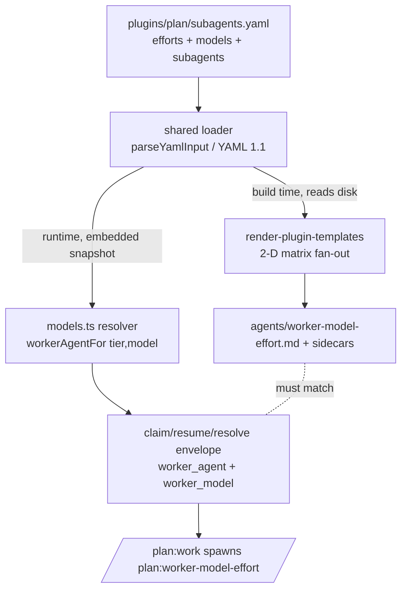

## Overview

Invert the plan plugin's per-task worker selection from a 1-D effort tier into a
config-driven **{model × effort} matrix**. A new committed `plugins/plan/subagents.yaml`
becomes the single source of truth for the allowed `efforts` and `models`, consumed by
two seams: the build-time template **renderer** (fans out one generated agent per cell,
`plan:worker-<model>-<effort>`) and the runtime **resolver** (validates a task's `tier`
+ new required `model`, composes the agent name onto the claim envelope). End state:
`/plan:work` always spawns `plan:worker-<model>-<effort>`, and adding a model is a
one-line config edit that A/B-compares models on the same task — no combinatorial file
explosion, no per-spawn effort override (which Claude Code does not support).

## Quick commands

- `keeper prompt render-plugin-templates --project-root "$(pwd)" && ls plugins/plan/agents/worker-opus-*.md`  # matrix files exist
- `test -z "$(git status --porcelain plugins/plan/agents)"`  # regeneration is idempotent, no stale files
- `bun test plugins/plan/test plugins/prompt/test`  # resolver, verbs, render parity, consistency all green
- `grep -c 'plan:worker-' plugins/plan/hooks/hooks.json`  # SubagentStop matcher is a single prefix

## Acceptance

- [ ] `plugins/plan/subagents.yaml` is the sole source for the effort + model axes; `TASK_TIERS` const and the template `variants:` list are retired.
- [ ] Generated worker agents are `plan:worker-<model>-<effort>.md` (opus × 4 efforts today); the four old `worker-<tier>.md` + sidecars are deleted.
- [ ] `model` is a required, validated per-task field (`model_invalid` mirrors `tier_invalid`); a null-model task stops like a null-tier task does today.
- [ ] `/plan:work` spawns `plan:worker-<model>-<effort>` in both autopilot and human-interactive paths; `SubagentStop` matcher is the `plan:worker-` prefix.
- [ ] `set-tier` is removed and `set-model` is not added; the op-deriver still recognizes historical `set-tier` commands.
- [ ] A build/promote drift guard fails loudly if the embedded runtime snapshot diverges from the on-disk config.

## Early proof point

Task that proves the approach: task 1 (`.1`). It settles the one genuine unknown — whether
the compiled `keeper-plan` binary can read the matrix config at runtime via a compile-time
embed. If it fails (embed not honored by `bun build --compile`, or `parseYamlInput` cannot
take the embedded string): fall back to a generated `.ts` constant module (render step emits
a typed `subagents.generated.ts` the resolver imports) rather than a runtime file read.

## References

- Effort is NOT spawn-overridable in Claude Code (only `model=` is) — the reason effort must be baked into each generated agent definition rather than passed at spawn. This is why the design keeps a matrix of named agents instead of one `worker` + `--agents` launch injection.
- `plugins/plan/src/yaml_input.ts` — `parseYamlInput`/`loadYamlInput`, the one sanctioned YAML reader (pinned yaml 2.8.1, YAML 1.1). Both consumers route through it.
- `plugins/plan/src/config.ts:74` `loadRoots` — precedent for reading a committed YAML through `parseYamlInput` (note: its fail-SOFT default cannot be copied — the matrix has no safe default and must fail loud).
- `cli/keeper.ts:20` — `import … with { type: "json" }`, the compile-time embed precedent.
- `plugins/prompt/test/oracle/fixtures/render-plugin-templates.json` + `oracle/capture.ts` — the byte-for-byte render parity oracle; regenerate when the rendered agent set changes.
- Epic-scout: no dependency or overlap with the only other open epic (fn-1027, pair/panel — orthogonal write surface).

## Alternatives

- **Single `worker` name + launch-time `--agents` effort injection** (rejected): effort is not spawn-overridable, so a single-named worker would need `--agents` wired at session boot — which breaks the human-interactive path (tier known only after boot) and forces a relaunch crux. A pre-generated matrix keeps every cell boot-loaded, so both launch paths are identical.
- **Model via spawn `model=` (kwarg), effort via named agent** (rejected): `model=` IS spawn-overridable, so this works and needs zero new files, but it splits config across two seams (effort in a file, model in a kwarg) and makes model asymmetric with effort. Baking both into the generated definition keeps one uniform, config-driven surface — the human's explicit choice.
- **Full model×effort variants as an in-template `variants:` 2-D list** (rejected): would change the shared 1-D `variants:` contract used by every other template and couples the axes to template frontmatter instead of a first-class config.

## Architecture

Single source → two consumers, two access modes:

The renderer reads the real file from disk; the compiled `keeper-plan` binary reads an
embedded snapshot. The two copies drift between a config edit and a rebuild+promote — the
drift guard (Rollout) closes that window. The composed name and the on-disk agent set must
never disagree, which drives the cutover ordering.

## Rollout

Cutover ordering so a composed worker name never lacks a backing agent file:

1. Land the config + runtime embed with axes = today's set (opus × 4 efforts); names still `plan:worker-<tier>` (task 1, green no-op).
2. Flip generation + resolver + hook matcher together to `plan:worker-<model>-<effort>` with model constant-opus, deleting the old files in the same change (task 2, atomic rename).
3. Make `model` a required per-task axis the resolver reads (task 3) — only now can a task select a non-opus cell.
4. Add the promote-time drift guard + consistency hardening (task 4).

The compiled binary (via `scripts/promote.sh`) and the committed agent `.md` files deploy
through different channels; landing generation and resolver name-composition in the same
task keeps them from skewing. Rollback: revert the epic's commits; the deleted old files
return on the render step of the reverted template.
