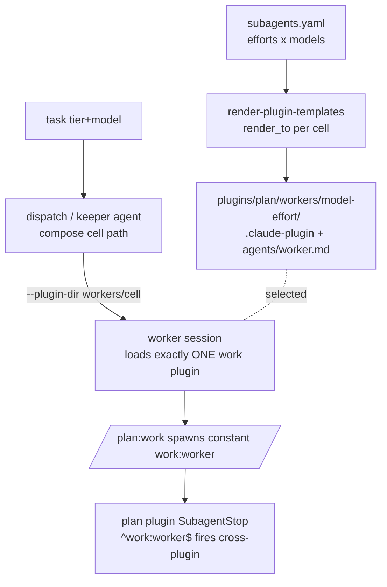

## Overview

Repackage the plan worker matrix (built by fn-1028) from named agents
`plan:worker-<model>-<effort>` in the shared `plan` plugin into ONE generated `work` plugin
per (model,effort) cell. Each cell renders a self-contained plugin dir —
`plugins/plan/workers/<model>-<effort>/{.claude-plugin/plugin.json (name: work), agents/worker.md
(baked model+effort)}` — via the renderer's `render_to:` path. `/plan:work` then always spawns
the CONSTANT `work:worker`; the launcher (`keeper agent`/dispatch) selects the ONE matching `work`
plugin per task via `--plugin-dir`, resolved producer-side from the task's model/effort. End state:
a uniform spawn name, with all per-task variation moved to launch-time plugin selection.

## Quick commands

- `keeper prompt render-plugin-templates --project-root "$(pwd)/plugins/plan" && ls plugins/plan/workers/*/`  # per-cell work plugins
- `test -z "$(git status --porcelain plugins/plan/workers plugins/plan/agents)"`  # regeneration idempotent, old agents pruned
- `! grep -rl '"name": *"work"' ~/code/arthack/claude/*/. 2>/dev/null | grep -v plan/workers`  # arthack `work` name freed (prerequisite)
- `bun test plugins/plan/test plugins/prompt/test test/autopilot-worker.test.ts test/exec-backend.test.ts`

## Acceptance

- [ ] Each matrix cell renders a `work` plugin dir under `plugins/plan/workers/<model>-<effort>/` (manifest name `work`, agent name `worker`); the four old `plan:worker-*` agents + sidecars are removed and `.gitignore` flips to `workers/`.
- [ ] The launcher threads a per-task `--plugin-dir <workers/cell>` through the structured `LaunchSpec` path (not just the shell twin); exactly one `work` plugin loads per session.
- [ ] `/plan:work` spawns the constant `work:worker`; the resolver's composed name is no longer the spawn target, but its null-either-axis stop is preserved.
- [ ] `SubagentStop` matcher is `^work:worker$` and fires (cross-plugin) for the launched cell.
- [ ] A dispatched task carrying an out-of-matrix `(model,effort)` fails loud at compose, and a missing cell dir fails loud pre-launch — never an opaque agent-not-found inside the session.
- [ ] Oracle fixtures regenerated (render tree walks `workers/`); the marketplace/scan `work`-name collision is structurally excluded.

## Early proof point

Task that proves the approach: task 1 (`.1`). It settles the two load-bearing unknowns before any
cutover: (a) that loading `--plugin-dir plugins/plan` does NOT recursively auto-load the nested
`plugins/plan/workers/*/.claude-plugin` manifests (else N same-named `work` plugins collide and the
single-load guarantee is void — if so, relocate the workers base out of `plugins/plan` to a
render_to-reachable path), and (b) that a single `--plugin-dir`'d `work` cell resolves `work:worker`
with the arthack `work` name freed. If (a) fails and no render_to-reachable relocation works, fall
back to fn-1028's named-agent scheme (this epic reverts cleanly, having only ADDED the workers tree).

## References

- Builds on fn-1028 (config-driven worker model-effort matrix — DONE): the `subagents.yaml` SSOT, the 2D matrix render branch, and the per-task `tier`+`model` fields all carry forward.
- PRIOR ART: commit `0119d6bb` removed a per-tier `--plugin-dir` worker-launch push (`workPluginDir`/`checkWorkPluginManifest`/`WorkPluginCheck`/`buildResumeCommand`, plus the `PLANCTL_ROOT` root seam). Reuse its shell-twin / manifest-check / root-seam SHAPE — but note the live launch reads the structured `LaunchSpec` (`src/exec-backend.ts`), which that commit never touched, so `pluginDir` is a NET-NEW field there.
- The renderer's `render_to:` path (`plugins/prompt/src/render_plugin_templates.ts` `resolveAgentOutput` + `manifestContent`, hardcoded manifest `name: "work"`) is complete and path-traversal-guarded; feed it, don't reimplement.
- Cross-plugin `SubagentStop` firing is global; the matcher tests the full `^work:worker$`. Keep the hook in the plan plugin's `hooks.json` (settings.json hooks are unreliable per CC bug #27755).
- PREREQUISITE: the arthack `work` plugin (gmail/tmux) is being renamed to the `arthack` namespace (handoff `rename-work-skills-to-arthack`) to free the `work` name — a keeper-agent worker session scans `~/code/arthack/claude`, so an un-freed `work` would shadow the cell (CC bug #72369).

## Alternatives

- **Free name (`planworker:worker`) instead of taking over `work`** (rejected by the human in favor of consolidating the `work` namespace): would have avoided the arthack rename entirely at no functional cost, but the human chose to reclaim `work`.
- **Keep fn-1028's named agents in the `plan` plugin** (the status quo this inverts): simpler, no launcher change, but the spawn name varies per cell — the uniform `work:worker` goal is the whole point here.
- **Inject the agent inline at launch via `--agents`** (rejected earlier): effort is not spawn-overridable and `--agents` interacts poorly with the human-launch paths; pre-generated per-cell plugins keep every cell inspectable on disk.

## Architecture

The generator writes each cell; the launcher selects one at dispatch. The `<workers-base>/<model>-<effort>`
path convention is a SINGLE shared source (extend `subagents_config.ts`) read by both, so they can't drift.

## Rollout

1. Generate the per-cell `work` plugins ALONGSIDE the existing `plan:worker-*` agents (green no-op); prove single-load + name-freed (task 1).
2. Thread `--plugin-dir` through the structured launch + resume; the cell loads but is unused while the skill still spawns the old agents (green) (task 2).
3. Flip `/plan:work` to `work:worker`, retarget the matcher, delete the old agents (atomic cutover) (task 3).
4. Docs, observability note, marketplace-name guard, consistency (task 4).

Rollback: revert the epic's commits; the deleted named agents return on the reverted template render.
The arthack `work`-name rename is independent and does not need reverting.
