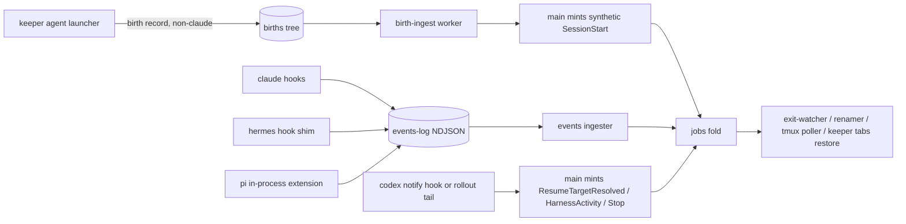

## Overview

keeper's launcher already drives claude/codex/pi, but only claude gets lifecycle
integration (jobs row, state, tab rename, resume/restore). This epic brings codex,
pi, and hermes to tracked + resumable maturity with a per-harness descriptor
registry replacing the scattered unions and inline branches so a harness is data,
not forty edit sites.

Two governing principles. **Parity:** presence and state work the same whether a
session is dispatched by the system or started by the human — every keeper agent
launch of a non-claude harness, interactive or detached, registers presence via a
birth record (claude is exempt: its hook SessionStart is authoritative for both
presence and resume identity, and a second seed would double-fire the revive arm).
**Most-detailed-state-available:** each harness gets the richest live state its
native mechanisms allow — hermes via native shell hooks, pi via an in-process
launcher-armed extension, codex via notify-hook-or-rollout-tail (at minimum
stop-churn), claude unchanged. Gates are capability-derived everywhere: pi's panel
bar is lifted; hermes turns panel-eligible when its capture capability lands.
Dispatch/autopilot stays claude-only as a missing capability (deferred), not a bar.

Restore builds on the keeper tabs browser-grade restore system (fn-1102): harness
tags ride restore candidates and generations, and the revive script and
keeper tabs restore emit per-harness resume argv.

Maturity vocabulary: M0 Named, M1 Launchable, M2 Capturable, M3a Tracked-presence,
M3b Tracked-live, M4 Resumable, M5 Workable (out of scope). Targets: hermes M0-M2;
all three M3a+M4; M3b best-available per harness.

## Quick commands

- keeper agent run hermes 'reply exactly DONE' — uniform envelope, outcome completed
- keeper agent codex --x-tmux --x-tmux-detached --x-tmux-session pair 'say hi'; keeper query jobs — a harness-tagged jobs row appears, window renamed, kill flips it to killed
- keeper agent pi (interactive, in your own terminal) — the session appears on the board while you use it
- keeper tabs restore — a mixed-harness dead generation restores with per-harness resume argv

## Acceptance

- [ ] Detached AND interactive launches of codex, pi, and hermes each yield a tracked jobs row (harness-tagged, titled); rows without tmux coordinates still get killed-detection, rows with them get tab rename
- [ ] keeper tabs restore and the durable revive script handle mixed-harness generations, emitting each harness's own resume argv; a job with no known resume target reports not-resumable instead of failing
- [ ] hermes and pi sessions show live working/stopped churn (native hooks / in-process extension); codex shows at minimum stop-churn from its rollout or notify hook; every live-state mechanism degrades to presence-only, never an error
- [ ] Panel membership is capability-derived: a pi preset is panel-valid now, a hermes preset once M2 lands; no harness-name allowlist remains
- [ ] bun run test:full green, including refold-equivalence and fresh-vs-migrated schema parity

## Early proof point

Task that proves the approach: ordinal 5 (birth-record ingest producer): a real
detached codex launch appears on the board, renamed and killed-detected, with no
reducer arm added. If it fails: fall back to per-harness writers on the existing
events-log hook channel, keeping the registry and migration.

## References

- `fn-1102-keeper-tabs-browser-grade-restore` (dependency) — the restore system this epic extends: recency-bounded richness-ranked generation selection, resume by exact session UUID (cwd prefix load-bearing for claude), durable revive side-file; task 7 makes all of it harness-aware
- .keeper/specs/fn-980-pi-pair-and-panel-partner.md — pi second-axis + no-seeder precedent; intended pi as a panel partner (this epic reconciles the code)
- .keeper/specs/fn-1039-harness-default-presets-and-fail-loud.md — preset fail-loud + binary-before-config ordering
- `fn-1098-resolver-first-merge-conflict-flow` (overlap) — edits src/daemon.ts merge-escalation sweeps; this epic edits the worker registry/spawn sites in the same file; land after it
- `fn-1099-live-verification-acceptance-guidance` (overlap) — shares skill-doc files; trivial hunks, different sections
- `fn-1101-fix-stale-board-pill-after-unblock` (advisory) — adjacent fold/serve surface, zero shared files; deliberately NOT dep-wired
- Panel-settled architecture: birth records feed the synthetic channel because the launcher cannot write the DB, an RPC would widen the guarded 7-verb surface, and a socket call races daemon downtime

## Alternatives

- Launcher writes synthetic SessionStart NDJSON directly into events-log — rejected: puts a non-hook producer in the hook-sourced tree; the synthetic channel is the established home for non-hook events
- A new seed RPC — rejected: widens the seven-verb mutation surface and races daemon downtime for detached launches
- Claude birth records — rejected: double-fires the SessionStart revive arm and risks resume_target clobber; claude's hook is authoritative
- Persistent pi extension install — rejected: would fire on the human's non-keeper pi sessions; arming is ephemeral per-launch only
- Routing codex tail-derived state through events-log — rejected: a non-hook producer in the hook-sourced tree; codex state rides MAIN-minted synthetic events
- Re-minting SessionStart to carry a late resume id — rejected: the ON-CONFLICT arm revives terminal rows; dedicated non-reviving arms exist instead

## Architecture

Identity: claude/pi pin their session uuid at launch (job_id = session_id;
resume_target = session_id at seed); codex/hermes get a keeper-minted job_id with
resume_target back-filled (codex: rollout SessionMeta.originator exact-match via
CODEX_INTERNAL_ORIGINATOR_OVERRIDE, cwd+created-at refuse-to-guess fallback;
hermes: native session id from its on_session_start hook payload). A resume
relaunch reuses the ORIGINAL job_id so the revived session folds onto the same
row. NULL harness means claude at every read; the fold never synthesizes a value.

Channel discipline: in-process/subprocess mechanisms that die with the harness
(claude hooks, hermes shim, pi extension) write per-pid events-log NDJSON keyed
on the keeper job id; everything decoupled from harness liveness (birth records,
codex rollout tail) flows through MAIN-minted synthetic events, and tail-derived
state uses non-reviving fold arms with source-line timestamps so replays can
never flicker a dead session back to working.

## Rollout

Land order: registry refactor (pure, byte-pinned) -> hermes M0-M2 and the schema
migration in parallel -> birth-record writer -> ingest producer -> back-fill,
resume/restore, hermes shim, pi extension, codex producer -> docs sweep. Epic
waits on fn-1098 (daemon.ts) and fn-1102 (the restore system task 7 extends).
Single SCHEMA_VERSION bump, the only in-flight one. Additive feature, no flag:
legacy rows stay NULL-harness (claude). Operator config (presets.yaml
hermes_default, panel members) is added only AFTER the binary lands (fn-1039
ordering). Rollback = revert; the migration is additive nullable columns only.

## Docs gaps

- **CLAUDE.md**: generalize the sole-writer bullet (events-log gains hermes-shim and pi-extension writers), add births-tree sole-writer + new workers; hook rules gain the shim/extension discipline; the restore guardrail line follows fn-1102's keeper tabs restore spelling
- **plugins/keeper/skills/pair/SKILL.md**: harness enumerations + hermes consent note
- **plugins/plan/skills/panel/references/panel.md**: capability-derived eligibility wording
- **README.md**: ingest narrative and producer map acknowledge multi-harness sources
- **src docstrings**: prune renamer-worker / resume-descriptor / restore-set claims that code is claude-only once it is not

## Best practices

- **Maildir handoff:** birth records write tmp -> fsync -> rename; consumer reacts to move-in, never create; idempotent on (pid, start_time) [maildir/POSIX]
- **Process identity:** pid + platform-tagged start_time, compared same-platform same-method only; never locale-formatted lstart for identity [systemd precedent]
- **Hook payloads are attacker-influenced:** JSON-encode every field, bound size, never shell-interpolate tool_input; shim stdout is the host's control channel — log privately
- **In-process extensions fail open:** top-level guard, no-op without the keeper env marker, host-runtime primitives only — a throwing extension must never crash the human's session
- **Never revive terminal rows from replayable logs:** tail-derived state events use non-reviving fold arms and source-line timestamps
- **Consent is load-bearing:** hermes silently skips hook registration in non-TTY without pre-seeded allowlist or accept flag; seed both, re-seed on shim version bump
- **Read codex rollout JSONL, not its internal SQLite** (schema churn); treat session files as sensitive — extract identity/metadata only
- **Bound the births dir** (GC processed + stale records) or boot-scan cost grows with history
