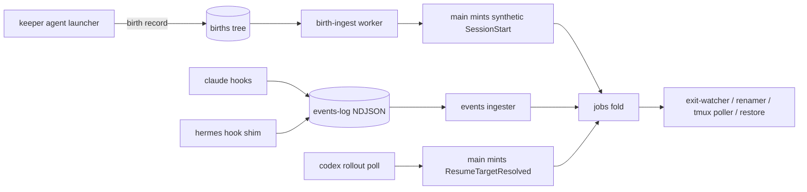

## Overview

keeper's launcher already drives claude/codex/pi, but only claude gets lifecycle
integration (jobs row, state, tab rename, resume/restore). This epic brings codex,
pi, and hermes to tracked-presence + resumable maturity (hermes also live-tracked
via its native hooks), with a per-harness descriptor registry replacing the
scattered unions and inline branches so a harness is data, not forty edit sites.
Gates become capability-derived everywhere: pi's panel bar is lifted; hermes turns
panel-eligible the moment its capture capability lands. Dispatch/autopilot stays
claude-only as a missing capability (deferred), not a bar.

Maturity vocabulary: M0 Named, M1 Launchable, M2 Capturable, M3a Tracked-presence,
M3b Tracked-live, M4 Resumable, M5 Workable (out of scope). Targets: hermes M0-M2,
all three M3a+M4, hermes M3b.

## Quick commands

- keeper agent run hermes 'reply exactly DONE' — uniform envelope, outcome completed
- keeper agent codex --x-tmux --x-tmux-detached --x-tmux-session pair 'say hi'; keeper query jobs — a harness-tagged jobs row appears, window renamed, kill flips it to killed
- keeper restore-agents — buckets list non-claude agents with harness + native resume target

## Acceptance

- [ ] A detached codex, pi, and hermes launch each yields a tracked jobs row (harness-tagged, titled) with killed-detection and tmux tab rename
- [ ] restore-agents relaunches each harness with its own resume argv; a job with no known resume target reports not-resumable instead of failing
- [ ] hermes sessions show live working/stopped churn via native hooks; hook absence degrades to presence-only, never an error
- [ ] Panel membership is capability-derived: a pi preset is panel-valid now, a hermes preset once M2 lands; no harness-name allowlist remains
- [ ] bun run test:full green, including refold-equivalence and fresh-vs-migrated schema parity

## Early proof point

Task that proves the approach: ordinal 5 (birth-record ingest producer): a real
detached codex launch appears on the board, renamed and killed-detected, with no
reducer arm added. If it fails: fall back to per-harness writers on the existing
events-log hook channel, keeping the registry and migration.

## References

- .keeper/specs/fn-980-pi-pair-and-panel-partner.md — pi second-axis + no-seeder precedent; intended pi as a panel partner (this epic reconciles the code)
- .keeper/specs/fn-1039-harness-default-presets-and-fail-loud.md — preset fail-loud + binary-before-config ordering
- `fn-1098-resolver-first-merge-conflict-flow` (overlap) — edits src/daemon.ts merge-escalation sweeps; this epic edits the worker registry/spawn sites in the same file; land after it
- `fn-1099-live-verification-acceptance-guidance` (overlap) — shares skill-doc files; trivial hunks, different sections
- `fn-1101-fix-stale-board-pill-after-unblock` (advisory) — adjacent fold/serve surface, zero shared files; deliberately NOT dep-wired
- Panel-settled architecture: birth records feed the synthetic channel because the launcher cannot write the DB, an RPC would widen the guarded 7-verb surface, and a socket call races daemon downtime; launcher-direct NDJSON into events-log was rejected to keep that tree hook-sourced-only

## Alternatives

- Launcher writes synthetic SessionStart NDJSON directly into events-log — rejected: puts a non-hook producer in the hook-sourced tree; the synthetic channel is the established home for non-hook events
- A new seed RPC — rejected: widens the seven-verb mutation surface and races daemon downtime for detached launches
- Transcript pollers for pi/codex live churn — deferred by decision; presence-only is accepted for them initially
- Re-minting SessionStart to carry a late resume id — rejected: the ON-CONFLICT arm revives terminal rows, so a late back-fill could flip killed to stopped; a dedicated ResumeTargetResolved arm sets only resume_target

## Architecture

Identity: claude/pi pin their session uuid at launch (job_id = session_id,
resume_target = session_id at seed); codex/hermes get a keeper-minted job_id with
resume_target back-filled (codex: rollout SessionMeta.originator exact-match via
CODEX_INTERNAL_ORIGINATOR_OVERRIDE, cwd+created-at refuse-to-guess fallback;
hermes: native session id from its on_session_start hook payload). NULL harness
means claude at every read; the fold never synthesizes a harness value.

## Rollout

Land order: registry refactor (pure, byte-pinned) -> hermes M0-M2 and the schema
migration in parallel -> birth-record writer -> ingest producer -> back-fill,
resume/restore, hermes shim -> docs sweep. Single SCHEMA_VERSION bump, the only
in-flight one (serialization point). Additive feature, no flag: legacy rows stay
NULL-harness (claude). Operator config (presets.yaml hermes_default, panel members)
is added only AFTER the binary lands (fn-1039 ordering). Rollback = revert; the
migration is additive nullable columns only.

## Docs gaps

- **CLAUDE.md**: generalize the sole-writer bullet (events-writer is no longer the only NDJSON writer), add births-tree sole-writer + new worker; hook rules gain the hermes shim
- **plugins/keeper/skills/pair/SKILL.md**: harness enumerations + hermes consent note
- **plugins/plan/skills/panel/references/panel.md**: capability-derived eligibility wording
- **README.md**: ingest narrative says Claude-Code-only; becomes multi-harness
- **src docstrings**: prune renamer-worker / resume-descriptor / restore-set claims that code is claude-only once it is not

## Best practices

- **Maildir handoff:** birth records write tmp -> fsync -> rename; consumer reacts to move-in, never create; idempotent on (pid, start_time) [maildir/POSIX]
- **Process identity:** pid + platform-tagged start_time, compared same-platform same-method only; never locale-formatted lstart for identity [systemd precedent]
- **Hook payloads are attacker-influenced:** JSON-encode every field, bound size, never shell-interpolate tool_input; shim stdout is the host's control channel — log privately
- **Consent is load-bearing:** hermes silently skips hook registration in non-TTY without pre-seeded allowlist or accept flag; seed both, re-seed on shim version bump
- **Read codex rollout JSONL, not its internal SQLite** (schema churn); treat session files as sensitive — extract identity/metadata only
- **Bound the births dir** (GC processed + stale records) or boot-scan cost grows with history
