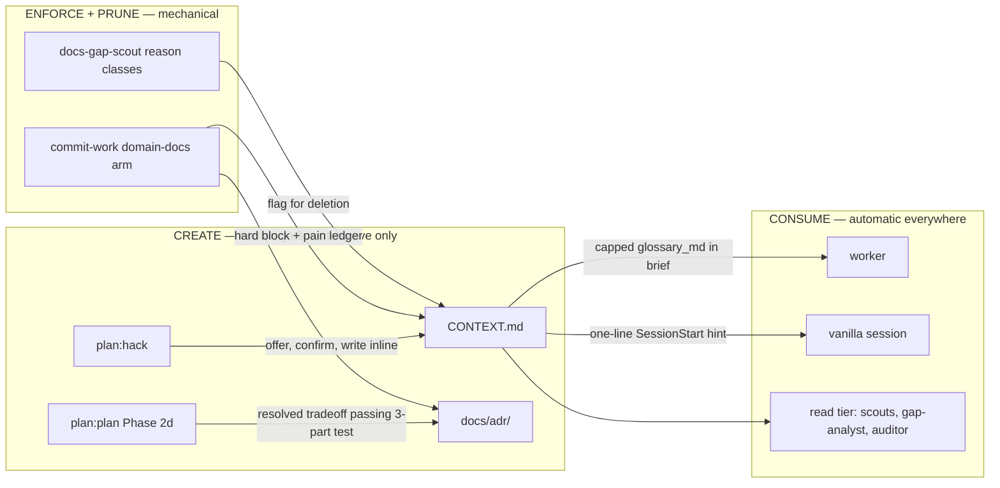

## Overview

Give every repo keeper touches a durable domain-knowledge layer with typed homes — CLAUDE.md stays imperative guardrails only; a root CONTEXT.md holds the ubiquitous-language glossary (1-2 sentence definitions plus Avoid-synonym lines, zero implementation detail, lazy-created); docs/adr/ becomes the ONE sanctioned home for decision history, gated by a three-part significance test. Creation stays human-gated and interactive; consumption, enforcement, and pruning run mechanically everywhere: a domain-docs linter rides inside keeper commit-work, workers receive the glossary in their brief, read-tier agents challenge and flag, and a one-line SessionStart hint advertises the layer to vanilla sessions. The blanket no-history rule decomposes per-genre across its seven enforcement surfaces, and keeper's own repo bootstraps the layer as the first adopter.

## Quick commands

- `bun test` — root suite green (linter fixtures, brief field, lint-claude-md fixtures)
- `echo "**Term**: uses src/foo.ts for things" >> CONTEXT.md && keeper commit-work "test" ; git checkout CONTEXT.md` — the implementation-detail fingerprint hard-blocks (lint_failed, linter domain-docs)
- `keeper plan claim <task> --json | jq .glossary_md` — brief carries the capped glossary
- `bun scripts/vendor-corpus.ts --check` — snippet corpus + BAKE regions drift-free
- `wc -l CLAUDE.md && bun scripts/lint-claude-md.ts` — net-smaller CLAUDE.md, gate green

## Acceptance

- [ ] Commits touching CONTEXT.md or docs/adr in any repo pass through a deterministic domain-docs lint arm: structural caps and under-capturing implementation-detail fingerprints hard-block, an inline escape marker exists, and every failure appends one NDJSON pain-ledger record
- [ ] Worker briefs carry a capped glossary_md sourced from the target repo, present-but-empty when absent, byte-parity preserved with the Python twin
- [ ] The read tier consumes and challenges the glossary (gap-analyst section, quality-auditor flags, docs-gap-scout prune targets with reason classes and the no-docs-sweep rule) while staying structurally write-free
- [ ] The two interactive design skills carry the domain-modeling reflex (offer-don't-auto-write, update-inline, three-part ADR test) via drift-gated snippets; workers write durable docs only as a declared deliverable
- [ ] History/rationale is banned everywhere except docs/adr and commit messages, and every former rule-0 surface states the per-genre policy consistently
- [ ] A dep-free SessionStart hint surfaces CONTEXT.md to vanilla sessions with a read-when trigger, one line, exit 0 always
- [ ] Keeper's own repo carries a linted CONTEXT.md glossary, seed ADRs, and a net-smaller CLAUDE.md

## Early proof point

Task that proves the approach: task 1 (the linter — the highest-risk, no-prior-art piece; its fixture corpus proves the fingerprints hold). If it fails: fall back to structural-caps-only blocking and move the fingerprints to the read-tier flags while the corpus is re-tuned.

## References

- Settled design: the session's domain-layer-design.md (typed homes, autopilot seam, five-layer anti-bloat defense, seven-surface decomposition, migration)
- `fn-1105-matt-skillset-craft-deltas` — sibling epic this one builds on (shared files: worker template, skill-authoring doc, plan skill)
- `fn-1099`, `fn-1102`, `fn-1103` — open epics editing plan/SKILL.md, CLAUDE.md, lint-claude-md.ts, hooks.json; sequenced via epic deps
- Practice evidence: MADR/Nygard supersession model; AST-over-regex doc linting (markdownlint/Vale architecture); the ~150-line always-loaded-doc cost knee; agent-authored docs reduce task success when auto-generated — interactive-with-confirmation is the guardrail

## Architecture

## Rollout

Lands in dependency order behind the craft-deltas epic; keeper's own bootstrap is the last task and the first real exercise of the linter. Other repos adopt lazily — first resolved term creates CONTEXT.md; nothing nags a repo with no domain docs. Rollback: the linter arm is gated on file presence (a repo without CONTEXT.md/docs/adr is untouched), the brief field defaults empty, and the hook emits nothing when no glossary exists — every surface degrades to today's behavior in the absence of the new files.

## Docs gaps

- **docs/plugin-composition-map.md**: hook inventory + SessionStart wiring gain the hint hook; verify the dated lint-forensics section is not rendered misleading by the new lint arm
- **docs/problem-codes.md**: extend the lint_failed row's linter family with the domain-docs linter name if the registry enumerates linters
- **README.md**: one-line pointer to the two new typed doc homes (lands with bootstrap, once the homes exist)
