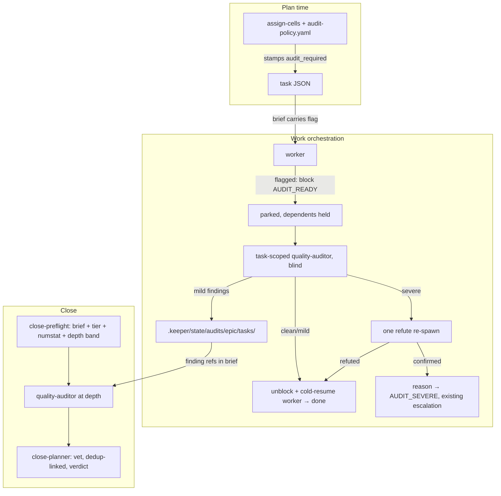

## Overview

Review depth becomes a plan-time-derived property executed unattended: the close audit sizes itself from epic signals (task count, tier mix, diff size, touched repos) via a drift-gated policy config, and selected high-risk tasks earn a per-task audit that holds the done-latch through the existing block machinery (AUDIT_READY) so dependents never build on unreviewed drift. Findings route autonomously — verified-severe survives a refute pass and escalates as AUDIT_SEVERE through the existing block-escalation path; mild findings accumulate into the epic audit state for close, fingerprint-linked so fixed findings suppress and open ones surface. close-planner keeps verdict authority. Every failure mode degrades to today's lean single-pass audit, never a wedged board.

## Quick commands

- `cd plugins/plan && bun test` — policy drift gate, brief field, numstat fake, verdict/guard suites green
- `bun test test/daemon.test.ts` — escalation treats AUDIT_READY as self-handled, AUDIT_SEVERE pages
- `keeper plan selection-brief <epic> && cat .keeper/state/selections/<epic>/brief.json | python3 -m json.tool | head` — policy context present
- Board smoke: an xhigh task on a scratch epic parks blocked AUDIT_READY after its worker finishes, then flips done after a clean audit

## Acceptance

- [ ] Close audits derive a depth band (lean/standard/deep) from a drift-gated policy over signals already carried or newly computed (per-task tier, diff numstat, task count, touched repos); derivation failure degrades to lean and the close proceeds
- [ ] Deep close audits run more dimensions and a strengthened close-planner vet; lean audits match today's single pass
- [ ] Audit-flagged tasks (stamped at selection time from policy) park blocked with an AUDIT_READY reason instead of stamping done; dependents do not dispatch while parked
- [ ] A clean or mild per-task audit unblocks and cold-resumes the worker, which stamps its own done; a verified-severe finding survives one refute pass, rewrites the reason to AUDIT_SEVERE, and escalates through the existing block path
- [ ] Per-task findings persist under the epic audit state; at close, fingerprint-linked findings marked fixed are suppressed and accumulated-open findings surface — nothing is double-reported and nothing open vanishes
- [ ] The escalation producer never pages on a fresh AUDIT_READY while its orchestrator lives and pages after a grace period if it dies; AUDIT_SEVERE pages like any block
- [ ] No new RPC, no new reconcile verdict, no re-added audit verbs from the removed-verbs list; all audit state rides gitignored plan state via the audit-artifacts helpers

## Early proof point

Task that proves the approach: task 1 (policy + selection stamping + brief field). If it fails: the policy/selection seam was misread — re-derive against the live assign-cells flow before any downstream task starts.

## References

- docs/adr/0014-audit-gate-rides-block-machinery.md — the ratified gating decision (A/B/C trade-off recorded)
- The selection beat (selection-brief / model-selector / assign-cells + .keeper/selections sidecar) — the plan-time sizing pattern this mirrors
- The audit-artifacts spine (.keeper/state/audits layout, computeCommitSetHash, commit-free writes) — the persistence surface per-task audits extend
- Practice evidence: gate only on verified high-severity (noise is the dominant failure), generator never reviews itself, refute passes only on gating decisions, fingerprints link across stages rather than blindly suppress, diff-only review misses cross-file bugs so the whole-surface close audit stays
- The working tree's selection-review removal lands before this epic; specs assume the post-deletion tree

## Architecture

## Rollout

Lands behind the in-flight selection-review removal. Policy config ships with conservative defaults (only max-tier tasks audit-flagged initially; depth bands biased lean) so autopilot behavior changes gradually and the pain of false positives is measurable before thresholds widen. Rollback: remove the policy file — claim/close degrade to today's behavior by construction (absent policy = not-audited, lean band); the AUDIT_READY category is inert prose once nothing emits it.
