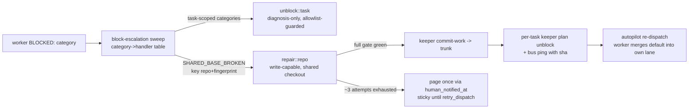

## Overview

Escalation sessions today are constrained only by tool-level denies that
`--dangerously-skip-permissions` lets them route around via Bash file-writes, and the
"shared base is broken" incident class has no blocked category and no actor allowed to fix
it. This epic makes unblock's diagnosis-only contract mechanical (a role-keyed
PreToolUse(Bash) allowlist guard over every escalation session), names the incident class
(baseline-gated `SHARED_BASE_BROKEN`), and gives it a purpose-built write-capable owner
(`repair::<repo>` — deconflict-precedent discipline, trunk commit, fan-out unblock). End
state: authority follows surface ownership, decided by category at dispatch time; decision
record in docs/adr/0017.

## Quick commands

- echo '{"tool_name":"Bash","tool_input":{"command":"python3 -c \"open(1)\""}}' | KEEPER_ESCALATION_ROLE=unblock bun plugins/keeper/plugin/hooks/escalation-guard.ts   # expect deny envelope
- keeper escalation-brief repair::<repo-token>   # repair-kind incident once plumbing lands
- bun test && bun run test:full   # full gate

## Acceptance

- [ ] Every escalation session (unblock/deconflict/resolve/repair) is mechanically constrained to its role's command-family allowlist; interpreter/heredoc/redirect Bash writes are denied for diagnosis-only roles
- [ ] A worker-confirmed shared-base breakage routes to exactly one repair session per (repo, fingerprint), which lands a full-gate-verified trunk commit (or a green-at-HEAD no-op) and unblocks every affected task across epics
- [ ] A declined repair pages the human exactly once and stays parked until retry
- [ ] All suites, byte-pins, and drift gates green; schema bump paired with the python whitelist

## Early proof point

Task that proves the approach: ordinal 1 (the guard). It exercises the load-bearing
mechanism — envelope-deny surviving skip-permissions, role keying, fail-closed semantics —
end-to-end with a one-line echo probe. If it fails (envelope semantics do not hold),
re-scope enforcement to skill-side hard rules plus daemon-side command auditing before
building repair on top.

## References

- docs/adr/0017-trunk-repair-escalation-and-role-keyed-guard.md (the posture decision)
- docs/adr/0007-autonomous-escalation-dispatch.md (escalation-over-creator-wake)
- plugins/plan/skills/deconflict/SKILL.md (write-capable escalation precedent)
- Incident forensics: sessions b964a8b1 / b6cf2c97 under ~/.claude/projects/-Users-mike-code-keeper/ (heredoc bypass, cross-lane cd, toolDenialKind permission-rule)
- `fn-1167` (overlap) — its task .5 lands AUDIT_READY/AUDIT_SEVERE handling in the same block-escalation sweep; the routing table here must admit those as first-class routes

## Docs gaps

- **CLAUDE.md**: five-hooks line -> six; fold repair/SHARED_BASE_BROKEN routing into the Autopilot paragraph (revise in place, prune)
- **plugins/plan/CLAUDE.md**: skills inventory gains /plan:repair
- **CONTEXT.md**: Repair session / SHARED_BASE_BROKEN / Escalation role glossary entries
- **docs/plugin-composition-map.md**: escalation-dispatches section gains repair:: + sixth hook
- **plugins/plan/skills/plan/references/operator-orchestration.md** and **plugins/keeper/skills/autopilot/SKILL.md**: operator narratives gain the repair route

## Best practices

- **Parse, never prefix-match:** tokenize to executable+args, split compound commands, require every segment to pass, enforce word boundaries — naive prefix allowlists are 100% bypassable [claude-code#4956]
- **Deny interpreter/env-runner families outright:** python/node/ruby -c/-e/heredocs, sh -c, xargs-with-flags, find -exec — the exact observed bypass class [Claude Code permissions doc]
- **Only the deny envelope (or exit 2) blocks:** an uncaught exception exiting 1 silently disables a guard — validate payload shape first
- **Trunk bots:** structured commit trailers (trigger, fingerprint, attempt N), revert-first, rate-limit + freeze after N failures, external audit ping per commit [DORA/TBD norms]
- **Fingerprints:** conservative normalization (mask numbers/hex/paths/timestamps), O(1) keyed lookup, never a history scan; over-merge hides a second defect, under-merge races duplicates [Sentry grouping]

## Alternatives

- **Unblock self-elevation** (grant Edit/Write to the unblock skill): rejected — arms all seven categories for the sake of one, relies on prose to police re-implementation, and N blocked lanes would mean N self-elevated sessions editing default. Recorded in ADR 0017.
- **Live-jobs-only repair dedup** (no durable latch): rejected — no once-page marker, so a declined repair re-dispatches every sweep; the merge-escalation column-latch precedent exists precisely for this.

## Architecture

## Rollout

Land the guard first (independent, immediately probe-able); category + ref plumbing next;
the daemon sweep rides on both; the skill and docs land last so prose describes shipped
contracts. Every step is a small revertable commit; the guard is the one surface that can
brick live escalation sessions if over-tight — after it lands, watch the first autopilot
unblock dispatch and loosen the role list via a follow-up commit if a legitimate command is
denied (the deny envelope names the command, so the failure is visible, not silent).
