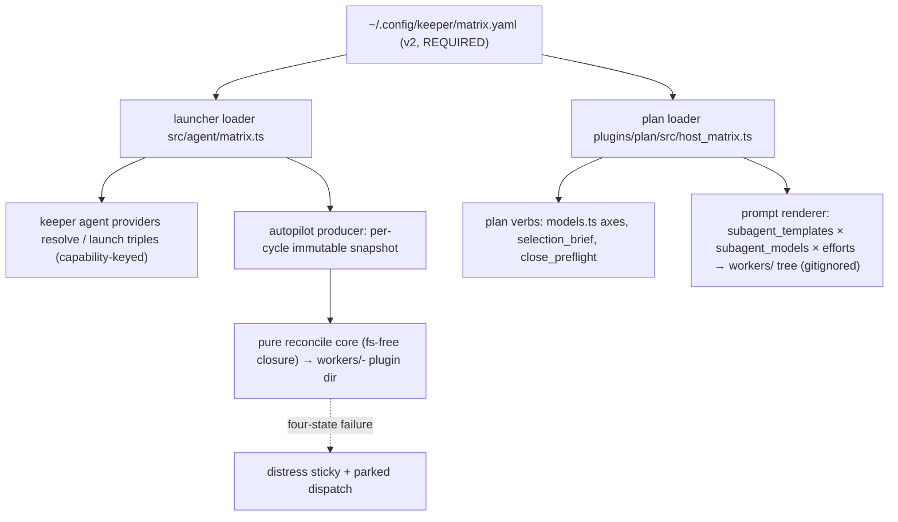

## Overview

Delete `plugins/plan/subagents.yaml` and its embedded-fallback machinery; `~/.config/keeper/matrix.yaml`
(v2 schema) becomes the single, REQUIRED worker-matrix config. Provider model entries become launch-ids
(what the harness CLI receives) with capability tokens derived by basename; worker-cell eligibility is an
explicit `subagent_models` list and the cell-template inventory an explicit `subagent_templates` list;
`route:`/`native:`/`name:`/`render_to:` all retire. Absence or malformedness is a typed, four-state loud
failure on every surface — the daemon parks dispatch behind a distress sticky, never exits. The decision
record is docs/adr/0036 (committed at plan time); 0010's superseded clauses are annotated.

## Quick commands

- `KEEPER_CONFIG_DIR=$(mktemp -d) bun plugins/plan/scripts/model-guidance-check.ts --check` — integrity-only gate passes with no host matrix
- `bun test test/agent-matrix.test.ts` — cross-island parity + matrix.example.yaml anti-rot
- `bun run test:full` — root + plan + prompt suites, all pinned to fixtures via KEEPER_CONFIG_DIR

## Acceptance

- [ ] `matrix.yaml` v2 is the only worker-matrix config: `subagents.yaml` and `subagents_config.ts` are gone and nothing in code, scripts, or tests references them
- [ ] Absent/malformed matrix is a typed loud failure discriminated into four states (absent / unparseable / schema-invalid / valid-but-empty) on every surface — loaders, renderer, plan verbs, `keeper agent` provider resolve — and the daemon parks dispatch behind a visible distress sticky without exiting
- [ ] Provider entries are launch-ids with basename-derived capabilities; cross-provider dedup is first-provider-wins with effort-list ownership and visible shadow logging; `route:`/`native:`/`name:`/`render_to:` are rejected or absent everywhere
- [ ] CI gates are host-blind integrity checks; every suite passes with `KEEPER_CONFIG_DIR` pinned at committed claude-only fixtures and no test reads the live `~/.config/keeper`
- [ ] Docs and the CONTEXT.md glossary describe only the v2 world (forward-facing; history lives in ADR 0036)

## Early proof point

Task that proves the approach: ordinal 1 (both island parsers reshaped in lockstep + the example rewrite
under the anti-rot test). If it fails: re-scope task 1 to an additive v2 loader beside the existing parse
layer and re-plan the cutover order before touching consumers.

## References

- docs/adr/0036-required-host-matrix-v2-with-launch-id-entries.md — the decision this epic implements
- docs/adr/0010-host-provider-matrix-and-wrapped-worker-cells.md — superseded clauses annotated in place
- docs/adr/0033-launch-triples-over-named-preset-catalog.md — UNCHANGED: launch triples stay capability-keyed; the launcher resolves capability → launch-id from the winning provider entry
- Injection seam: `src/autopilot-worker.ts` loadReconcileSnapshot (~:6934) + driveCycle call site (~:7851); sticky reason strings ~:3616-3690
- `src/autopilot-worker.ts` contains a NUL byte — plain grep reads it as binary and silently matches nothing; use `grep -a` or `rg --text`
- The reconcile pure-import closure bans node:fs/node:os (test/reconcile-core-depgraph.test.ts); host_matrix.ts is explicitly OUTSIDE it — matrix data reaches the core only as an injected snapshot

## Alternatives

- Transform subagents.yaml into an in-repo embedded default matrix — withdrawn: keeps a second config instance whose silent-fallback semantics were the original complaint
- Template self-declaration (`matrix_cell: true` frontmatter) instead of `subagent_templates` — rejected by the human; the host-side inventory won
- `as:`/`capability:` override and a schema `version:` field — declined; v1-shaped files are handled by rejections that NAME the retired key

## Architecture

## Rollout

1. Epic lands and finalizes to main.
2. BEFORE the daemon restarts on the new build, the operator migrates the live `~/.config/keeper/matrix.yaml` to v2: drop `route:`/`native:`, add `subagent_models: [opus, sonnet, gpt-5.3-codex-spark]` and `subagent_templates: [template/agents/worker.md.tmpl]`, convert the pi entry to the bare launch-id `openai-codex/gpt-5.3-codex-spark`.
3. Re-render the workers/ tree; restart the daemon. If the daemon restarts before migration, the expected behavior IS the parked-dispatch distress sticky naming the schema-invalid state and the retired key — migrate and it clears on the next cycle.

## Docs gaps

- **docs/install.md**: host-matrix section inverts optional → required; prune claude-only-default/byte-identical-fallback language; strip route:/native:
- **docs/plugin-composition-map.md**: repoint subagents.yaml references at matrix.yaml (subagent_templates/subagent_models); refresh ADR cross-link 0010 → 0036
- **docs/problem-codes.md**: new absent/invalid-matrix failure code row (lands with the daemon task); audit surviving `route:`-era wording
- **CONTEXT.md**: add launch id / subagent_models / subagent_templates; redefine Capability model (basename derivation); reframe-or-retire Launch-only provider and Alias target
- **CLAUDE.md (root + plan)**: render-source bullet names the host matrix; test-isolation state classes six → seven (KEEPER_CONFIG_DIR)

## Best practices

- **Four-state config failure UX:** absent / unparseable / schema-invalid / valid-but-empty each get a distinct named error — collapsing them is the systemd-resolved mistake [practice-scout: Docker daemon.json precedent]
- **Missing-config errors carry what + where-looked + exact fix** (copy docs/examples/matrix.example.yaml) [Terraform init pattern]
- **Immutable per-cycle snapshot into the pure core**, atomic swap between cycles — never a mid-cycle re-read [functional core / imperative shell]
- **Dedup transparency:** log the winning launch-id and shadowed entries; same-provider basename duplicate is a typo → fail loud [dedup-engine literature]
- **Config-derived tokens entering filesystem paths get charset/escape validation** (derived capability, subagent_templates entries) — replaces the deleted render_to traversal guards
