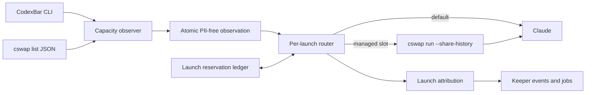

## Overview

Replace Keeper's account-profile, terminal-scrape, usage-projection, and quota-UI stack with a small optional account-routing boundary over the installed CodexBar and claude-swap CLIs. CodexBar gates automatic balancing and observes the ambient account; `cswap list --json` supplies managed-account capacity; every fresh, resumed, or restored Claude process independently selects a route and uses `cswap run --share-history` when a managed account wins.

The end state has no Keeper-owned profile farm, account affinity, reserve latch, usage viewer, or legacy launch path. Missing or unusable integrations always preserve native default Claude behavior, while per-process launch attribution remains available for diagnostics and forensics.

## Quick commands

- `keeper agent accounts check --json`
- `bun test test/account-observation.test.ts test/account-router.test.ts test/agent-account-routing.test.ts test/account-attribution.test.ts`
- `bun run test:full`

## Acceptance

- [ ] With CodexBar absent, stale, malformed, or unsupported, every unforced Claude start/resume/restore uses the native default route without attempting automatic balancing.
- [ ] With CodexBar healthy and claude-swap inventory fresh, each Claude start/resume/restore independently chooses the route with the greatest worst-window headroom, adjusted for concurrent reservations and LRU ties.
- [ ] A managed route executes through the existing public `cswap run <slot> --share-history -- <claude arguments...>` contract without modifying either external repository.
- [ ] Cross-account resume remains conversation-correct and no prior launch attribution influences a later route choice.
- [ ] Keeper creates or reads no account profile farm and exposes no usage viewer, usage frame, usage/profile query collection, scraper worker, or reserve-latch state.
- [ ] Install-time Claude settings seeding remains available, but launch-time settings drift never repairs, rejects, or blocks a launch; claude-swap shares the live canonical settings.
- [ ] Launch attribution records only a PII-free route identifier and remains observational rather than an affinity.
- [ ] The forward-only schema reaches the same final shape from a fresh database and an upgraded database, and deterministic re-fold remains green.
- [ ] Retired on-disk state has a documented, private clean-break archive procedure rooted at `~/archive/keeper-agent-usage/`; Keeper never imports credentials or reads the archive after cutover.
- [ ] Keeper's fast suite and all three full suites pass.

## Early proof point

Task that proves the approach: task 2, `Route Claude through claude-swap`. If exact argv forwarding, cross-account resume, plugin/hook loading, terminal behavior, or same-account fast-path attribution cannot be proven through the public CLI, stop before the retirement tasks and refine the wrapper design rather than patching an external repository.

## References

- `docs/adr/0038-external-capacity-and-per-launch-account-routing.md`
- `CONTEXT.md` — Capacity observation, Account route, Launch attribution, and Launch reservation
- `/Volumes/Scratch/src/steipete--CodexBar/docs/cli.md`
- `/Users/mike/src/realiti4--claude-swap/README.md`
- `fn-1237-matrix-v2-single-host-config` — launch/config contract dependency
- `fn-1238-model-guidance-v2-matrix-cards` — model-aware capacity-selection overlap

## Docs gaps

- **`README.md`**: prune the Keeper-owned usage collection and profile-balancing front-door claims.
- **`docs/install.md`**: replace `usage_models`, scraper, and profile setup with optional CLI discovery, fallback behavior, diagnostics, and the clean-break archive procedure.
- **`CONTEXT.md`**: prune Usage-model registry and `agentusage` after their code surfaces retire, retaining the account-routing vocabulary.
- **`CLAUDE.md`**: prune the profile-directory guard once no Keeper path creates profile directories.
- **`docs/plan-name-retirement.md`**: remove the retired Claude-profile environment surface.
- **`plugins/keeper/skills/query/SKILL.md`**: remove the usage and profiles collections.
- **`plugins/keeper/skills/autopilot/SKILL.md`**: replace usage-viewer guidance with the account-routing diagnostic.

## Best practices

- **Versioned machine boundaries:** validate schema majors and capabilities; accept additive fields but never infer compatibility from human `--version` text alone. [RFC 8259; Kubernetes ExecCredential]
- **Exact process composition:** use direct executable-plus-argv APIs with no shell, bounded output, concurrent stream draining, and explicit deadlines. [Node.js child_process; CWE-78]
- **Unknown is not zero:** stale, malformed, unavailable, or unlaunchable account data disables that candidate rather than presenting spare capacity. [Git porcelain precedent]
- **Credential containment:** keep credentials in claude-swap-owned stores and persist only PII-free route identifiers. [Docker credential helpers; CWE-214]
- **Atomic launch pressure:** serialize selection and reservation updates with short atomic critical sections, never while polling an external CLI or starting Claude. [SQLite isolation; existing Keeper FileLock]

## Alternatives

- Patch CodexBar to expose its app-only claude-swap projection: rejected because Keeper can compose the two existing public contracts directly.
- Patch claude-swap with a machine preparation command: rejected until a concrete public-wrapper proof fails.
- Use global `cswap switch` or `cswap auto`: rejected because it mutates unrelated terminals and cannot isolate concurrent workers.
- Preserve conversation-to-account affinity: rejected because shared history intentionally makes account choice orthogonal to start/resume/restore.
- Keep a reserve account or hysteresis latch: rejected in favor of continuous multi-window headroom plus short-lived launch pressure.
- Retain Keeper profile farms as compatibility state: rejected by the clean-break decision.

## Architecture

The observer is an optional, bounded producer and never a durable source of truth. The DB-free launcher reads its latest validated sidecar, performs one flock-guarded selection/reservation update, and composes either native Claude or the public claude-swap wrapper. Event folding records the route used but never feeds it back into selection.

## Rollout

1. Wait for both dependency epics to close so launch IDs, model cards, and provider resolution are stable.
2. Land observation and selection in shadow mode; `keeper agent accounts check --json` exposes health without reserving or changing launches.
3. Enable per-launch routing and prove exact default, managed, resume, restore, plugin/hook, and same-account-fast-path behavior before any destructive cleanup merges.
4. Land PII-free attribution, then remove Keeper profile creation/linking and every old usage runtime/UI surface.
5. After the finalized code is deployed, create `~/archive/keeper-agent-usage/` with mode 0700 and move retired profile/scraper state into it without reading, transforming, or importing credentials. Abort rather than overwrite an existing archive entry.
6. Run the full suite and the operator smoke commands. Roll back by disabling account routing and restoring the archived directories only with an explicit operator action; no production code reads the archive.
