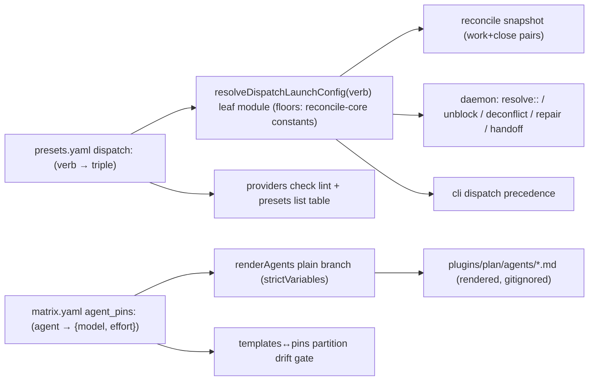

## Overview

Centralize every dispatched skill's model+effort in a per-verb `dispatch:` table of
launch triples in `~/.config/keeper/presets.yaml` (retiring the `worker`/`escalation`
role keys), and every static plan subagent's model+effort in an `agent_pins:` map in
the required host `matrix.yaml`, with the 11 static agents rendered from templates.
End state: retuning a dispatched skill is one `dispatch:` line picked up next
reconcile cycle; retuning a subagent is one `agent_pins:` line plus a re-render.
The decision record is docs/adr/0040 (committed at plan time).

## Quick commands

- `keeper agent presets list` — prints the resolved per-verb dispatch table
- `keeper agent providers check` — lints every dispatch triple against the launch cube (drift exit 9)
- `bun cli/prompt.ts render-plugin-templates` — re-renders agents from templates + pins; fails loud on a missing pin
- `KEEPER_CONFIG_DIR=$(mktemp -d) bun run test:full` — all suites host-blind at fixtures

## Acceptance

- [ ] Every dispatched verb (work, close, resolve, unblock, deconflict, repair, handoff) resolves model/effort through the dispatch table with per-verb-class floors; a `dispatch:`-less catalog produces byte-identical launch argv to the prior defaults
- [ ] A leftover `worker:`/`escalation:` key fails the catalog loud with a migration hint naming the `dispatch:` block
- [ ] `providers check` lints dispatch triples against the cube and `presets list` prints the resolved table (human + JSON)
- [ ] All 11 static plan agents render from templates with frontmatter injected from `agent_pins:`; a missing or extra pin fails loud at render and in the drift gate
- [ ] Full suite green with `KEEPER_CONFIG_DIR` pinned at committed fixtures; no test reads the live `~/.config`

## Early proof point

Task that proves the approach: ordinal 1 (the dispatch table parse + total-floor
resolver). If it fails: re-scope to additive verb keys beside the role keys and
re-plan the cutover order before touching consumers.

## References

- docs/adr/0040-per-verb-dispatch-table-and-host-agent-pins.md — the decision this epic implements
- docs/adr/0033 (superseded catalog-key clause annotated), docs/adr/0036 (required host matrix the pins extend)
- docs/adr/0039 — the Pi agent renderer consumes the RENDERED `plugins/plan/agents/*.md` as source; its implementation is unlanded, so template render must stay upstream of any pi-agent install step and bodies must stay byte-stable
- `fn-1240` (dep) — rewriting the daemon resolve::/deconflict:: dispatch surface this epic reroutes; author task 2 against its landed shape (task-scoped resolve::<taskId>/deconflict::<taskId> share the same verb keys)
- `fn-1241` (dep) — cuts `presets list`/`providers resolve`/`providers check` to the v2 matrix loader; task 3 builds on those verbs post-cutover, and its v2-example test pattern is the model for new verb tests
- Human-confirmed decisions: triples for the table (multi-harness later, claude-only warn-once today, harness carried through); clean replace with migration hint; handoff absent-by-default; pins are {model, effort} pairs in matrix.yaml; four reconcile-core constants stay as floors; whole-file-to-floor on a malformed table (no per-verb salvage); approve resolves through the work row

## Docs gaps

- **docs/install.md**: rewrite the host-config walkthrough — `dispatch:` table replaces the worker/escalation wiring step; add the `agent_pins:` step; fold in the two-file operator migration
- **docs/plugin-composition-map.md**: the "escalation key deliberately independent of worker" passage becomes the per-verb dispatch table; agent-rendering description gains render-time pin injection
- **docs/problem-codes.md**: add the dispatch-triple lint finding rows under the providers check section
- **docs/examples/matrix.example.yaml**: gains `agent_pins:` under its anti-rot test

## Best practices

- **Compile-time totality:** type the floor map `Record<DispatchVerb, ...>` with assertNever so a new verb cannot ship unmapped [practice-scout]
- **Warn once, off the hot path:** deduplicated load-time warning carrying key + observed value + fallback; missing vs malformed logged distinctly [practice-scout]
- **Regenerate-and-diff drift gate:** render into a temp dir against a fixture matrix, diff, fail with "run the generator" [practice-scout]
- **Host-blind CI:** pin KEEPER_CONFIG_DIR at fixtures AND guard the homedir fallback path; never read the live ~/.config [practice-scout, fn-1237 pattern]
- **Config-to-argv hygiene:** triples are operator-authored but validate as untrusted before reaching spawn argv — enum-validated fields, never raw interpolation [practice-scout]

## Alternatives

- Per-verb salvage of a malformed table — rejected (lenient second parse mode; partial-apply confusion); whole-file-to-floor chosen
- Repo-side pins file — rejected (recreates the second config instance ADR 0036 deleted; the renderer already requires the host matrix)
- Pins as launch triples — rejected (frontmatter has no harness axis)

## Architecture

## Rollout

1. Epic lands and finalizes to main.
2. BEFORE the daemon restarts on the new build, the operator migrates the two host files: `presets.yaml` — replace `worker:`/`escalation:` with the seeded `dispatch:` table (work/close/resolve `claude::sonnet::max`, unblock/deconflict/repair `claude::sonnet::high`, handoff omitted); `matrix.yaml` — add `agent_pins:` with the 11 current values.
3. Re-render the agents/workers tree; restart the daemon. If the daemon restarts first, dispatch floors loudly to constants (board keeps moving on defaults) and the CLI surfaces name the leftover key — migrate and it clears.
