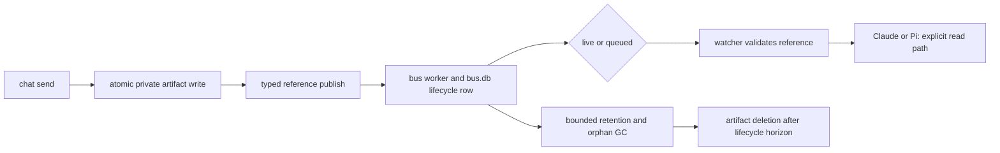

## Overview

Move Agent Bus chat content to private immutable files and send only typed, confined references over the local bus. Every new message presents the same explicit `read <path>` notification regardless of size, while legacy inline rows remain consumable and queued-for-wake references remain valid until delivery plus the ordinary retention window.

## Quick commands

- `bun test test/bus-artifact.test.ts test/bus-cli.test.ts test/bus-db.test.ts test/bus-worker.test.ts test/pi-bus-inbox.test.ts`

## Acceptance

- [ ] Every new Agent Bus chat publish carries only a typed artifact reference; the full message body exists only in a private Bus message artifact.
- [ ] Claude and Pi receive a metadata-only notification that explicitly instructs them to read a confined artifact path, with no body preview.
- [ ] Existing inline messages and queued inline rows remain readable during rollout, while malformed, unsupported, missing, or corrupt references fail loud without arbitrary filesystem access.
- [ ] Artifact retention is bounded, retryable, and coupled to message lifecycle: queued-for-wake artifacts are age-immune and terminally delivered artifacts remain readable for seven days.
- [ ] The fast suite proves live send, wake replay, crash/orphan, integrity, confinement, and mixed-version behavior without starting a real daemon, Worker, or UDS socket.

## Early proof point

Task that proves the approach: task 1. If it fails: reuse the handoff spill and confinement seams rather than weakening the reference boundary or reverting to receiver-side previews.

## References

- `CONTEXT.md` — canonical Bus message artifact definition.
- `docs/adr/0048-file-backed-agent-bus-messages.md` — accepted claim-check, confinement, compatibility, and retention decisions.
- `docs/adr/0043-pi-agent-bus-session-child.md` — watcher lifecycle retained while body transport is superseded.
- `cli/handoff.ts` and `src/daemon.ts` — existing same-host file handoff and confined-read precedent.
- Microsoft Claim-Check pattern: https://learn.microsoft.com/en-us/azure/architecture/patterns/claim-check

## Docs gaps

- **README.md**: add a concise Agent Bus usage note covering file-backed sends and the explicit read-path receive flow.
- **plugins/keeper/skills/bus/SKILL.md**: replace inline/spill guidance with the artifact-reference contract and failure behavior.

## Best practices

- **Typed claim token:** discriminate references by a versioned payload field, never by path-looking text.
- **Private atomic publication:** create complete 0600 files beneath a 0700 root before publishing a reference.
- **Confinement and integrity:** resolve opaque ids beneath the trusted root and verify regular-file type, byte length, and SHA-256 before presenting a read path.
- **Lifecycle-coupled cleanup:** use bounded row-driven retention plus bounded orphan collection; never independently age-delete queued artifacts.

## Alternatives

- Receiver-only spilling was rejected because the body would still travel through and persist in the bus.
- Path-looking text inference was rejected because ordinary content can collide with it and arbitrary paths become read invitations.
- Delete-on-notification was rejected because notification is not consumption and replay may duplicate delivery.

## Architecture

The Bus message artifact is immutable content storage; bus.db remains the routing, status, replay, and retention authority. The local UDS and shared Keeper state root make paths same-host and same-account by contract.

## Rollout

Land the typed codec and artifact primitives first, then enable CLI production/consumption and durable worker replay/retention. The reference's legacy `text` field remains an explicit read instruction so a watcher process already running old rendering code still presents a usable path. Keep the legacy inline decoder until all old queued rows have drained. A rollback must retain reference decoding and the artifact tree until every referenced row has aged out or delivered; reverting to a body-only reader while reference rows exist is not safe.
