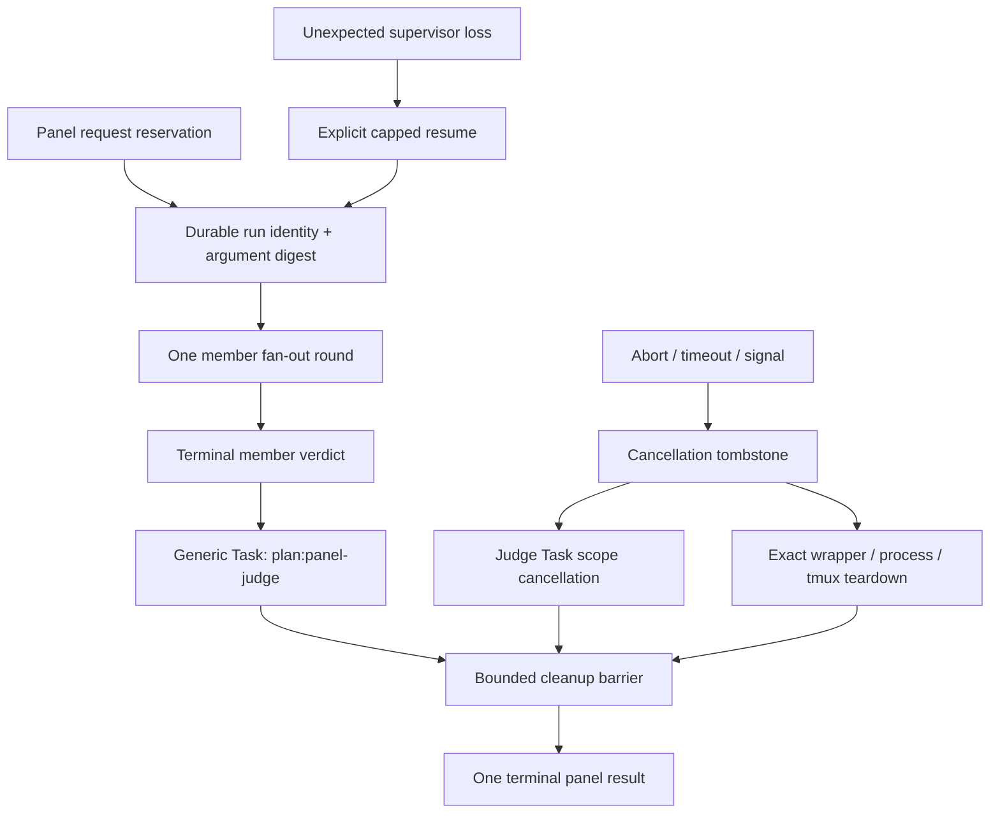

## Overview

Make every panel request an atomically admitted, single-run ownership scope covering member fan-out, the generic Task-owned judge, cancellation, and cleanup. The panel engine enforces launch cardinality and exact child teardown; Claude keeps native Task semantics while the Pi compatibility layer supplies strict named-agent resolution and hierarchical cancellation without changing the shared Task schema.

## Quick commands

- `bun test test/agent-run-capture.test.ts test/pair-panel.test.ts test/agent-panel-cli.test.ts test/pi-task-facade.test.ts test/pi-plan-agents.test.ts`
- `bun run test:full`
- `KEEPER_RUN_SLOW=1 bun test test/pair-panel.slow.test.ts`

## Acceptance

- [ ] One admitted panel request creates one durable run directory and one normal fan-out round; retries reconcile that identity and cannot mint a fresh slug or recursively admit a panel from a member leg.
- [ ] Explicit cancellation reaches every registered member resource and the Task-owned judge, waits for bounded cleanup, and reports exact unresolved identities instead of success.
- [ ] Crash recovery remains distinct from cancellation and uses an explicit, capped resume operation under the original request identity.
- [ ] Claude and Pi invoke the judge through the unchanged `Task(subagent_type, description, prompt)` contract; Pi strictly resolves the named agent and acknowledges hierarchical cancellation.
- [ ] Fake and injected tests cover launch amplification, partial launch, `no_message`, timeout, failed quorum, cancellation races, output failure, stale identities, and cleanup escalation before any real panel smoke is allowed.

## Early proof point

Task that proves the approach: task 1. If exact child identity cannot be durably exported before capture waiting begins, keep panel admission disabled and narrow the control artifact until teardown can target only positively owned resources.

## References

- `docs/adr/0051-panel-run-ownership-and-task-cancellation.md`
- `docs/adr/0039-pi-task-facade-and-plan-agent-rendering.md`
- `docs/adr/0043-pi-agent-bus-session-child.md`
- `docs/adr/0046-described-panel-roster-ladder.md`
- `CONTEXT.md`

## Alternatives

Prompt-only retry discipline is insufficient because models can recurse or invent fresh slugs. Launching the judge through detached `keeper agent run` is also rejected because it loses typed-agent policy and generic foreground Task ownership.

## Architecture

## Rollout

Land the deterministic child-control seam and panel state machine before changing the shared runner. Land pi-subagents ownership support before Keeper requires its stronger RPC contract. Keep real inference disabled until the fake gate is green; after the epic lands, run one deliberately small panel, verify exactly the configured member count, abort it once, and confirm the run directory reports no live wrapper or tmux child before lifting the CodexBar retry gate.

## Docs gaps

- **README.md**: document one-request/one-run behavior, cancellation, and retry safety concisely.
- **docs/problem-codes.md**: document machine-visible duplicate, cancellation, and cleanup-failure outcomes if introduced.
- **docs/install.md**: state the Pi Task RPC/runtime requirement and verification behavior.

## Best practices

- **Atomic admission:** claim request identity before launch and reject identity/argument mismatches.
- **Structured cancellation:** cancellation settles only after owned children and cleanup settle; sending a signal is not completion.
- **Positive teardown identity:** persist PID start time, process ownership, and exact socket-qualified tmux targets before destructive cleanup.
- **Injected proof first:** fake clocks, spawners, Task controllers, and tmux adapters must prove cardinality and race behavior before a bounded real smoke.
