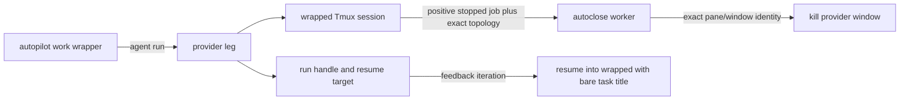

## Overview

Provider legs run inside the shared `wrapped` Tmux session but currently leave stopped windows resident, while resumed turns can escape that session and retain a redundant `wrapped::` title prefix. Make the dedicated session an explicit autoclose boundary, preserve it across resume, and keep titles as display-only bare task IDs while exact run and tmux identities continue to own lifecycle operations.

## Quick commands

- `bun test test/autoclose-worker.test.ts test/keeper-guard.test.ts test/agent-run-capture.test.ts plugins/prompt/test/parity.test.ts`
- `bun run test:full`

## Acceptance

- [ ] A positively stopped provider-leg window in the shared `wrapped` session is autoclosed through the existing exact-identity, grace, pause, config, prompt, generation, and blast-cap rails.
- [ ] Running or ambiguously observed provider legs are never closed merely because a capture chunk timed out or a title matched.
- [ ] Fresh and resumed provider-leg turns stay in `wrapped` and use bare task-ID titles without making those titles lifecycle identity.
- [ ] Stopped legacy `wrapped::<task-id>` windows remain eligible for convergence.
- [ ] Generic pair, panel, debug, and resident agent-run behavior remains unchanged.

## Early proof point

Task that proves the approach: task 1. If the existing autoclose decision core cannot admit a dedicated wrapped bucket without weakening exact-identity rails, fall back to a persisted true-stop cleanup posture scoped to provider-leg launches.

## References

- `docs/adr/0056-wrapped-provider-leg-window-lifecycle.md`
- `docs/adr/0050-wrapped-delegation-guard.md`
- `docs/adr/0051-panel-run-ownership-and-task-cancellation.md`
- `docs/adr/0055-harness-activity-dispatch-claims-and-resource-holds.md`
- tmux lifecycle and stable-ID behavior: https://man7.org/linux/man-pages/man1/tmux.1.html

## Docs gaps

- **`docs/install.md`**: consolidate the autoclose operations paragraph to include provider-leg windows, legacy convergence, and resume-safe shared-session behavior.
- **`docs/plugin-composition-map.md`**: describe the wrapped provider-leg launch, bare-title, resume-placement, and daemon cleanup topology.

## Best practices

- **Exact targeting:** use persisted tmux window/pane identity for cleanup; duplicate display titles are legal and cannot authorize teardown. [tmux manual]
- **Positive stop evidence:** never equate a chunk timeout, missing transcript, or ambiguous transcript with a stopped Harness session.
- **Session recreation:** treat disappearance of the last-window `wrapped` session as normal and reuse the existing race-safe create-or-join launch seam.
- **Display/identity separation:** task IDs may label windows and Harness sessions, but waiting, cleanup, and continuation stay keyed by run handle, exact tmux identity, and Harness resume target.

## Alternatives

- A client-side `--reap-window-on-stop` contract was rejected because cleanup would depend on the original wrapper or a later waiter returning; daemon-owned autoclose converges after wrapper loss.
- Reusing `--reap-window-on-terminal` was rejected because it tears down after a chunk-level `timed_out` result while the provider may still be running.
- Moving provider legs into the `autopilot` session was rejected because the parent `work::<task-id>` remains the sole Board-work owner and provider legs are non-owning Harness sessions.

## Architecture

## Rollout

The autoclose classifier accepts both bare task-ID titles and the legacy `wrapped::<task-id>` form, so existing stopped windows converge without a migration. The global autoclose off-switch and autopilot pause remain rollback controls; reverting the classifier leaves windows resident without losing Harness transcripts or provider results.
