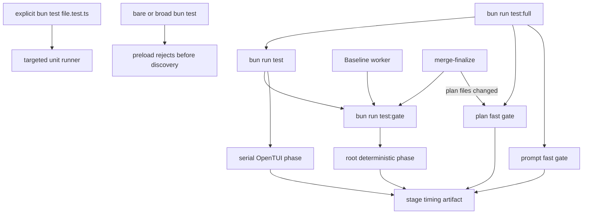

## Overview

Replace keeper's contention-sensitive, integration-heavy test topology with one explicit deterministic correctness contract. The end state rejects accidental aggregate `bun test`, gives humans, Baseline, and merge-finalize stable named gates, and removes real-git/tmux/process/storage/scale/wall-clock correctness journeys in favor of narrow injected seams and a compact SQLite integrity matrix.

This intentionally accepts less integration coverage so every landing proof is cheap enough to run continuously and trustworthy enough not to bypass. Production dogfooding and manual diagnostics remain the integration safety net; no opt-in slow correctness tier survives.

## Quick commands

- `! bun test 2>&1 | grep -F 'use bun run test'`
- `bun test test/test-gate.test.ts`
- `bun run test:gate`
- `bun run test`
- `bun run test:full`
- `KEEPER_TEST_ENFORCE_BUDGET=1 bun run test:full`

## Acceptance

- [ ] Direct aggregate `bun test` fails before test discovery in the root, plan, and prompt package directories, while explicit `*.test.ts` targets remain available.
- [ ] Humans, Baseline, and merge-finalize invoke stable named gate scripts; no production code parses the first segment of a package-script `&&` chain.
- [ ] All landing-blocking correctness coverage runs in deterministic fast package gates; root slow E2Es, plan real-git promotion coverage, and every opt-in slow correctness tier are removed.
- [ ] The fast gates contain no real git, tmux, daemon/Worker/UDS journey, detached process, production-scale fixture, hardware-sensitive performance assertion, or fixed real-time sleep.
- [ ] Current-schema consumers clone migrated templates; real migration execution is limited to a compact, explicit integrity matrix.
- [ ] Root storage coverage uses tiny file-backed SQLite only where persistence, corruption, reopen, or atomic-file semantics are the contract; repeated VACUUM/backup/reclaim journeys are absent from the default gate.
- [ ] Required suite/package/phase membership fails closed on omission or zero discovery, and OpenTUI remains a serial non-isolated phase.
- [ ] Every run emits monotonic per-stage and total timing data; reference enforcement applies the accepted 15s `test:gate`, 18s `test`, and 30s `test:full` hard ceilings while reporting 10s/12s/20s objectives.
- [ ] Test execution remains lock-free, sandboxed, per-run capped, process-group bounded, and protected by exact orphan-worker cleanup.

## Early proof point

Task that proves the approach: task 1. If the preload cannot reliably distinguish sanctioned aggregate children from explicit targeted files on pinned Bun, keep the named gate contract and enforce accidental aggregate use through the existing quote-aware command guards plus a fail-fast root sentinel while preserving targeted commands.

## References

- `docs/adr/0057-named-fast-gate-and-deterministic-proof-policy.md`
- `docs/adr/0005-suite-baseline-store.md`
- `docs/adr/0029-daemon-load-surface-fingerprint.md`
- `docs/adr/0051-panel-run-ownership-and-task-cancellation.md`
- `test/helpers/template-db.ts`
- Bun test discovery/configuration documentation
- SQLite in-memory and WAL documentation

## Docs gaps

- **CLAUDE.md**: consolidate the canonical aggregate/targeted commands and prohibit slow correctness, fixed sleeps, and uncontrolled process/storage work in fast gates.
- **docs/testing.md**: add one authoritative contributor guide for gate membership, preserved proof obligations, diagnostics, budgets, and targeted-test syntax.
- **README.md**: link briefly to the testing guide without duplicating its command matrix.
- **docs/install.md**: remove obsolete direct slow/E2E validation recipes and point operations checks at surviving diagnostics.
- **plugins/plan/CLAUDE.md**: remove stale Python/full-suite and real-git promotion descriptions.

## Best practices

- **Named contract:** one stable package script is consumed by humans and automation; package shell layout is never an API.
- **Dependency-shaped tests:** inject clocks, runners, schedulers, storage, and cleanup decisions; test transitions rather than elapsed time.
- **Tiny honest SQLite:** keep file-backed tests only for semantics an in-memory clone cannot prove; never fake SQL constraints or persistence.
- **No quarantine graveyard:** delete duplicate pseudo-E2E coverage instead of moving it into a slow tier.
- **Separate deadlines from budgets:** hangs fail everywhere; performance hard-fails only on a qualified reference run.

## Alternatives

- Keep bare `bun test` harmless by narrowing discovery: rejected because it still bypasses caps, orphan cleanup, OpenTUI sequencing, and named automation contracts.
- Move expensive tests to a slow tier: rejected because skipped correctness rots and remains an excuse for weak default coverage.
- Increase parallelism or timeouts: rejected because the dominant costs are repeated migrations, physical storage work, subprocesses, scale, and sleeps; more concurrency amplifies host contention.
- Preserve the plan real-git promotion gate: rejected by policy; promotion correctness must be represented by the plan fake-VCS/in-process harness.

## Architecture

## Rollout

Land the named entrypoint and migrate Baseline/merge consumers before changing suite membership. Add timing in report-only mode, then remove migration/storage/time/process costs in parallel cleanup lanes. Delete slow tiers only after their unique invariants have narrow replacements or are explicitly retired. Run ten qualified reference samples, confirm P95 meets the 10s/12s/20s objectives, then enable the 15s/18s/30s enforcement thresholds. Rollback keeps the named scripts and disables only budget enforcement; it never restores first-`&&` parsing or the deleted slow correctness tiers.
