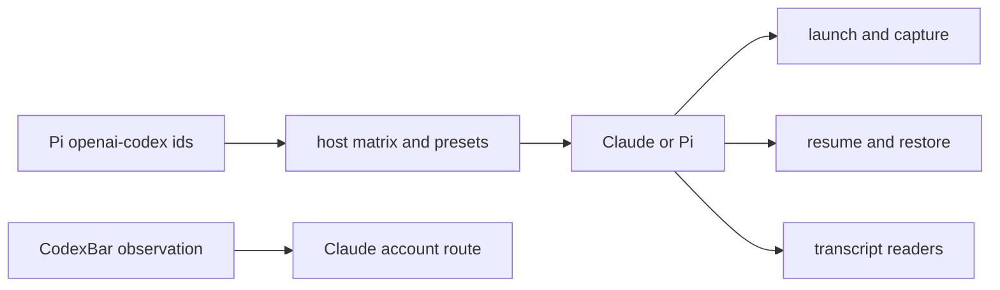

## Overview

Contract Keeper's executable harness boundary to Claude and Pi. Remove every Hermes and Codex harness launcher, capture path, lifecycle producer, trust/state writer, transcript reader, restore path, plugin artifact, and active configuration surface while preserving Pi-hosted OpenAI/Codex launch ids and CodexBar-backed Claude account routing.

This is a clean removal, not historical compatibility. Unregistered harness inputs use ordinary failure, the narrow empty-harness Claude behavior remains only where current Claude restore requires it, and the Codex adoption column is physically removed.

## Quick commands

- `bun test test/agent-harness.test.ts test/agent-config.test.ts test/agent-launch-config.test.ts test/restore-set.test.ts test/transcript-cli.test.ts`
- `bun run test:full`
- `rg -n 'hermes|codex' src cli plugins scripts README.md CLAUDE.md CONTEXT.md docs test`

## Acceptance

- [ ] Claude and Pi are the only harnesses accepted by launch, triples, Providers, panels, capture, resume, restore, and transcript readers.
- [ ] No Keeper runtime resolves, launches, tails, adopts, resumes, restores, or writes configuration for Hermes or the Codex harness.
- [ ] Hermes code, plugins, shim, and host state are removed; Keeper-owned Codex links/indexes are removed without recursively deleting ambient `.codex` credentials, sessions, or unmarked trust.
- [ ] `autopilot_state.codex_adoption` and its CLI, RPC, collection, reducer, producer, and schema surfaces are absent from fresh and upgraded databases.
- [ ] Unknown non-empty harness values cannot reach Claude process creation and receive no retired-harness compatibility treatment.
- [ ] Pi `openai-codex/...` Launch ids and CodexBar/claude-swap account routing remain supported.
- [ ] Current docs describe the Claude/Pi-only contract and `bun run test:full` passes.

## Early proof point

Task that proves the approach: task 1. If it fails, expand that atomic removal across compile-bound launcher branches rather than retaining a retired descriptor or parallel registry.

## References

- `CONTEXT.md` — Supported harness and Launch id definitions.
- `docs/adr/0058-claude-and-pi-supported-harness-boundary.md` — accepted clean-removal decision.
- `docs/adr/0038-external-capacity-and-per-launch-account-routing.md` — retained CodexBar routing.
- `fn-1242-multi-harness-keeper-transcript` — landed generic reader seam and Pi reader.
- `f28f0bba` — landed `gpt` Worker provider family rename, outside this harness removal.

## Docs gaps

- **README.md / CLAUDE.md**: narrow the product and guardrail contract.
- **docs/install.md / docs/examples/matrix.example.yaml**: remove retired defaults/Providers while showing Codex-named models through Pi.
- **docs/problem-codes.md / docs/plugin-composition-map.md**: prune live retired-harness examples.
- **Pair/panel skills, templates, and model guidance**: narrow to Claude/Pi and regenerate managed outputs.

## Best practices

- **Fail at process creation:** command/help removal is insufficient if generic spawn still accepts arbitrary values.
- **Keep namespaces typed:** harness, Pi Launch id, Capability model, Worker provider, and CodexBar observation are independent.
- **Remove producers before schema:** stop Codex adoption and tailing before dropping the column.
- **Preserve bounded Pi parsing:** delete only the Codex transcript reader.

## Alternatives

- A readable retired-harness class is rejected because no historical treatment is wanted.
- An inert adoption column is rejected because physical cleanup is required.
- Lexical deletion of every Codex name is rejected because Pi models and CodexBar remain.

## Architecture

## Rollout

Remove retired Provider/default rows from live config, land producer removal before the schema migration, delete all Hermes host/plugin state and only provably Keeper-owned Codex links/indexes, restart Keeper, regenerate installed artifacts, and run the full test gate. Migration versions are assigned at merge time and the schema fingerprint is re-pinned.
