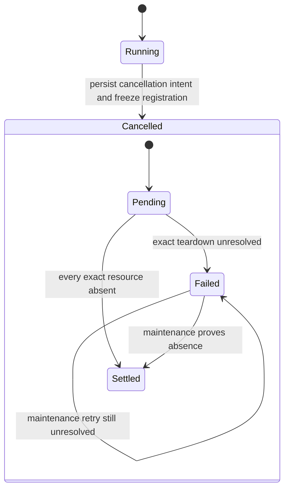

## Overview

Panel cancellation currently proves only that an outer supervisor PID died, allowing detached member windows to survive while the run reports a clean cancellation. Give every Panel leg a durable association to its exact Run-control artifact, separate the monotonic cancellation outcome from reconcilable cleanup status, and make maintenance converge pending or failed teardown across process and host restarts. Restore the daemon safety net by stamping Tmux birth-session provenance on every tracked Pi launch with an explicit session.

## Quick commands

- `bun test test/pair-panel.test.ts test/agent-run-capture.test.ts test/agent-panel-cli.test.ts test/panel-lifecycle-integration.test.ts test/maintenance-worker.test.ts test/agent-launch-config.test.ts test/agent-run-capture-golden.test.ts test/birth-record.test.ts test/autoclose-worker.test.ts`
- `KEEPER_RUN_SLOW=1 bun test test/pair-panel.slow.test.ts`
- `bun run test:full`

## Acceptance

- [ ] Cancellation freezes Panel-run registration and consumes every member attempt's durable exact Run-control artifact, including attempts whose result already exists.
- [ ] A bounded cancellation call reports `cleanup_failed` with exact unresolved `member#attempt` identities while any owned window is unverified, and reports the monotonic cancelled outcome only after cleanup status settles.
- [ ] Panel maintenance automatically retries pending and failed cleanup across initiating-process exit and daemon restart, while unresolved controls remain protected from garbage collection.
- [ ] Missing, malformed, legacy, or ownership-mismatched controls fail closed without title-, PID-, session-, or index-derived teardown.
- [ ] Every keeper-launched tracked Pi process with an explicit Tmux session carries immutable birth-session provenance that daemon autoclose corroborates against live topology.
- [ ] Explicit cancellation, normal exact teardown, and daemon autoclose races converge on already-absent windows without false failure or cross-run destruction.
- [ ] The real abort smoke proves zero surviving wrapper processes, Run-control artifacts requiring cleanup, and Tmux windows without a separate manual reap step.

## Early proof point

Task that proves the approach: task 1. If pre-registering a panel-owned control location cannot close the launch-to-control publication gap, extend the launcher contract to accept a caller-minted run identity rather than discovering or copying controls after launch.

## References

- `docs/adr/0051-panel-run-ownership-and-task-cancellation.md`
- `docs/problem-codes.md#panel-run-lifecycle`
- `src/agent/run-capture.ts` — exact Run-control artifact and idempotent teardown primitives.
- Kubernetes finalizer semantics: https://kubernetes.io/docs/concepts/overview/working-with-objects/finalizers/
- tmux exact target IDs: https://github.com/tmux/tmux/wiki/Advanced-Use
- `fn-1277-autoclose-wrapped-provider-legs` — execution dependency due shared launch/golden test files; behavior remains separate.
- `fn-1278-repair-topology-ownership-binding` — distinct null-Generation repair with no behavioral dependency.

## Docs gaps

- **`README.md`**: revise the owned-panel summary to distinguish cancellation outcome from automatically reconciled cleanup.
- **`docs/install.md`**: consolidate panel cancellation, tracked Pi provenance, exact teardown, and daemon fallback operations.
- **`docs/problem-codes.md`**: define temporary `cleanup_failed`, automatic reconciliation, exact unresolved diagnostics, and eventual cancelled reporting.

## Best practices

- **Finalizer-style convergence:** persist cancellation intent before teardown, reject new registration, and withhold successful settlement until every exact resource is absent. [Kubernetes Finalizers]
- **Exact teardown authority:** consume immutable socket-qualified Run-control artifacts; never rediscover windows from names, PIDs, indexes, or active-session state. [tmux Advanced Use]
- **Truthful partial failure:** treat already-absent as idempotent success, retain unresolved identities and metadata on every inconclusive/error path, and retry with bounded maintenance cadence.
- **Positive provenance:** stamp birth-session facts at launch and corroborate them against current topology before daemon autoclose acts.

## Alternatives

- A SIGTERM/finally handler inside `keeper agent run` was rejected as the primary fix because the Panel run still could not prove teardown, observe failures, survive hard-kill races, or reconcile after process loss.
- Treating wrapper PID death as full cancellation was rejected because detached Harness processes and resident tmux shells outlive supervisors.
- Reconstructing controls from panel titles or current tmux membership was rejected because names collide and ownership-sensitive cleanup must fail closed.
- Keeping `cleanup_failed` as a terminal Panel-run outcome was rejected because automatic cleanup convergence requires progress independent of the monotonic result/cancellation outcome.

## Architecture

Each member attempt pre-registers a panel-owned control location before its wrapper starts. `keeper agent run` publishes the canonical Run-control artifact there immediately after exact tmux launch, or tears the launch down and fails. Foreground cancellation performs one bounded pass; maintenance owns durable retries and GC protection. Pi birth provenance remains a separate fallback path through the existing births tree and autoclose classifier.

## Rollout

Manifest additions remain optional so historical runs stay readable. New launches cannot proceed without a durable exact control association; legacy/missing controls remain fail-closed and operator-visible. Pi provenance is prospective because birth facts are immutable. The existing panel config, cleanup diagnostics, and daemon autoclose off-switch remain rollback controls; no title-based fallback is introduced.
