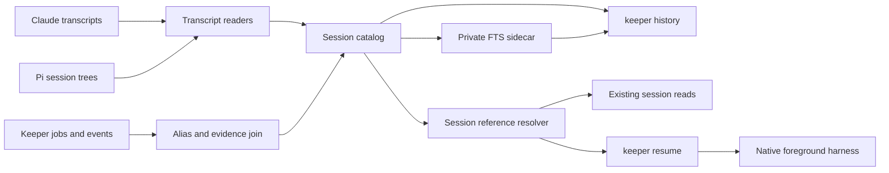

## Overview

Give humans and agents one cross-project history surface for every supported Claude and Pi Harness session, including conversations launched outside Keeper. A shared Session catalog and reference resolver back transcript traversal, full-text search, file evidence, existing session reads, and a foreground `keeper resume`, while titles remain mutable selectors rather than identity.

Full-text data lives in a private, rebuildable FTS5 sidecar rather than `keeper.db`. The public cutover is complete only when the old prompt-only and live-attribution command names, their internal callers, and their authored guidance are gone.

## Quick commands

- `bun test ./test/history-catalog.test.ts`
- `bun test ./test/history-index.test.ts`
- `bun test ./test/history-search.test.ts ./test/history-cli.test.ts`
- `keeper history list --limit 1 --format json`
- `keeper history search "session history" --limit 5 --format json`

## Acceptance

- [ ] `keeper history` lists, shows, searches, and reports file evidence across Claude and Pi projects through one Session reference grammar.
- [ ] Exact native ids, Keeper job ids, and exact current or historical titles resolve consistently; distinct matches remain visible ambiguity and never collapse by recency.
- [ ] Native sessions without Keeper jobs remain discoverable and searchable, while Keeper-only reads report `not_tracked` honestly.
- [ ] Full-text search is incrementally refreshed from native transcripts through a private, independently rebuildable FTS5 sidecar with bounded results and stable provenance.
- [ ] Observed mutation, possible mutation, and textual mention are distinct file-evidence classes with source and path provenance.
- [ ] `keeper resume` selects the correct supported harness, refuses positively live sessions, validates the artifact-derived project directory, prints an exact shell-safe re-invocation from the wrong directory, and otherwise runs the native harness in the foreground.
- [ ] `search-history` and `find-file-history` are absent from the public command tree and every in-repository caller or authored prompt uses the unified surface.
- [ ] The accepted Claude/Pi harness boundary, event-sourcing invariants, native trust prompts, and unrelated working-tree changes remain intact.

## Early proof point

Task that proves the approach: task 2, the private FTS index. If incremental ingestion or atomic rebuild cannot meet the contract, stop before exposing the CLI and narrow the sidecar to explicit lock-serialized refresh while preserving the same catalog and query interfaces.

## References

- `docs/adr/0062-unified-session-history-and-resume.md`
- `docs/adr/0058-claude-and-pi-supported-harness-boundary.md`
- `CONTEXT.md` — Session reference, Session catalog, History index, and File evidence
- `/Users/mike/docs/keeper-session-history-cli-reference.md`
- https://www.sqlite.org/fts5.html
- https://github.com/earendil-works/pi/blob/main/packages/coding-agent/docs/session-format.md
- `fn-1288-handoff-capture-and-handle-semantics` (overlap) — agent launch/target semantics share integration files, so this epic follows it.

## Docs gaps

- **README.md**: replace separate history readers with the unified history and foreground-resume surface.
- **docs/problem-codes.md**: document resolver, index, evidence, and resume failure envelopes.
- **CONTEXT.md**: keep the newly established session-history vocabulary aligned with the landed behavior.
- **/Users/mike/docs/keeper-session-history-cli-reference.md**: refresh the external operational reference after the code lands without making it a worker acceptance gate.

## Best practices

- **Native identity first:** preserve harness-qualified native ids and treat every title as an alias, never a key. [Claude/Pi session docs]
- **Visible ambiguity:** convenience selectors resolve only when unique; candidates carry enough metadata to choose safely. [Git disambiguation precedent]
- **Derived private index:** source transcripts remain authoritative and a failed rebuild leaves the previous closed index usable. [SQLite FTS5]
- **Literal-by-default search:** advanced FTS syntax is explicit so punctuation and user text cannot accidentally become operators. [SQLite FTS5 query syntax]
- **Evidence grading:** a mention or bounded shell inference never becomes a confirmed mutation. [Claude hook and Pi tool-result semantics]
- **Native foreground resume:** argv stays shell-free and process control preserves terminal signals and native trust prompts. [Node child process guidance]

## Alternatives

- Extending each existing reader independently keeps selector and coverage drift, so every session-taking surface instead consumes one resolver.
- Putting FTS in `keeper.db` couples external rebuildable text to the deterministic control-data store, so the index has an independent lifecycle.
- Scanning every transcript from scratch per query avoids storage but makes repeated agent traversal unnecessarily expensive.
- Semantic embeddings remain a separate decision because provider disclosure, model versioning, cost, and purge behavior are unresolved by full-text search.

## Architecture

## Rollout

The epic waits for the Claude/Pi harness retirement and overlapping launch-handle work. The new history surface lands alongside old readers until the final task migrates every caller and removes the obsolete public names in one repository state. The index is lazily created or explicitly rebuilt from native artifacts; deleting its closed database is the rollback and purge path. Reverting the CLI cutover leaves native transcripts and `keeper.db` untouched.
