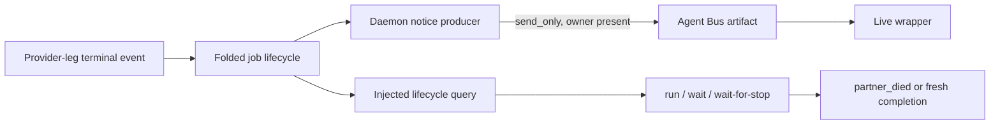

## Overview

Make Provider-leg failure immediately visible to its wrapper through two independent rails. Capture waits re-derive folded lifecycle state and return a typed `partner_died` result instead of serving stale transcript evidence or exhausting the timeout, while a daemon producer sends a low-latency, owner-only Agent Bus notice after an authoritative terminal transition.

The durable pull path is correctness; the Bus push is a best-effort fast path. This epic deliberately does not add the durable wrapper-attempt-to-leg ownership edge, cascade termination, Dispatch-claim release, or any commit-work behavior.

## Quick commands

- `bun test ./test/agent-pair-subcommands.test.ts ./test/agent-run-capture.test.ts ./test/agent-run-capture-golden.test.ts ./test/agent-transcript-background.test.ts`
- `bun test ./test/provider-leg-death-notice.test.ts ./test/bus-worker.test.ts ./test/autoclose-worker.test.ts`
- `bun run typecheck`

## Acceptance

- [ ] `keeper agent run`, `agent wait`, and `wait-for-stop` return a typed `partner_died` without consuming the stop timeout when the exact run-id partner is already terminal or becomes terminal during either transcript-discovery or stop-wait phases.
- [ ] A settled stop and message proven fresh for the current invocation retain normal completion semantics; prior-turn evidence cannot satisfy a resumed or delayed capture.
- [ ] Every authoritative `ended` or `killed` transition for a wrapped Provider leg is eligible for an owner-only, versioned Agent Bus notice on the next healthy daemon tick without creating Bus Presence or replaying historical deaths.
- [ ] Bus loss, missing Presence, ambiguous interim ownership, or direct-path handles without lifecycle identity fail safe: no wrong recipient, no false death claim, and no effect on Fold or capture correctness.
- [ ] Fast tests prove already-dead, dies-during-path, dies-during-stop, stop/death race, stale-stop, boot-fence, retry/dedup, ambiguous owner, and `send_only` behavior without a real daemon, Worker, UDS, Tmux, or subprocess.

## Early proof point

Task that proves the approach: task 1. If exact job identity cannot remain available to the DB-free capture stack through an injected seam, keep the public outcome contract and move the projection lookup behind an existing dep-free daemon-query boundary rather than importing SQLite.

## References

- `docs/adr/0069-provider-leg-death-notices-and-honest-waits.md`
- `docs/adr/0056-wrapped-provider-leg-window-lifecycle.md`
- `docs/adr/0048-file-backed-agent-bus-messages.md`
- `docs/agent-surface-contracts.md`
- `~/docs/keeper-legdeath-epic-planning-state.md`

## Docs gaps

- **`docs/agent-surface-contracts.md`**: revise the answer-envelope outcome set and wait contract in place for `partner_died`; preserve schema version when the nine-key shape is unchanged.
- **`CONTEXT.md`**: glossary terms are deliberately deferred to post-fn-1295.3 operator consolidation; that active prune should target about 136 lines so the accepted ADR's Provider-leg death-notice and `partner_died` definitions can be absorbed without crossing the 140-line cap.

## Best practices

- **Monitor, do not link:** report Provider-leg death without coupling wrapper lifetime or authorizing teardown.
- **Push plus durable pull:** use the Bus for latency and folded lifecycle state for correctness.
- **At-least-once with idempotency:** key duplicate suppression on terminal event id; do not promise exactly-once delivery.
- **Tri-state evidence:** unknown lifecycle identity stays unknown rather than becoming death.
- **Bound main-loop work:** cap sends per tick and retry only bounded transient/ambiguous transport outcomes.

## Alternatives

- A durable queued notice was rejected until an attempt-fenced ownership edge exists because an old leg's notice could reach a replacement wrapper.
- PID-only liveness was rejected because PID reuse cannot establish identity; direct transcript paths therefore retain transcript-only semantics.
- Sending from a Fold was rejected because side effects and live Presence violate replay determinism.
- A second capture envelope was rejected in favor of extending the existing closed outcome union.

## Architecture

## Rollout

Land the capture rail and daemon notice producer behind their existing command/daemon lifecycles; no migration or RPC is introduced. After epic finalize, restart keeperd so the notice producer is loaded, then smoke one disposable wrapped leg termination and confirm one Bus artifact plus an immediate typed wait result. Roll back by reverting the producer integration and outcome extension; folded lifecycle data remains unchanged.
