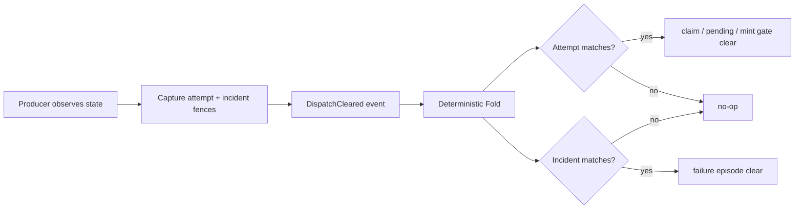

## Overview

Close the remaining gap in Keeper's Dispatch-attempt model: every modern `DispatchCleared` becomes an exact compare-and-clear operation instead of key-wide authority. A delayed clear may remove only the attempt-owned and incident-owned state it originally observed; newer claims, launch reservations, mint gates, and incident episodes survive unchanged.

The work is serialized behind fn-1296 because both change `src/daemon.ts`. It establishes the safety prerequisite for durable wrapper→Provider-leg ownership and cascade termination.

## Quick commands

- `bun test ./test/reducer-projections.test.ts ./test/db.test.ts ./test/refold-equivalence.test.ts`
- `bun test ./test/autopilot-worker.test.ts ./test/daemon.test.ts ./test/rpc-handlers.test.ts`
- `bun run typecheck`

## Acceptance

- [ ] A delayed or duplicate clear for attempt A cannot release, delete, or re-arm state owned by newer attempt B.
- [ ] Claimless Sticky and Distress incidents clear only their exact incident episode and never authorize Dispatch-claim release.
- [ ] Human retry retains its public key-only input while binding internally to the exact owners observed at append time.
- [ ] Never-bound and instant-death streak evidence survives operator retry and resets only on existing positive recovery evidence.
- [ ] Historical tokenless events remain deterministic and bounded to legacy-unfenced state without forcing a production re-fold.
- [ ] Every automatic producer, direct mint path, durable gate, and in-memory gate follows the same fence contract with pure race coverage.

## Early proof point

Task that proves the approach: task 1. If the two-fence projection model cannot express an existing clear producer without guessing ownership, that producer must stop using `DispatchCleared` rather than widening either fence into a wildcard.

## References

- `docs/adr/0070-attempt-and-incident-fenced-dispatch-clears.md`
- `docs/adr/0055-harness-activity-dispatch-claims-and-resource-holds.md`
- `docs/adr/0024-stuck-sentinel-orphan-reconciliation.md`
- `CONTEXT.md` — Dispatch attempt and Dispatch claim definitions
- Kubernetes UID delete preconditions: https://kubernetes.io/docs/reference/using-api/api-concepts/
- Temporal task-attempt validation: https://docs.temporal.io/activity-execution

## Docs gaps

- **ADR 0055 / ADR 0024:** ADR 0070 amends their generic clear wording in one cap-compliant record; implementation comments must point to the modern exact-fence contract rather than restating history.

## Best practices

- **Exact equality, never ordering:** acquisition may be monotonic, but release authority requires the exact incarnation.
- **Capture before delay:** preserve the originally observed attempt and incident through every asynchronous boundary.
- **Resource-side enforcement:** producer checks reduce noise; the Fold repeats the comparison authoritatively.
- **Idempotent stale no-op:** duplicates and old clears allocate no authority and remain diagnosable.
- **No tokenless modern events:** compatibility reads old history but never grants missing fields modern wildcard power.

## Alternatives

- Key-only or `incoming <= current` release was rejected because it authorizes the stale actor the fence exists to stop.
- A five-token fence vector was rejected: breaker streaks are cross-attempt evidence and no longer belong to the clear effect set.
- An immediate rewind was rejected because replaying millions of events adds operational risk while historical released rows are inactive.
- One monolithic task was rejected because projection safety can land green before producer activation.

## Architecture

## Rollout

Task 1 adds nullable owner metadata and fold compatibility without activating modern producers. Task 2 activates fence carriage only after the projection contract exists. Deployment is prospective and requires the ordinary daemon reload after fn-1296 and this epic land; no forced replay occurs. Roll back task 2 first if producer integration fails, retaining the additive schema and safe parser.
