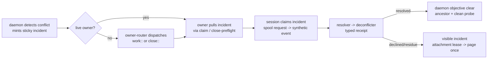

## Overview

Invert merge timing so every merge incident has a live owner: provision stops pre-merging fan-in (the work session integrates at claim time via resolver/deconflicter subagents), finalize splits into integrate (a live closer under a per-repo trunk lease with fencing token and tri-state ancestry gate) and teardown (daemon), and a level-triggered owner-router dispatches the owning work or close verb for any incident with no live owner. Incidents are pulled through the claim and close-preflight envelopes over existing sticky rows; live incident claims double as exclusion locks the recover and freshness passes honor. This epic sits behind the operator review gate.

## Quick commands

- `bun test test/daemon.test.ts test/reducer-projections.test.ts` — router, claim, and fold suites green
- `bun test test/refold-equivalence.test.ts` — determinism preserved
- `keeper prompt render-plugin-templates --project-root plugins/plan --check` — skill renders drift-free

## Acceptance

- [ ] A fan-in conflict is resolved inside the owning work session (or terminally declined into a visible incident) with no resolver or deconflict session dispatched
- [ ] A close-sink conflict is resolved inside a live closer holding the trunk lease; the daemon performs teardown and origin push only after objective verification
- [ ] An incident with no live owner causes exactly one owning-verb dispatch (never an escalation verb), nothing dispatches while autopilot is paused, and page-once fires only after the bounded attachment attempts exhaust
- [ ] The recover pass never aborts a merge under a live incident claim, and base-freshness conflicts defer instead of escalating

## Architecture

## Alternatives

- Keeping daemon-side merges and attaching helpers only to live sessions was rejected: nearly all merge incidents are ownerless at detection, so the fallback would have been the main path
- Windowless top-level escalation processes (nohup, no tmux) would cut sprawl but keep the full session lifecycle machinery and plugin boot cost — rejected as destination, acceptable only as never-needed interim

## Rollout

Authority flips when this epic lands: provision stops creating resolver-chain trigger rows, so the legacy merge-escalation sweeps idle against a drained input and are physically removed by the retirement epic. Any sticky rows minted before this epic keep their stamped latch markers and drain through the legacy path. The recover pass keeps its backstop role for crash residue and closed-epic bases throughout.

## References

- docs/adr/0089-in-session-escalation-subagents.md — the decision this epic implements (spool-request contract, tri-state gate, content-vs-liveness blindness)
- docs/adr/0070 — incident-fenced clear identities the claim envelope must carry
- docs/adr/0055/0078/0085 — the claim family the incident claim and trunk lease join
- The cross-epic merge-gate discipline — the existing tri-state DEFER precedent

## Docs gaps

- **CLAUDE.md autopilot section**: the worktree paragraph's resolver/deconflict chain wording goes stale here — rewritten wholesale by the retirement epic; this epic edits only statements that become actively false

## Best practices

- **Fencing at the mutation:** the trunk lease token is validated where the git write happens; expiry is never the correctness boundary
- **Re-probe inside the fence:** the ancestry check and default-tip compare run inside the held lease immediately before the merge — never cached from before acquisition
- **Reason before acquiring:** all subagent deliberation happens before the lease; the lease covers only mechanical git operations
- **Residue is a new incident:** a wedged MERGE_HEAD quarantines with full metadata; nothing deletes MERGE_HEAD by hand and the existing sole-owned abort carve-outs stay
