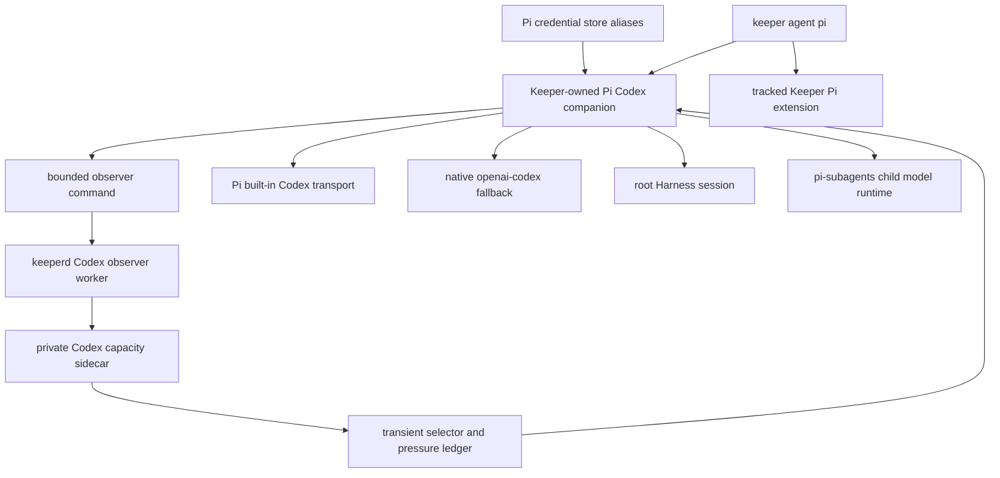

## Overview

Give every Keeper-launched Pi root and pi-subagents child capacity-aware access to the operator's authorized Codex subscriptions without moving OAuth credentials into keeperd. A Keeper-owned companion package wraps Pi's Codex stream, while a separate daemon-published observation and transient pressure ledger coordinate account choice across processes; standalone Pi remains native and pool failures visibly fall open to Pi's existing credential.

## Quick commands

- `bun run test:gate`
- `bun run typecheck`
- `bun test ./integrations/pi-codex-pool/test/provider-pool.test.ts ./integrations/pi-codex-pool/test/observer.test.ts ./test/codex-account-observation.test.ts ./test/codex-account-router.test.ts ./test/codex-account-observer-worker.test.ts ./test/agent-account-routing.test.ts ./test/agent-pi.test.ts`

## Acceptance

- [ ] Keeper-launched Pi roots and inherited pi-subagents child runtimes select independently from authorized opaque Codex aliases while standalone Pi remains byte-for-byte on its native provider path.
- [ ] keeperd publishes only a bounded, versioned, credential-free Codex capacity observation; cross-process pressure and cooldown state remain transient and never enter a Projection or mutating RPC.
- [ ] A logical provider call can move once to a different alias only before Substantive output, preserving abort and provider options; partial output, unknown events, and user cancellation never replay.
- [ ] Missing, stale, or broken pool machinery falls open visibly to Pi's native `openai-codex` credential without affecting non-Codex models.
- [ ] Package, daemon, launcher, installer, diagnostics, secret scanning, and root/child compatibility tests pass with no real credential, daemon, subprocess, socket, or tmux use in correctness gates.
- [ ] Pool activation stays gated on the separate live two-account proof epic; implementation completion alone does not claim production balancing.

## Early proof point

Task that proves the approach: task 1. If Pi's provider or credential APIs cannot satisfy the contract, retain the recorded provider-boundary proof, keep native Pi active, and stop before adding daemon or launcher dependencies.

## References

- `docs/adr/0090-keeper-managed-pi-codex-account-pool.md`
- `CONTEXT.md` account-routing glossary
- `/Users/mike/docs/pi-codex-provider-routing-proof.md`
- `/Users/mike/docs/pi-codex-multi-account-subagent-balancing-context-2026-07-17.md`
- `docs/adr/0079-mandatory-claude-swap-routing.md` — analogous Claude mechanics, not a schema to widen
- https://github.com/earendil-works/pi-mono/blob/main/packages/coding-agent/docs/custom-provider.md
- https://developers.openai.com/codex/auth

## Docs gaps

- **README.md**: add a concise optional Pi Codex pooling summary and link to operations.
- **docs/install.md**: consolidate alias enrollment, Keeper-only activation, diagnostics, retry limits, and recovery.
- **docs/problem-codes.md**: describe sanitized pool and launch failures with retry guidance.
- **docs/plugin-composition-map.md**: show the companion package, tracked Pi extension, and inherited model-runtime boundary.
- **docs/testing.md**: record the companion compatibility and secret-safety gates.

## Best practices

- **Single retry owner:** disable or account for transport retries below the wrapper so attempts cannot multiply. [Pi custom-provider docs]
- **Event-level cutoff:** text, thinking, tool-call, and unknown stream events close the retry window; generic start alone may be withheld. [Pi stream contract]
- **Credential confinement:** resolve aliases only inside the companion and never serialize token-bearing objects. [OWASP Secrets Management]
- **Account-scoped transport:** key reusable Codex transports by account alias and session so authenticated connections never cross aliases. [Pi AI provider notes]
- **Triangular fork workflow:** keep local integration and clean upstream proposal branches in separate worktrees. [GitHub triangular workflows]

## Alternatives

- Install a marketplace balancer unchanged — rejected because inspected releases target removed Pi APIs, lack shared coordination, or continue through synthetic user turns.
- Wrap the `Agent` tool — rejected because provider interception covers scheduler, RPC, nested, foreground, and isolated-child paths without duplicating pi-subagents.
- Put credentials in keeperd — rejected because sanitized observation does not justify widening the daemon's secret surface.
- Create a third repository immediately — rejected because the companion is currently meaningful only on Keeper's managed Pi launch path.

## Architecture

## Rollout

Land the package behind Keeper-only extension arming and native fallback, then land the daemon observer and launcher integration without declaring the pool active. The dependent live-proof epic enrolls a second account, exercises genuine root/child routing and failover, verifies artifacts contain no secrets, and records the activation verdict. Roll back by removing the companion arming path; native Pi credentials and standalone behavior remain intact.
