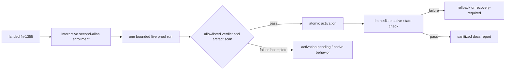

## Overview

Activate Keeper-managed Pi Codex pooling only after the landed implementation proves two real authorized OAuth accounts end to end. One bounded operator run verifies independent refresh, root/child routing pressure, genuine pre-output account failover, visible native degradation, restoration, and complete secret sanitation; a fresh passing machine report is the sole activation authority.

## Quick commands

- `keeper agent accounts check --json`
- `keeper status --json`

## Acceptance

- [ ] Two distinct same-operator Codex account aliases are enrolled through Pi's interactive credential path without credentials, PII, token metadata, or raw provider objects entering captured output or artifacts.
- [ ] One bounded proof run establishes independent refresh and same-alias refresh coalescing, distinct root and child Codex session routes under genuine overlapping Routing pressure, and successful work through both aliases.
- [ ] A provider-supported logout or revocation of the non-native alias produces a classified pre-Substantive-output account failure, one different-alias attempt, exactly one outward response, and verified restoration before proceeding.
- [ ] Temporarily unavailable pool state produces the visible native `openai-codex` degraded path without claiming balanced operation, then normal pool health is restored.
- [ ] An allowlisted private report is bound to the landed revision, configuration, host-local opaque alias set, and one proof window; complete artifact scanning finds no secret/PII material and every missing, stale, interrupted, unknown, or unsanitized clause is non-passing.
- [ ] Activation atomically accepts only that fresh passing report, verifies the active state immediately, and rolls back or reports recovery-required on any mutation/reload/verification failure.
- [ ] A sanitized human proof report is saved under `~/docs/` with its YAML sidecar; raw ledgers, sidecars, transcripts, provider errors, and credential material are never copied into it.

## Early proof point

The single task proves the first live gate: two independently refreshable opaque aliases. If that fails or cannot be observed safely, stop with activation pending and retain native Pi behavior; do not continue into routing, fault injection, or activation.

## References

- `fn-1355-add-pi-codex-account-pool` — landed implementation and operator workflow
- `docs/adr/0090-keeper-managed-pi-codex-account-pool.md`
- `/Users/mike/docs/pi-codex-provider-routing-proof.md`
- https://datatracker.ietf.org/doc/html/rfc9700#section-4.14
- https://developers.openai.com/codex/auth

## Docs gaps

- **`~/docs/pi-codex-account-pool-live-proof.md`**: persist the sanitized live verdict and activation outcome with a YAML sidecar.
- **docs/install.md**: use the already-landed operator workflow; change only if the live run exposes inaccurate current-state recovery guidance.

## Best practices

- **Predefined aggregate verdict:** every clause passes in one bounded run; zero exit codes alone never activate. [Google SRE canary guidance]
- **Interactive credential boundary:** OAuth/MFA/logout/revocation occur outside captured stdout and require explicit human participation. [OpenAI Codex auth]
- **Controlled failure:** target only the non-native alias, restore it before activation, and stop on uncertain blast radius. [Principles of Chaos Engineering]
- **Allowlisted evidence:** construct safe fields at the source and scan every retained artifact; redaction never authorizes raw collection. [OWASP Logging]

## Alternatives

- Treat synthetic or single-account evidence as sufficient — rejected by ADR 0090's production gate.
- Corrupt credential files to create failure — rejected because it tests storage damage and risks unrelated credentials.
- Enable first and observe afterward — rejected because activation authority must precede the mutation.
- Add this live flow to correctness gates — rejected because real OAuth/provider/process work belongs in a landed-dependent operator epic.

## Architecture

## Rollout

Run during an isolated maintenance window with no unrelated standalone Pi work. Stop after any unsafe or inconclusive clause, restore the non-native alias, and leave activation pending. On pass, activate atomically, verify immediately with one root and one child request, write the sanitized report, and retain the landed rollback command as the operator escape hatch.
