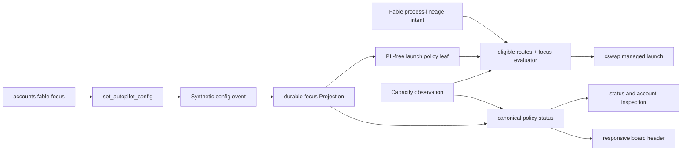

## Overview

Add a durable **Fable focus** that prefers one stable Claude Account route for Fable work, preserves that route for Fable by steering other Claude work elsewhere when alternatives are eligible, and falls back to normal managed-account balancing instead of blocking work. The policy survives restarts, preserves Fable intent across continuation paths, exposes one machine-readable status model, and renders in a responsive two- or three-line `keeper board` header across live, snapshot, frame, and copied output.

The epic carries no dependency on another epic. Its implementation must re-read the account CLI surface before editing because adjacent Codex-pool work may land meanwhile, but no Codex API or structure is required by this Claude policy.

## Quick commands

- `bun test test/fable-focus.test.ts test/account-router.test.ts test/agent-account-routing.test.ts test/agent-resume-policy.test.ts test/tabs.test.ts`
- `bun test test/board.test.ts test/view-shell.test.ts test/live-shell.test.ts test/status.test.ts`
- `keeper agent accounts fable-focus show --json`
- `keeper board --snapshot`

## Acceptance

- [ ] An operator can atomically set, replace, inspect, and clear a Fable focus over any stable managed Claude Account route using permanent, absolute, current-reset, or cycle-end intent.
- [ ] An eligible focused route serves Fable launches; an ineligible target visibly falls back to the unchanged normal managed-route selector rather than blocking Claude.
- [ ] Non-Fable Claude launches avoid the focused route whenever another eligible managed route exists and use it when it is the sole eligible route.
- [ ] Fresh launches, continuations, resumes, restores, and forks apply the same explicit-or-inherited Fable intent without creating conversation-to-account affinity; Pi routing is unchanged.
- [ ] Status, account inspection, live board, snapshot, frames, and copied diagnostics expose one PII-free policy/effective-state contract.
- [ ] The board header uses two lines at normal widths and three compact semantic lines on narrow supported terminals, preserving focus target, lifetime, and focused/fallback state.
- [ ] Guarded current-reset activation refuses stale, elapsed, or mismatched observations without replacing the existing policy or rolling into the next cycle.

## Early proof point

Task that proves the approach: task 1. If the durable Projection-to-launcher delivery cannot preserve one atomic policy identity, stop before routing changes and refine that boundary rather than introducing a second source of truth.

## References

- `CONTEXT.md` — Account route, Capacity observation, Fable focus, Fable intent, Launch attribution, and Launch reservation vocabulary.
- `docs/adr/0092-durable-fable-focus-routing.md` — accepted policy, fallback, lifetime, lineage, and presentation decisions.
- `docs/adr/0079-mandatory-claude-swap-routing.md` — superseded mandatory-routing rationale retained by ADR 0092.
- `docs/testing.md` — named-gate and deterministic in-process test requirements.
- `fn-1355-add-pi-codex-account-pool` — adjacent account-command edits to re-read before implementation; no execution dependency.

## Docs gaps

- **README.md**: briefly expose inspectable Fable focus state and the board surface, linking to the operational guide.
- **docs/install.md**: consolidate Claude account routing around focus, fallback, avoidance, lifetimes, continuation classification, inspection, and guarded activation.
- **docs/problem-codes.md**: document invalid policy, stale/reset mismatch, and safe retry/refusal outcomes.

## Best practices

- **Filter, then prefer:** compute eligible managed routes once and layer focus over the existing selector so policy never resurrects an invalid account. [Kubernetes scheduling]
- **Snapshot reset boundaries:** current-reset resolves to one immutable UTC deadline and never advances after restart. [durable scheduling practice]
- **Evaluate expiration on read:** every launch and status render uses the same injected time; timers may clean up but never define correctness. [Node timing guidance]
- **Soft avoidance:** non-Fable work preserves availability by using the target as the sole eligible fallback. [Kubernetes PreferNoSchedule]
- **One semantic view model:** live, snapshot, frames, copy, inspection, and status derive from the same PII-free fields. [Node TTY guidance]
- **Sanitize diagnostics:** route labels and status text cannot inject control characters or expose credentials/session identifiers. [OWASP Logging Cheat Sheet]

## Alternatives

- Fail closed when the target is unavailable — rejected because quota focusing must not halt work.
- Store intent only in transient account sidecars — rejected because Capacity observations and reservations are not durable operator intent.
- Add an account-specific mutating RPC — rejected because the generic config event is the sanctioned durable-setting boundary.
- Bind a conversation to an account — rejected because process-level Fable intent is independent of Launch attribution and shared-history resume.
- Put policy only in the live banner — rejected because non-live evidence surfaces must remain truthful.

## Architecture

The Projection is authoritative durable intent. The launch leaf is a derived delivery surface for the SQLite-free cold launcher and is atomically republished after mutation and daemon boot. Routing computes eligibility once, applies explicit account choice first, then focus preference/avoidance, then the existing deterministic balance.

## Rollout

- Land all source and documentation before changing live routing policy.
- On the `landed` milestone, re-read slot 2's fresh `model:Fable` observation. Activate only when its reset still matches `2026-07-20T23:59:59Z` through whole-second precision and current time is before that boundary.
- If the boundary is stale, elapsed, or different, leave focus off and report the missed activation; never reinterpret it as the next cycle.
- Verify `fable-focus show --json`, model-scoped account inspection, and the board header after activation.
- Roll back with the idempotent clear command; normal balancing is the resting behavior.
