## Overview

Give Keeper-managed Claude sessions a transcript-derived `/rename` with the same explicit-slug, bounded-input, native-title, and fail-open outcomes as Pi while retaining separate harness implementations. Claude naming uses a non-persistent Haiku print process through the managed Account route; Pi keeps direct host inference. Both expand tightly bounded project-file references before naming so a title reflects referenced content rather than only a filename.

## Quick commands

- `bun test test/session-rename-input.test.ts`
- `bun test test/pi-rename-command.test.ts`
- `bun test test/agent-metadata-inference.test.ts`
- `bun test test/claude-rename-command.test.ts`

## Acceptance

- [ ] Keeper-managed Pi and Claude sessions expose `/rename` with equivalent bare-inference, explicit canonical-slug, invalid-input, and fail-open outcomes while retaining separate harness-native implementations.
- [ ] Naming input follows the active transcript branch, excludes command/tool/thinking/skill noise, weights human intent over assistant detail, and stays within a 16 KiB UTF-8 budget.
- [ ] Human-authored `@path` references expand once from project-contained regular UTF-8 files under the documented count, per-file, aggregate, and final-input caps; unsafe or unavailable references never abort other valid input.
- [ ] Claude inference uses independently selected managed Account routing and a bounded Haiku print process without ambient credential fallback, plugins/tools, persistence, a child Harness session, a Keeper Job, or Session-catalog pollution.
- [ ] Accepted titles commit only through Pi `setSessionName()` or Claude `UserPromptSubmit.sessionTitle`; existing transcript, reducer, and tmux title propagation remains asynchronous and lifecycle-neutral.
- [ ] Overlapping, cancelled, stale, malformed, unavailable, and timed-out operations leave the newest native Session title unchanged.

## Early proof point

Task that proves the approach: task ordinal 2. If a managed print process cannot avoid child-session artifacts while preserving Account routing, stop before Claude command integration and revise the metadata-launch boundary rather than bypassing routing or native title state.

## References

- `docs/adr/0041-pi-direct-inference-for-metadata-commands.md`
- `docs/adr/0092-durable-fable-focus-routing.md`
- `docs/adr/0093-harness-specific-session-rename-inference.md`
- `CONTEXT.md` — Session title, Canonical slug, Harness session, Session catalog, and Account route definitions
- `fn-1359` — managed Account-route behavior consumed by Claude metadata inference

## Docs gaps

- **README.md**: consolidate the Pi-only rename summary into the harness-specific command contract.
- **docs/install.md**: consolidate the existing Pi rename section with Claude availability and subscription behavior; add no setup instructions beyond managed launch behavior.
- **CLAUDE.md**: keep the hook inventory and permitted dependency boundary accurate when the rename hook lands.

## Best practices

- **Native title commit points:** inference produces only a candidate; the harness-native title API remains the sole mutation boundary. [Claude commands; Pi extension docs]
- **Bound every layer:** count, per-file, aggregate expansion, final transcript input, output, wall-clock, and process-tree lifetime each have independent caps. [Pi extension docs]
- **Treat referenced files as untrusted data:** delimit content, disable inference tools, prevent recursive expansion, and validate the resulting slug. [OWASP LLM01]
- **Canonicalize before containment:** require project-contained regular files, reject symlink escapes and special files, and never use lexical prefix checks as security. [OWASP Path Traversal]
- **Preserve managed credentials:** route every Claude process independently and do not inherit ambient provider credentials that can outrank subscription OAuth. [Claude authentication docs]

## Alternatives

- Use Claude's built-in `/rename`: rejected because Keeper cannot apply the shared transcript projection, `@path` policy, managed failure contract, or drift tests.
- Append Claude `custom-title` JSONL directly: rejected because it bypasses live native state and creates a competing transcript writer.
- Spawn bare `claude -p`: rejected because it bypasses Account-route selection and can select ambient credentials.
- Share one runtime command module across Claude and Pi: rejected because Pi's fail-open extension remains an isolated module island.

## Architecture

```mermaid
flowchart LR
  C[Claude /rename skill] --> H[UserPromptSubmit rename hook]
  H --> CT[Active Claude transcript projection]
  CT --> X[Bounded @path expansion]
  X --> ML[Managed metadata launch]
  ML --> AR[Account route and claude-swap]
  AR --> HP[Haiku claude -p]
  HP --> SV[Slug validation]
  SV --> ST[Claude sessionTitle]

  P[Pi native /rename] --> PC[Active Pi context]
  PC --> PX[Bounded @path expansion]
  PX --> PI[Pi direct completion]
  PI --> PS[Pi setSessionName]

  ST --> TT[Native title record]
  PS --> TT
  TT --> TW[Transcript title producer]
  TW --> R[Reducer projection]
  R --> TM[Tmux renamer]
```

## Rollout

The command and hook become available on the next Keeper-managed Claude launch; Pi picks up path expansion on the next managed Pi launch. There is no schema migration or daemon feature flag. Roll back by removing the Claude skill/hook and metadata launch mode together while leaving existing native title records untouched; Pi path expansion can be reverted independently without changing title history.
