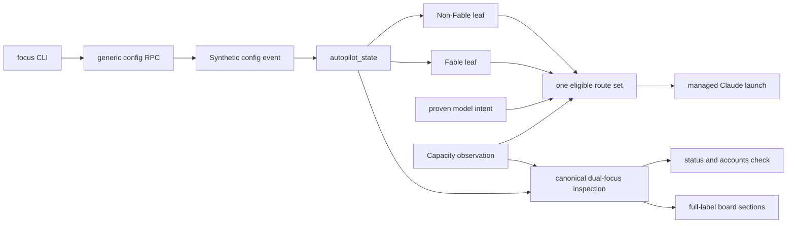

## Overview

Add an independent durable **Non-Fable focus** that prefers one stable managed Account route for proven non-Fable Claude launches while preserving the existing Fable focus and visible fallback to normal Account route selection. The two policies keep independent targets, lifetimes, delivery health, inspection, and board sections; setting both to `claude-swap:2` deliberately directs both proven traffic classes there while their windows overlap.

The rollout target is stable route `claude-swap:2` (the second account, currently displayed as zero-based `c1`) with the fixed request-time deadline `2026-07-21T00:03:50Z`. Activation occurs only after landing, only while `now < deadline`, and only while route 2 is freshly present and eligible; otherwise no policy mutation occurs.

## Quick commands

- `bun test ./test/account-focus.test.ts ./test/fable-focus.test.ts ./test/account-router.test.ts ./test/agent-account-routing.test.ts`
- `bun test ./test/board.test.ts ./test/status.test.ts ./test/db.test.ts ./test/reducer-projections.test.ts`
- `keeper agent accounts non-fable-focus show --json`
- `keeper agent accounts check --json`
- `keeper board --snapshot`

## Acceptance

- [ ] Operators can atomically set, inspect, replace, and clear one permanent or absolute Non-Fable focus over a stable managed Account route without changing the Fable policy.
- [ ] Explicit Account route selection remains highest precedence; proven Fable and proven non-Fable launches use only their matching active focus, then the existing selector chain.
- [ ] An eligible Non-Fable target wins regardless of reservation pressure; an unavailable or ineligible target falls back visibly without making any route eligible or bypassing mandatory claude-swap evidence.
- [ ] A matching Non-Fable focus overrides Fable-target avoidance for non-Fable work, while Fable routing remains neutral toward the Non-Fable target.
- [ ] Unknown model intent does not match Non-Fable focus; fresh and passthrough launches with explicit non-Fable intent do.
- [ ] Fable and Non-Fable durable cells and owner-only leaves fail independently and remain compatible across mixed absent/present policy states.
- [ ] Account inspection, `keeper status`, and the board expose both PII-free desired/effective/delivery views with full labels and shared structured reasons.
- [ ] Guarded post-land activation sets `claude-swap:2` only before `2026-07-21T00:03:50Z` while freshly eligible; missed or refused activation leaves existing policy unchanged.

## Early proof point

Task that proves the approach: task 1. If a second independently delivered policy cannot preserve the active Fable leaf across mutation, restart, and publication failure, stop before selector changes and refine the delivery boundary rather than combining the failure domains.

## References

- `CONTEXT.md` — Account focus, Fable focus, Non-Fable focus, Fable intent, and Account route vocabulary.
- `docs/adr/0100-independent-scoped-account-focus.md` — authoritative coexistence, precedence, lifetime, delivery, and rollout decisions.
- `docs/adr/superseded/0092-durable-fable-focus-routing.md` — preserved Fable-focus rationale and compatibility contract.
- `docs/testing.md` — deterministic in-process correctness and explicit named test gates.

## Docs gaps

- **README.md**: consolidate account-focus overview and link to the operating guide.
- **docs/install.md**: document the two-focus model, stable targets, precedence, fallback, commands, verbose board sections, and guarded activation.
- **docs/problem-codes.md**: extend focus refusal, delivery, fallback, and uncertain-acknowledgement recovery across both scopes.

## Best practices

- **One eligibility pass:** matching focus composes over the existing candidate set and never creates another balancer. [Envoy endpoint override]
- **Independent atomic intent:** each policy updates as one event-owned document and publishes through its own failure-isolated leaf. [event-sourced control practice]
- **Proven classification only:** unknown lineage does not enter a complementary focus merely because it is not proven Fable. [Claude model precedence]
- **Visible fallback:** successful normal selection retains a stable focus-specific reason in inspection/status while default launch stderr stays quiet. [CLI guidance]
- **Half-open fixed deadline:** rollout checks `now < deadline` and never restarts a relative duration after landing. [gRPC deadline practice]
- **Full semantic labels:** board rows wrap without abbreviation and machine consumers use JSON, not terminal text. [Node TTY and CLI guidance]

## Alternatives

- One unscoped focus target — rejected because the two traffic classes require independent targets and lifetimes.
- Treat unknown intent as non-Fable — rejected because a failed lineage lookup could misroute Fable work.
- Make Non-Fable focus reciprocally avoid its target for Fable — rejected because no quota-conservation rule calls for changing Fable selection.
- Combine both policies in one delivery leaf — rejected because a new policy fault must not disable the active Fable focus.
- Fail closed on an unavailable target — rejected because focus controls preference, not global Claude availability.
- Start 9h55m when implementation lands — rejected because the authorized window is anchored to the request-time deadline.

## Architecture

Each policy is independently atomic and independently delivered. Routing classifies one launch, computes eligibility once, honors an explicit route, applies the matching active focus, applies Fable-target avoidance only when no Non-Fable target applies, then delegates to the existing score/reservation/LRU selector.

## Rollout

- Land and reload all code before attempting live configuration.
- Re-read Non-Fable focus and fresh capacity. Require no conflicting rollout-owned policy, route `claude-swap:2` present, and route 2 eligible for proven non-Fable Claude.
- If current UTC time is strictly earlier than `2026-07-21T00:03:50Z`, atomically set an absolute Non-Fable focus to that exact deadline and verify the policy identity through `show`, account inspection, status, and the board.
- If time is equal/later, target is absent/ineligible, daemon acknowledgement is uncertain, or a concurrent human policy exists, make no blind retry or clear; inspect and report the unchanged state.
- Roll back with the idempotent Non-Fable clear command; Fable focus remains untouched.
