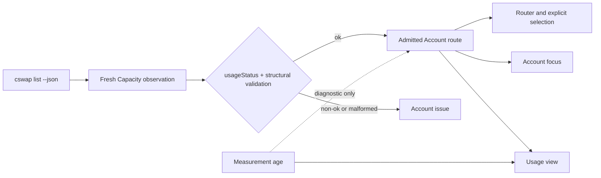

## Overview

Make claude-swap's current versioned machine response the single authority for managed Claude account telemetry trust. Keeper continues to freshness-bound the Capacity observation itself, validate every admitted row structurally, and fail closed on non-`ok` status, but underlying Measurement age becomes diagnostic provenance instead of a second eligibility policy.

The end state keeps automatic routing, explicit Account selection, Account focus, and the Usage view on one admission decision. Raw utilization remains authoritative until claude-swap reports a changed value, so Keeper never becomes more optimistic than the credential-owning producer by advancing an elapsed reset locally.

## Quick commands

- `bun test ./test/account-observation.test.ts ./test/account-observation-refresh.test.ts ./test/account-router.test.ts ./test/agent-account-routing.test.ts`
- `bun test ./test/fable-focus.test.ts ./test/usage.test.ts`
- `keeper usage --snapshot`

## Acceptance

- [ ] A fresh, healthy Capacity observation admits every structurally valid `usageStatus: ok` Account route regardless of its underlying Measurement age, while any fresh non-`ok` status revokes that route.
- [ ] Missing or malformed required provenance/windows, unsupported provider or sidecar schemas, stale Capacity observations, and raw exhausted required meters remain fail-closed.
- [ ] Keeper does not independently clear utilization when a reported reset timestamp elapses; routing, scoring, reservations, and Account focus consume the raw producer-reported percentages.
- [ ] Automatic routing, explicit Account selection, inspection, Account focus, and the Usage view agree on the same admitted route set.
- [ ] The Usage view exposes underlying Measurement age honestly without age-only heartbeat movement becoming semantic history.
- [ ] The transient Capacity sidecar schema prevents observations produced under the prior admission semantics from being reused ambiguously.

## Early proof point

Task that proves the approach: task 1. If it fails, retain the existing fail-closed age gate and do not remove consumer checks until the parser/router contract has one deterministic authoritative projection.

## References

- `docs/adr/0101-claude-swap-owned-measurement-trust.md`
- `CONTEXT.md` — Capacity observation, Account route, Usage meter, Measurement age, and Usage view vocabulary
- `docs/adr/0097-sidecar-backed-dynamic-usage-viewer.md`
- `docs/adr/0100-independent-scoped-account-focus.md`
- https://docs.pact.io/consumer
- https://opentelemetry.io/docs/specs/semconv/general/events/

## Docs gaps

- **README.md**: consolidate the account-routing summary around fresh claude-swap advice rather than fresh underlying measurements.
- **docs/install.md**: distinguish Capacity observation freshness from Measurement age and document producer-owned `usageStatus` admission across routing, focus, inspection, and Usage view behavior.

## Best practices

- **One policy owner:** consume the producer-issued status instead of reconstructing age and reset policy in every consumer. [Pact consumer guidance](https://docs.pact.io/consumer)
- **Separate timestamps:** keep observation time and source measurement time as distinct concepts and diagnostics. [OpenTelemetry event conventions](https://opentelemetry.io/docs/specs/semconv/general/events/)
- **Bound the observation:** retain the freshness ceiling on Keeper's successfully observed response so producer authority never becomes indefinite cached trust. [Envoy xDS API](https://www.envoyproxy.io/docs/envoy/latest/configuration/overview/xds_api)

## Alternatives

- Keep Keeper's independent Measurement-age ceiling: rejected because it creates a second telemetry policy that conflicts with claude-swap's bounded last-good decisions.
- Force claude-swap to poll inside Keeper's ceiling: rejected because claude-swap owns credential safety, provider request budgets, cadence, and backoff.
- Infer availability from TUI bars: rejected because displayable last-good data is not the versioned eligibility contract.
- Advance elapsed reset windows locally: rejected because it can make Keeper more optimistic than the producer.

## Architecture

## Rollout

Publish the producer and consumers together with a transient Capacity schema bump. Existing sidecars become incompatible and routing may fail closed only until the supervised observer publishes the next response on its normal 30–35-second cadence. Rollback is symmetric: the prior binary rejects the newer sidecar and republishes its own schema before selecting routes. No database migration or credential operation is involved.
