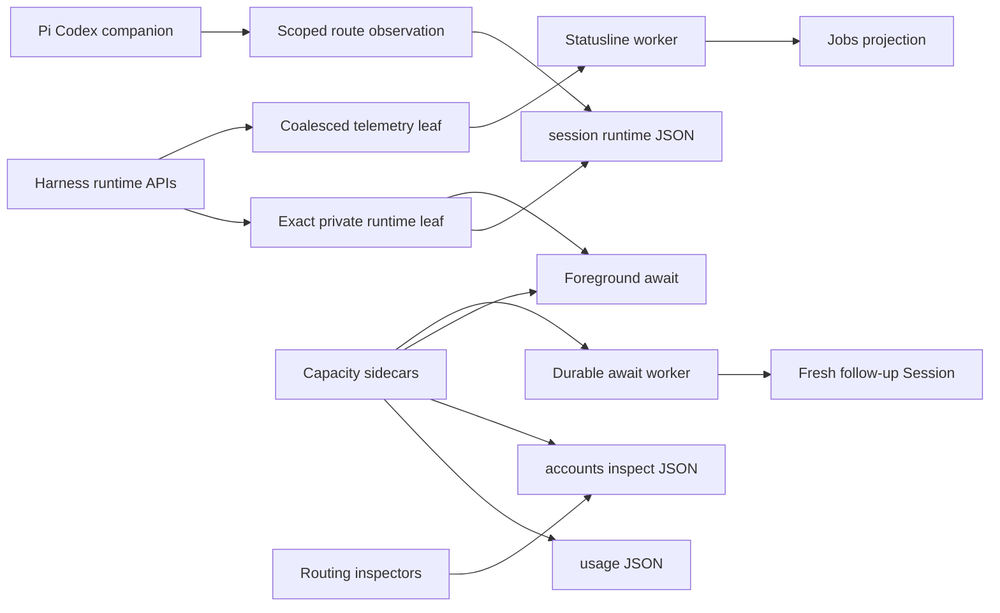

## Overview

Give agents stable, versioned reads of their current Harness runtime, the display-grade Usage view, and routing-authoritative account diagnostics without parsing TUI output or private artifacts. Add level-triggered context and weekly-quota awaits that preserve exact provenance: context remains attached to the foreground Session, while durable quota intent freezes one PII-free route and scope at arm time.

The design keeps exact runtime leaves separate from the coalesced jobs Projection, keeps Usage data separate from routing authority, and keeps Claude launch routing separate from scoped Pi Codex runtime routing. Existing durable-await storage, RPC, firing fences, and account-selection policy remain the source of lifecycle truth; no migration or new RPC is introduced.

## Quick commands

- `keeper session runtime | jq '{schema_version, ok, data: {subject: .data.subject, model: .data.model, context: .data.context, route: .data.route}}'`
- `keeper usage --json | jq '{schema_version, ok, sources: .data.sources}'`
- `keeper accounts inspect --json | jq '{schema_version, ok, claude: .data.claude_launch, codex: .data.codex_launch, runtime: .data.pi_runtime}'`
- `keeper await context-used-at-least 0 --probe`

## Acceptance

- [ ] Agents can read a versioned current-runtime envelope that reports proven identity scope, exact/coalesced provenance, model, effort/thinking, context, freshness, and current route without presenting unavailable values as zero.
- [ ] Agents can read every normalized `keeper usage` meter and a separate reservation-free explanation of routing inputs and outcomes through direct JSON stdout.
- [ ] Pi diagnostics report the actual scoped Codex session route after selection or retry rather than treating the initial launch alias as authoritative.
- [ ] Foreground context thresholds and foreground/durable weekly-quota thresholds preserve existing await transition, cancellation, timeout, and effect-fencing semantics.
- [ ] Durable quota intent freezes a concrete route, weekly meter, and scope at arm time, waits on unavailable evidence, and launches its follow-up through normal independent routing.
- [ ] Supported outputs and failures expose only allowlisted PII-free fields and bounded reason codes; prompt text, credentials, raw provider errors, and private paths remain absent.
- [ ] Existing jobs telemetry, human Usage rendering, `keeper agent accounts check --json`, and durable await rows remain compatible without a migration or new RPC.

## Early proof point

Task that proves the approach: task 1. If exact runtime publication cannot report a proven scoped Pi route without widening the credential boundary, retain the existing coalesced jobs path and narrow the new route block to explicit unavailable provenance while isolating the companion publication seam for review.

## References

- `docs/adr/0103-agent-runtime-diagnostics-and-threshold-awaits.md`
- `docs/adr/0097-sidecar-backed-dynamic-usage-viewer.md`
- `docs/adr/0090-keeper-managed-pi-codex-account-pool.md`
- `docs/adr/0072-owner-fenced-await-cancel-and-armed-line-semantics.md`
- `docs/adr/0054-terminal-repairs-dead-writer-sweep-durable-awaits.md`
- OpenTelemetry logs data model: <https://opentelemetry.io/docs/specs/otel/logs/data-model/>
- Kubernetes API conventions: <https://github.com/kubernetes/community/blob/master/contributors/devel/sig-architecture/api-conventions.md>

## Docs gaps

- **`README.md`**: consolidate the account/runtime entry points and prune superseded account-check guidance rather than adding a second runbook.
- **`docs/install.md`**: document runtime, Usage JSON, routing inspection, threshold grammar, frozen-route semantics, and durable follow-up operations.
- **`docs/problem-codes.md`**: add bounded refusal/degradation codes and exact recovery commands for unavailable runtime, route freezing, and threshold evaluation.
- **`docs/agent-surface-contracts.md`**: define the independent schema-v1 envelopes, compatibility rules, partial-data semantics, and durable follow-up boundary.
- **Agent skills**: update query/await discovery and prune the query skill's stale hand-maintained collection inventory.

## Best practices

- **Independent schema versions:** evolve each machine surface additively and require consumers to tolerate unknown fields and enums. [Terraform JSON formats]
- **Separate timestamps:** preserve source measurement, observation, and response-generation time rather than overloading `updated_at`. [OpenTelemetry]
- **Immutable armed intent:** store frozen route/scope/threshold separately from live observed state and re-evaluate level predicates after every wake. [Kubernetes API conventions]
- **Safe-field serialization:** construct diagnostics from an allowlist and exercise secret canaries across stdout, stderr, sidecars, and errors. [OWASP Logging Cheat Sheet]
- **Recovery polling:** combine authoritative rechecks with bounded idle wakes and avoid per-await filesystem watchers or provider refreshes. [AWS Builders Library]

## Alternatives

- Reusing `keeper status --json` for every field was rejected because runtime, display Usage, and routing evidence have different freshness and partial-failure semantics.
- Reading only the jobs Projection was rejected because context and timestamps are deliberately coalesced and nested identity may be parent-scoped.
- Dynamically following whichever account is current on each quota poll was rejected because it mutates durable intent.
- Event-sourcing Capacity observations or adding an await RPC was rejected because validated sidecars and the generic condition/follow-up payload already carry the required state.

## Architecture

## Rollout

Land the tasks in dependency order so every public command has its source data and compatibility seam before threshold automation consumes it. Keep the existing statusline, human Usage viewer, account-check command, and generic durable follow-up behavior available throughout; the new commands and condition kinds are additive. No data backfill is required because exact runtime and route observations appear on the next Harness sample or routing decision, while older jobs remain explicitly coalesced or unavailable.

## Operator post-land

- Required after this epic lands: run `keeper daemon restart` from the Keeper repo root. Report a refresh failure separately from the landed commit.
