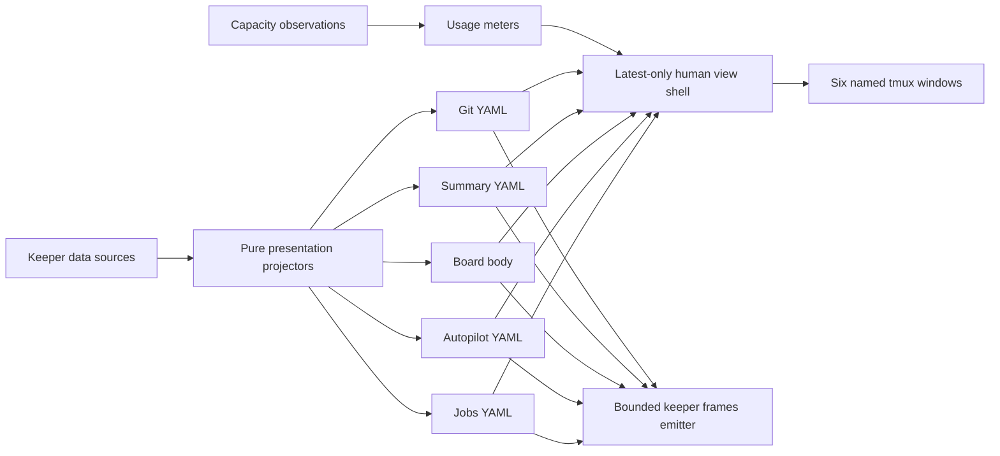

## Overview

Replace Keeper's multi-pane, history-bearing dashboard viewers with six focused current-state surfaces: Jobs, Autopilot, Board, Summary, Git, and Usage. Human viewers remain live and scrollable but retain only the latest frame, while `keeper frames` remains the sole bounded rendered-frame interface for agents.

Board loses its semantic header to a new Summary command; Jobs, Autopilot, Git, and Summary render deterministic human-oriented YAML; Usage keeps its meter presentation. `setup-tmux` provisions one named window per viewer, and all agent guidance points to `keeper status`, `keeper query`, `keeper autopilot show`, or `keeper frames` rather than viewer commands and sidecars.

## Quick commands

- `bun test test/live-shell-core.test.ts`
- `bun test test/view-shell.test.ts`
- `bun test test/summary.test.ts`
- `bun test test/jobs.test.ts`
- `bun test test/autopilot.test.ts`
- `bun test test/git.test.ts`
- `bun test test/setup-tmux.test.ts`
- `bun run test`

## Acceptance

- [ ] The six human viewer commands are live, current-frame-only surfaces whose only content interaction is scrolling; Ctrl-C tears down the process and no frame browsing, selection, expansion, replay, focus, copy, or `--watch` path remains.
- [ ] Human live/snapshot evidence retains at most one atomic per-process current state/frame pair and never writes indexed frame/state/diff history, a prior-frame scratch file, or a frame index.
- [ ] Board renders its plan body without the semantic header, while Summary owns the same Account-focus, Board-count, and Autopilot semantics as deterministic structured YAML across live, snapshot, current sidecars, and `keeper frames`.
- [ ] Jobs, Autopilot, and Git render complete deterministic YAML presentations with explicit stable ordering and terminal-safe serialization; Usage preserves its capacity meters and records local repaints as the latest current frame.
- [ ] `keeper frames` retains its versioned NDJSON, bounds, cursor/coverage, default Board view, trailer/exit behavior, and bounded sidecar ring; Summary is additive and Usage remains excluded.
- [ ] `keeper setup-tmux` rebuilds the dedicated dash server with six one-pane windows named `jobs`, `autopilot`, `board`, `summary`, `git`, and `usage`, then selects Board without weakening server recovery or self-teardown guards.
- [ ] Agent-facing skills and prompt advice never direct agents to human viewer commands, snapshots, or sidecars; one-shot state uses machine query/show commands and rendered change supervision uses `keeper frames`.
- [ ] Viewer, CLI, completion, prompt, Frames, and tmux tests pass through the named repository gates.

## Early proof point

Task that proves the approach: task 1. If the shared shell cannot separate latest-only human retention from the Frames emitter cleanly, introduce a dedicated latest-human shell adapter while preserving the existing Frames emitter contract rather than weakening either surface.

## References

- `CONTEXT.md` — Board/Summary and Human viewer/Machine frame stream vocabulary.
- `docs/adr/0104-latest-frame-human-viewers.md` — accepted human/machine surface boundary.
- `docs/adr/0012-agent-frame-stream-wire-contract.md` — bounded Frames protocol.
- `docs/adr/0088-viewer-staleness-and-paint-watchdog.md` — freshness and self-healing behavior.
- `docs/adr/0097-sidecar-backed-dynamic-usage-viewer.md` — Usage provenance and meter behavior.
- `docs/adr/0100-independent-scoped-account-focus.md` — Account-focus semantics transferred to Summary.
- https://yaml.org/spec/1.2.2/ — YAML collection and ordering semantics.
- https://github.com/tmux/tmux/wiki/Advanced-Use — stable tmux object targeting.

## Docs gaps

- **README.md**: distinguish Board, Summary, the six human viewers, and the machine Frames interface without teaching agents the human commands.
- **docs/install.md**: replace the old four-pane setup with six named windows and document the disruptive dashboard rebuild.
- **Agent skills and prompt snippets**: replace viewer snapshot/watch advice with status/query/show or bounded Frames recipes.
- **ADR cross-references**: mark the human-history and Board-header clauses now owned by ADR 0104 without rewriting their original rationale.

## Best practices

- **Human/machine separation:** keep presentation YAML free to evolve while the Frames envelope remains independently versioned and bounded.
- **Deterministic YAML:** construct semantic field order and total collection ordering before serialization; disable aliases and width-based wrapping.
- **Terminal safety:** escape untrusted control characters before rendering titles, paths, reasons, or commands.
- **Coherent first paint:** composite views wait for every required stream and never publish seeded partials as current state.
- **Stable tmux identity:** capture and target object IDs while treating window names as human labels.

## Alternatives

- One-shot commands rerun by an external tmux polling wrapper were rejected because the existing live shell already owns reconnect, readiness, stale-frame proof, and efficient subscription behavior.
- Reusing `keeper dash` for Summary was rejected because Dash is a separate interactive job-card application with a different domain and lifecycle.
- Serializing raw daemon rows was rejected because the YAML is a human presentation, not a machine schema; typed projectors must remove redundancy and establish ordering first.
- Retaining `--watch` as a compatibility exception was rejected because it recreates an unbounded agent-facing stream beside the bounded Frames contract.

## Architecture

The human shell owns only the latest frame, current sidecars, scrolling, readiness, reconnect, and stale-state chrome. The Frames emitter owns bounded historical evidence and machine envelopes. Pure command-specific projectors feed both without making human YAML a versioned machine protocol.

## Rollout

Land the shared shell boundary first, then allow Summary, Jobs, and Autopilot/Git presentation tasks to proceed on that contract. Provisioning and advice changes follow the final command roster. Existing dash clients continue running their loaded code until the operator deliberately refreshes Keeper and rebuilds the dedicated dashboard server.

## Operator post-land

- Required after this epic lands: run `keeper daemon restart` from the Keeper repo root. Report a refresh failure separately from the landed commit.
- Required to apply the dashboard topology: from outside `tmux -L dash`, run `keeper setup-tmux`; this intentionally replaces attached dashboard clients.
