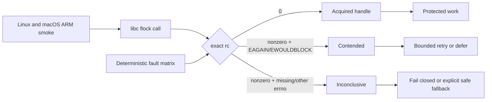

## Overview

Make every Keeper advisory-lock boundary return-authoritative: only an exact successful syscall result authorizes protected work, while positive contention and inconclusive native failures remain distinct. The end state removes unlocked Plan mutations, applies explicit fail-closed or defer policies at each caller, and continuously checks the Linux and macOS ARM FFI/kernel boundary without relying on Bun to preserve errno correctly.

## Quick commands

- `bun run test:full`
- `bun run test:flock-smoke`

## Acceptance

- [ ] No nonzero flock result can produce a held-lock handle or execute a protected mutation, including when errno is zero, stale, unreadable, or unexpected.
- [ ] Root and package-local callers preserve Acquired, Contended, and Inconclusive outcomes through their policy boundaries, with timeout claimed only from positively contended attempts.
- [ ] Daemon admission and integrity-critical mutations fail closed on Inconclusive, while optional work defers or falls back without performing its protected write.
- [ ] Plan creation, refinement, selection, and auto-commit never proceed unlocked after lock setup or acquisition becomes inconclusive.
- [ ] Pinned Ubuntu and macOS ARM smoke repeatedly exercise real native contention under the qualified Bun runtime with no retry that can hide a failed iteration.
- [ ] Machine-facing lock outcomes and operator recovery guidance are documented consistently.

## Early proof point

Task that proves the approach: task 1. If the canonical adapter cannot safely capture the required outcomes across Bun FFI, keep return-code authority and substitute a narrow native wrapper behind the same tagged contract rather than weakening acquisition semantics.

## References

- `CONTEXT.md` — canonical Lock acquisition outcome vocabulary.
- `docs/adr/0107-return-authoritative-lock-acquisition-outcomes.md` — governing return-authoritative and fail-closed decision.
- `docs/adr/0030-single-instance-gate-and-restart-provenance.md` — daemon admission must distinguish incumbent contention from primitive uncertainty before DB access.
- `docs/adr/0057-named-fast-gate-and-deterministic-proof-policy.md` — deterministic correctness proof and bounded compatibility-smoke constraints.
- `docs/adr/superseded/0023-durable-plan-id-reservation.md` — preserved context for the retired fail-soft unlocked Plan behavior.
- https://man7.org/linux/man-pages/man2/flock.2.html
- https://man7.org/linux/man-pages/man3/errno.3.html
- https://github.com/oven-sh/bun/blob/main/docs/runtime/ffi.md

## Alternatives

- Upgrade Bun and leave the code unchanged: rejected because Bun 1.3.14 publishes no flock/errno correctness guarantee and a later runtime could regress.
- Treat every failed nonblocking call as contention: rejected because it hides environmental and ABI failures and destroys truthful recovery policy.
- Compile a native C wrapper immediately: deferred as the bounded fallback if the canonical FFI adapter cannot preserve return authority and resource ownership; the tagged outcome contract does not depend on the transport.

## Architecture

## Rollout

Land the canonical adapter first with compatibility seams, then migrate integrity-critical and general callers while keeping every intermediate commit green. Apply the same protocol to the Plan package, remove unlocked mutation fallbacks, then enable the focused cross-platform smoke and Bun 1.3.14 pins. A rollback may disable the new smoke job or restore the prior supported runtime, but must not restore unlocked mutation or permit a nonzero syscall result to authorize work.

## Docs gaps

- **`docs/problem-codes.md`**: document distinct contention timeout and inconclusive lock outcomes, recovery, and retry safety for root and Plan commands.
- **`docs/testing.md`**: document the injected outcome matrix, focused platform smoke, architecture assertions, and the role of Bun 1.3.14 as defense-in-depth.

## Best practices

- **Return authority:** only an exact zero syscall return authorizes acquisition; errno is diagnostic after failure. [Linux `flock(2)`, `errno(3)`]
- **Typed uncertainty:** keep Contended and Inconclusive distinct until a caller deliberately maps them to refusal, retry, defer, or safe fallback.
- **Resource ownership:** retain the exact close-on-exec descriptor for the critical section and close every non-acquired path exactly once.
- **Two proof layers:** use deterministic injected failures for exhaustive correctness and bounded real-native repetition for ABI/libc/kernel compatibility.

## Operator post-land

- Required after this epic lands: run `bash scripts/install.sh` from the Keeper repo root. Report a refresh failure separately from the landed commit.
