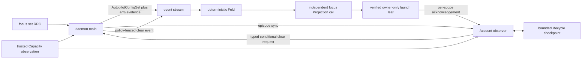

## Overview

Make both Account-focus scopes retire their durable intent automatically when their half-open lifetime ends or their relevant trusted quota reaches either endpoint through an exact transition. Fable uses the target route's `model:Fable` meter and Non-Fable uses `week`; policy-fenced Synthetic events, restart-safe producer state, and independently verified launch leaves prevent stale automation from clearing replacement intent.

Focus setting also becomes fail-closed: main must prove a fresh, healthy, structurally valid target meter below full utilization before accepting any lifetime kind. Existing public focus commands, independent routing precedence, unconditional operator clears, and Projection/leaf schemas remain compatible.

## Quick commands

- `bun test ./test/account-focus-arm.test.ts ./test/account-focus-lifecycle.test.ts ./test/account-focus.test.ts ./test/fable-focus.test.ts ./test/account-observer-worker.test.ts ./test/daemon.test.ts ./test/reducer-projections.test.ts ./test/refold-equivalence.test.ts`

## Acceptance

- [ ] Setting either focus refuses without fresh trustworthy target-meter evidence and refuses a trusted meter already at full utilization, without mutating existing intent.
- [ ] Fable and Non-Fable focuses clear independently at lifetime end, on an exact below-full to full transition, or on an exact above-zero to zero transition.
- [ ] Unavailable observations do not advance transition state, and the last trusted predecessor survives refresh gaps and daemon restarts.
- [ ] Every delayed automatic clear is fenced to the exact policy episode in main and the Fold, so replacement intent and the sibling focus cannot be erased.
- [ ] Projection clear and owner-only launch-leaf publication recover idempotently across append, Fold, acknowledgement, publication, and process crash windows.
- [ ] Existing routing precedence, legacy policy delivery, unconditional manual clear, and deterministic re-fold behavior remain compatible.
- [ ] Operator documentation states the current focus lifecycle, quota mapping, error behavior, recovery, and rollback path without retaining stale read-only-expiration advice.

## Early proof point

Task that proves the approach: `1`. If event-owned arming evidence cannot preserve the public policy contract, keep the existing policy leaf unchanged and seed the detector from a bounded internal event-derived episode handoff rather than widening client input.

## References

- `docs/adr/0110-policy-fenced-account-focus-lifecycle-clearing.md`
- `docs/adr/0101-claude-swap-owned-measurement-trust.md`
- `docs/adr/0070-attempt-and-incident-fenced-dispatch-clears.md`
- `CONTEXT.md` — Account focus, Focus episode, Focus quota transition, and Automatic focus clear.
- `docs/install.md` — Account-focus operating guide.

## Docs gaps

- **`docs/install.md`**: consolidate Account-focus setting, automatic retirement, inspection, restart behavior, and manual recovery into the operating guide.
- **`README.md`**: add a brief automatic-lifecycle statement while leaving mechanics in the operating guide.
- **`docs/problem-codes.md`**: align only the concrete set/refusal and recovery codes the implementation exposes; do not invent diagnostics.

## Best practices

- **Idempotent event effects:** retain pending evidence until durable clear and exact leaf publication are acknowledged; at-least-once delivery must be harmless. [AWS Transactional Outbox](https://docs.aws.amazon.com/prescriptive-guidance/latest/cloud-design-patterns/transactional-outbox.html)
- **Generation fencing:** capture policy identity before asynchronous transport and compare it again at the authoritative Fold. [kpt CRD status convention](https://kpt.dev/reference/schema/crd-status-convention/)
- **Ordered trusted state:** reject older/equal samples, ignore untrusted samples without replacing the predecessor, and keep detector state O(1). [Azure Event Sourcing](https://learn.microsoft.com/en-us/azure/architecture/patterns/event-sourcing)
- **Durable deadline reconciliation:** boot and cadence catch overdue lifetimes; an in-memory timer is never the source of truth. [Temporal Schedules](https://docs.temporal.io/schedule)

## Alternatives

- Current-level clearing is rejected because an endpoint level does not prove a transition and could erase newly armed intent.
- In-memory predecessor state is rejected because restart would lose or invent transitions.
- Re-baselining after every unavailable sample is rejected because a transient refresh gap would suppress a later trusted endpoint.
- Direct observer writes or a focus-specific RPC are rejected because automatic mutations belong on the generic Synthetic-event rail.
- Combined Fable/Non-Fable clear events are rejected because each scope needs an independent fence, leaf, retry, and failure domain.

## Architecture

The public policy cell and launch leaf remain routing intent only. Trusted arming evidence lives in the Synthetic event and the producer checkpoint; conditional clear metadata is internal event authority, while public `null` retains unconditional operator-clear semantics.

## Rollout

New focus sets require fresh below-full evidence immediately. Existing policies whose creation events lack arming evidence establish one trusted baseline before quota transitions become actionable; lifetime reconciliation still clears an overdue policy. Sidecar absence, corruption, or unsupported schema re-baselines safely rather than converting a current endpoint into a transition. The event additions are forward-compatible unknown fields for old reducers, and rollback leaves ordinary focus policies and manual clear behavior intact.

## Operator post-land

- Required after this epic lands: run `keeper daemon restart` from the Keeper repo root. Report a refresh failure separately from the landed commit.
