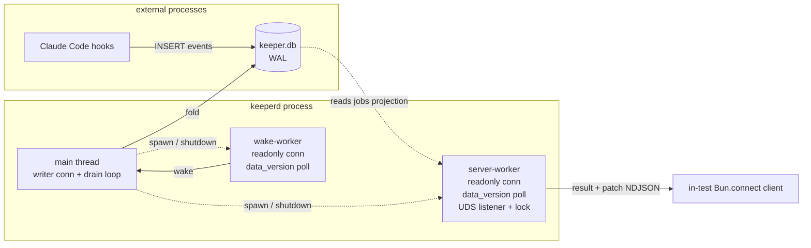

## Overview

Keeper V1 is reducer-only: consumers read the `jobs` projection from SQLite directly. This epic adds keeper's first read surface — a **read-only NDJSON-over-UDS subscribe server** that runs as keeperd's second Worker thread. A client sends a `query` (sort/limit/offset/filter) and gets back an ordered page of jobs that doubles as a live subscription: the page membership is frozen at query time, but each row's cells update in place as the reducer folds new events. The server is **just another reader** — its own read-only connection and its own `PRAGMA data_version` poll, fully decoupled from the reducer. Scope is deliberately narrow: **read + subscribe only — no client mutations, no reactor, and no shipped consumer/UI** (the only thing that connects to the socket is in-test fixtures). End state: a future TUI (separate epic) can target a documented protocol; this epic also sets the reusable **worker contract** for the many workers to come.

## Quick commands

- `bun test --isolate` — full suite (protocol framing, server-worker unit, two-worker daemon e2e) green
- `bun run lint && bun run typecheck` — clean
- `bun test test/server-worker.test.ts` — server worker: lock ownership, query→result, poll→patch
- `bun test test/integration.test.ts` — real daemon + in-test `Bun.connect` client → query→result→patch, SIGTERM removes socket

## Acceptance

- [ ] keeperd spawns a second Worker thread that binds a UDS at `resolveSockPath()` (`KEEPER_SOCK` → `~/.local/state/keeper/keeperd.sock`)
- [ ] A client `query` returns an ordered `result` page (frozen membership) and the connection then receives per-entity `patch` frames as watched rows' `last_event_id` advances
- [ ] The diff is exactly-once-per-advance: no double-send, no missed update; every frame carries `rev = reducer_state.last_event_id`
- [ ] Lock-file + PID-liveness ownership survives launchd crash-restart (stale socket reclaimed; live instance refuses to double-bind)
- [ ] Two-worker shutdown is clean: SIGTERM releases the socket + lock and exits 0; either worker's error → `fatalExit` (no in-process respawn)
- [ ] No new write paths, no schema change (`SCHEMA_VERSION` stays 1); V1 event-sourcing invariants intact
- [ ] CLAUDE.md / README V1 "no UDS" fences narrowed to V2 (no mutations / reactor / write-path), worker contract documented

## Early proof point

Task that proves the approach: `fn-2-keeper-uds-subscribe-server.2` — a Bun Worker that owns a UDS listener, acquires lock-file ownership, serves `query→result`, and releases the socket cleanly on shutdown. If it fails (Bun's documented Worker-owns-a-socket / termination caveats bite): fall back to running the server on the daemon's **main event loop** instead of a Worker — the protocol, subscription, and poll/diff logic (tasks `.1`/`.3`) are transport-agnostic and carry over unchanged; only the spawn/shutdown wiring in `.4` changes.

## References

- `src/wake-worker.ts` — the worker archetype this server mirrors (isMainThread guard, own readonly connection, `data_version` poll, shutdown/exit contract)
- `src/daemon.ts` — supervisor lifecycle (`spawn`, `fatalExit`, `shutdown`) extended for a second worker
- `src/db.ts` — `openDb(readonly)`, `applyPragmas`, `resolveDbPath` (sibling `resolveSockPath`), prepared-statement convention
- [Bun TCP/Unix sockets](https://bun.com/docs/api/tcp) — `Bun.listen({unix})`, `SocketHandler`, `socket.data`, byte-count `write` return, `server.stop(true)`
- [theodo-group/debug-that](https://github.com/theodo-group/debug-that) — production Bun UDS+NDJSON daemon: lock+PID ownership, stale-socket unlink, 1 MB inbound cap, partial-write+drain backpressure (note: it's request/response and `end()`s after reply — keeper keeps the socket open for persistent subscriptions)
- [unix(7)](https://man7.org/linux/man-pages/man7/unix.7.html) — AF_UNIX has no `SO_REUSEADDR`; caller must unlink stale paths

## Docs gaps

- **CLAUDE.md**: "what this is" intro (V1-only framing → V2); Directory layout + Module entry-points table (`src/server-worker.ts`, `src/protocol.ts`); DO-NOT "No UDS server / no RPC verbs" bullet (narrow to no mutations/reactor/write-path); invariants (server connection runs `applyPragmas`; `data_version` is its change primitive too); new Worker-contract subsection.
- **README.md**: "What keeper is NOT" non-goal "No RPC surface, no UDS server" (narrow to V2); Architecture section (add the server worker); Install/verify (`KEEPER_SOCK` + default socket path).
- **src/daemon.ts**: top JSDoc boot-sequence comment (document both workers + crash policy).
- **plist/arthack.keeperd.plist**: commented `KEEPER_SOCK` `EnvironmentVariables` note (socket lands in `~/.local/state/keeper/`).
- **AGENTS.md**: symlink to CLAUDE.md — tracks automatically, no separate edit.

## Best practices

- **Lock file + PID-liveness for ownership, not the socket file:** AF_UNIX has no `SO_REUSEADDR`; a crash leaves a stale socket → `EADDRINUSE`. Check `process.kill(pid,0)`; live → refuse, dead → steal. [unix(7), debug-that]
- **Frame NDJSON by buffering until `\n` with a partial tail + a max-line cap:** `data` callbacks deliver arbitrary chunk boundaries; an unbounded no-newline line is a DoS vector even locally. [debug-that]
- **Bun `socket.write()` returns bytes accepted (may be `< length`, may be `0`) — never `-1`:** on a short write, stash the remainder and resume in `drain`. Don't churn the Worker — the socket is owned by the process, not the thread. [Bun docs]
- **Coalesce via state-based last-value diff, not an event queue:** re-read watched rows on each `data_version` tick and diff `last_event_id`; bursts collapse to one push automatically. Skip a backpressured socket for the tick rather than stalling fan-out. [fan-out patterns]
- **`0700` parent dir is the real ACL gate on macOS** (socket-file mode may be ignored); `chmod 0600` the socket for Linux defense-in-depth. Keep the watcher connection in autocommit — a `BEGIN` freezes `data_version`. [man7, SQLite]

## Alternatives

- **Server on the main event loop instead of a Worker** — less ceremony (no second-worker spawn/shutdown), but client I/O then shares a thread with the drain loop, eroding the isolation kept everywhere else. Chosen against to set the "many workers, main trends toward a thin supervisor" pattern; remains the documented fallback if Bun's Worker-socket lifecycle misbehaves (see Early proof point).
- **In-process change feed from the reducer (push exact changed ids) instead of an independent poll** — lower latency and no empty wakeups, but couples the server to the reducer. Chosen against: "the server is just another reader" keeps components decoupled and reuses the proven `data_version` primitive; the re-read+diff cost is trivial at this scale.
- **Live query subscriptions (server re-runs filter/sort and reconciles membership)** instead of frozen-page/live-cells — more powerful but drags in result-set diffing and reorder handling. Chosen against: frozen membership + live cells collapses the server's per-change work to a set intersection.
- **Unlink-before-bind only (no lock file)** — simpler, adequate under launchd single-instance, but leaves a manual-double-start footgun. Chosen against: set the robust ownership pattern now.
- **Adopt a third-party sync engine (LiveStore/Zero/Electric/Replicache)** — their value (offline, conflict resolution, cross-device) is irrelevant for a local UDS round trip; would impose a framework worldview. Borrow the model (live query + mutation log), hand-roll the ~200 lines.

## Architecture

Two independent readers (`wake-worker`, `server-worker`) poll the same `data_version` primitive on their own read-only connections; the writer (drain) lives on main. The server reads only the `jobs` projection, never `events`. Main supervises both workers' lifecycle but routes neither's traffic.

## Rollout

- **Ship dark:** the server binds a socket nothing connects to in production yet (no consumer ships this epic). Zero behavior change for existing `jobs`-table readers; the reducer/wake-worker path is untouched.
- **Deploy:** symlink-update keeperd, `launchctl kickstart -k` the LaunchAgent. The new worker spawns alongside the existing one. `KEEPER_SOCK` defaults need no plist change; set the env only for a non-default path.
- **Verify:** `bun test --isolate` green pre-deploy; post-deploy confirm the socket file appears at `~/.local/state/keeper/keeperd.sock` and `lsof -U` shows keeperd listening.
- **Rollback:** revert the keeperd symlink + `launchctl kickstart -k`. No schema migration ran (`SCHEMA_VERSION` unchanged), so rollback is a pure binary swap; a leftover socket/lock file is reclaimed by the next boot's ownership check (or `rm` it).
