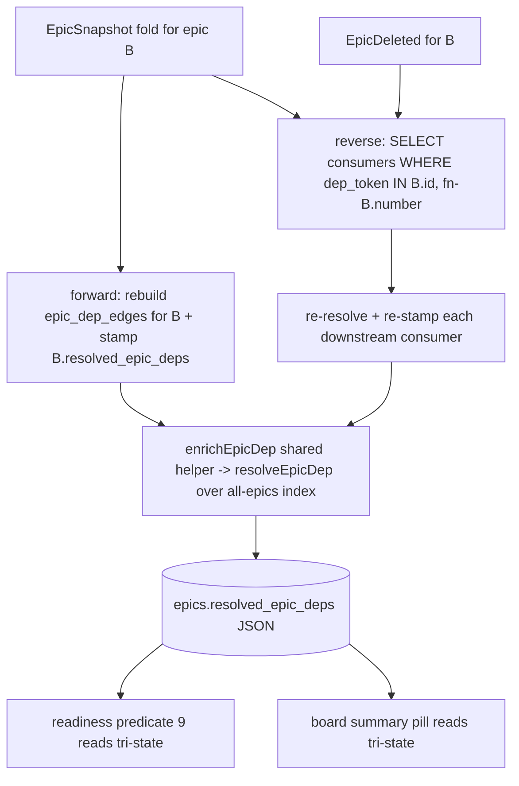

## Overview

Move cross-epic dependency resolution from client-side (recomputed on every
snapshot in `computeReadiness` predicate 9 and the board summary pill) into
the projection. Each epic's `epics` row gains an embedded `resolved_epic_deps`
array — the resolved, enriched state of its `depends_on_epics` — maintained at
fold time by the reducer using the shared `resolveEpicDep`, plus a
reverse-dependency fan-out (sibling of `syncJobLinksOnJobWrite`) keyed through a
new `epic_dep_edges` table. Predicate 9 and the board then READ the projection
instead of resolving live, and the fn-637 stopgap (a resolver-only
completed-epics subscription) is deleted. End state: a satisfied dependency on a
done+approved upstream resolves green natively, with no unbounded completed-epic
stream over the wire.

## Quick commands

- `bun test test/reducer.test.ts test/readiness.test.ts test/board.test.ts test/readiness-client.test.ts` — full affected-suite pass
- re-fold determinism: rewind cursor, `DELETE FROM epics; DELETE FROM epic_dep_edges`, re-drain, assert byte-identical `resolved_epic_deps` (mirror test/reducer.test.ts:1690)

## Acceptance

- [ ] Completing (done+approved) an upstream epic re-stamps every downstream consumer's `resolved_epic_deps` to `satisfied` in the SAME fold — the false `dep-on-epic-dangling` is gone with NO completed-epics subscription.
- [ ] Predicate 9 and the board summary pill read `resolved_epic_deps`; neither calls `resolveEpicDep` live. The `BlockReason` surface autopilot reads (`dep-on-epic`, `dep-on-epic-dangling`, with `cross_project`) is byte-for-byte preserved.
- [ ] The fn-637 stopgap is fully deleted (completedEpics subscription, snapshot field, `computeReadiness` param, board merge); readiness-client first-paint gate is back to 4 collections.
- [ ] A from-scratch re-fold reproduces `resolved_epic_deps` + `epic_dep_edges` byte-identically; nothing non-deterministic (`Date.now()`, env) enters the fold.
- [ ] Bare-id ambiguity flips (a new same-number epic appears) and `EpicDeleted` both re-stamp downstream consumers correctly.

## Early proof point

Task that proves the approach: `.3` (the reducer forward-stamp + reverse fan-out
+ re-fold determinism test). If the re-fold byte-identity test can't be made to
pass — i.e. resolution at fold time can't be made deterministic — fall back to
keeping the fn-637 subscription and abandon the projection move. `.1` and `.2`
are low-risk foundations that de-risk `.3`.

## References

- `fn-636` (already done+approved) — its board-pill coverage already added assertions against `scripts/board.ts:785-799`, the exact block `.4` rewrites to read the projection; `.4` rebases those assertions onto the projection-backed surface (no dep edge — fn-636 has landed).
- fn-637 (commit 875d3bd) — the stopgap this epic replaces (resolver-only completed-epics subscription).
- fn-635 — introduced the cwd-then-global `resolveEpicDep` + `dep-on-epic-dangling` BlockReason this epic projects.
- Pattern templates in `src/reducer.ts`: `syncJobLinksOnJobWrite` (2880-2978, reverse fan-out), `enrichJobLink` (2799-2834, shared enrich helper), `syncPlanctlLinks` (3026-3420, full-recompute-never-delta).

## Docs gaps

- **CLAUDE.md** (+ `AGENTS.md` symlink): add the 4th reverse-dep fan-out to the cursor+projection invariant enumeration; bump the schema-version note (currently closes at v32/fn-634); extend the `EpicSnapshot` ON CONFLICT carve-out list with `resolved_epic_deps`; PRUNE (not append) the fn-637 stopgap references.
- **README.md** `## Architecture`: add the "As of schema vN" paragraph for the new column + `epic_dep_edges` table + reverse-dep fan-out; revise the readiness-client/board stopgap description.

## Alternatives

- **Keep resolving client-side, widen the read (fn-637 stopgap).** Already shipped as the interim fix; rejected as the end state because it streams every completed epic over the wire (unbounded) just to match the handful actually depended on.
- **Resolved-id-keyed reverse index** instead of raw-token. Rejected: a dangling/ambiguous dep has no resolved id to key on, so those consumers fall out of the index and never get re-stamped when disambiguation becomes possible. Raw-token keying is resolution-independent and handles ambiguity flips.
- **`json_each` scan over `depends_on_epics` for the reverse lookup.** Rejected: the unindexed-TVF full-table-scan anti-pattern the codebase explicitly avoids (see reducer.ts:2857-2862).

## Architecture

Per-dep entry shape (minimal subset): `{dep_token, resolved_epic_id, epic_number, project_basename, cross_project, state}` where `state` is one of `satisfied | blocked-incomplete | dangling`.

## Rollout

Forward-only schema migration (v32 to v33) adds the nullable `resolved_epic_deps`
column (NULL = not-yet-computed) and the `epic_dep_edges` table. A
version-guarded, chunked backfill re-derives both for existing rows inside
`migrate()` before the daemon serves any connection. Rollback: the daemon is the
sole migrator and forward-only; to revert, restore the fn-637 stopgap commit and
leave the unused column in place (no down-migration). No client coordination
needed — the board/autopilot read the projection only after `.4` lands.
