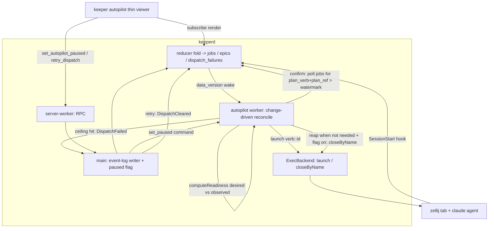

## Overview

Re-architect keeper's autopilot from a standalone `keeper autopilot` CLI dispatch
loop into a **server-side reconciler** living inside keeperd as a worker thread.
Dispatch decision, launch, confirmation, dedup, and (config-gated) reap all move
into the daemon next to the projections; the CLI collapses to a thin
pause/play/retry viewer. Dedup and liveness stop probing the zellij surface and
instead read keeperd's own `jobs` projection (correlation via `--name` →
`plan_verb`+`plan_ref`). The only durable autopilot-owned state is a new
event-sourced `dispatch_failures` projection. End state: a level-triggered,
change-driven control loop that structurally cannot wedge on a transient surface
probe and cannot double-spawn across restart.

## Quick commands

- `bun test test/reducer.test.ts test/exec-backend.test.ts test/autopilot-worker.test.ts test/daemon.test.ts` — full reconciler + fold suite
- `bun test test/schema-version.test.ts` — schema whitelist gate (keeper-py SUPPORTED_SCHEMA_VERSIONS must cover v42)
- `keeper autopilot` — thin viewer renders current / predicted / failed + paused state
- `keeper autopilot play` / `keeper autopilot pause` / `keeper autopilot retry <verb::id>` — control RPCs

## Acceptance

- [ ] Autopilot dispatch, confirm, dedup, and reap run inside keeperd as a worker thread; `keeper autopilot` is a thin render + pause/play/retry viewer with no dispatch logic
- [ ] keeperd boots with autopilot PAUSED (in-memory, never persisted); play/pause/retry over RPC
- [ ] Dedup is keeperd job presence (no `zellij query-tab-names` / `isSurfaceLive` anywhere); the transient-surface-probe wedge and the fn-652 restart double-spawn are both structurally impossible
- [ ] `DispatchFailed` + `DispatchCleared` events fold purely into a `dispatch_failures` projection; a from-scratch re-fold reproduces it byte-identically; SCHEMA_VERSION=42 and keeper-py whitelist updated in the same change
- [ ] No auto-retry: a failed dispatch is sticky + visible in the viewer until a human `retry`
- [ ] When the autoclose config flag is on, the reconciler reaps (kills agent + closes tab) a dispatch whose role is no longer needed; default-off preserves leave-open

## Early proof point

Task that proves the approach: `server-side-autopilot-reconciler.1` (the event +
projection + fold substrate). If the `dispatch_failures` fold can't be made
re-fold-deterministic cleanly, the whole "only durable state is event-sourced
failures" premise is wrong — recover by reclassifying it as an operational sidecar
(dead_letters-style, excluded from re-fold) and clearing via direct DELETE, at the
cost of the clean event-sourced model.

## References

- Worker contract + event-sourcing invariants: `CLAUDE.md` (`## Worker contract`, `## Event-sourcing invariants`, `## DO NOT`)
- Producer→main synthetic-event mint precedent: `src/daemon.ts:1309-1376` (git-worker)
- server-worker→main async RPC bridge precedent (replay_dead_letter): `src/daemon.ts:800-851`, `src/server-worker.ts:731-844`
- `computeReadiness` (shared by reconciler + viewer): `src/readiness.ts:305`; consumed by `cli/board.ts:809`
- Readiness gates to preserve: fn-638 (git-orphans, predicate 6.5), fn-644 (one-at-a-time launch stagger)
- Bug being retired: fn-652 restart double-spawn surface-probe hotfix (`cli/autopilot.ts` `isLiveSessionInRoot`)
- Reconciler design (level-triggered, enqueue-keys, no-op fast path, sticky failure): Kubernetes/Flux controller patterns

## Docs gaps

- **CLAUDE.md**: add `DispatchFailed`/`DispatchCleared` to the synthetic-event enumeration + `dispatch_failures` to the BEGIN IMMEDIATE projection list; extend the server-worker write-surface + DO-NOT RPC-scoped-surface paragraphs with `set_autopilot_paused`/`retry_dispatch`; add the v42 schema-history line; fix the worker-count prose
- **README.md**: Install config keys (`autoclose_windows`/`zellij_session` now server-side reconciler config); rewrite the `autopilot.ts` Example-clients entry to the thin viewer; update `## Architecture` worker-fleet count + synthetic-event enumeration + the "readiness stays client-side" note
- **keeper/api.py**: add v42 to `SUPPORTED_SCHEMA_VERSIONS` (whitelist-only; keeper-py reads jobs/git_status/meta, not dispatch_failures)

## Best practices

- **Level-triggered, not edge-triggered:** reconcile recomputes desired-vs-observed from scratch every wake; the trigger reason is irrelevant. Edge-triggering is exactly what wedged the old loop.
- **Enqueue keys, not events; no-op fast path:** the common post-convergence wake must be a read + equality check + return, no writes, no spawns.
- **Write nothing on the happy path; only failures are durable:** keeperd `jobs` is the observed-state oracle and the dedup signal; the sole controller-owned state is the event-sourced failure record.
- **Bounded single-attempt confirm, no auto-retry:** a timed-out confirm becomes a sticky failure (re-launching risks a duplicate if the first spawn was merely slow).
- **Never write a projection from inside the reconciler:** all projection change flows event-log → reducer; this also prevents the infinite-reconcile loop.

## Alternatives

- **Keep autopilot a standalone client, add durable state via a scoped RPC** (the earlier sketch): rejected — once dispatch state must be durable and re-foldable, it belongs next to the projections in the daemon; a client writing the event log is a privilege keeper reserves for the hook + main.
- **`dispatch_failures` as an operational sidecar (dead_letters-style)** cleared by direct DELETE: rejected — a `DispatchFailed` event *does* make it into the log, so its projection is re-foldable; sidecar status is reserved for facts that never reached the log. Kept as the documented fallback if re-fold determinism proves intractable.
- **A periodic safety-net reconcile timer** (practice-scout suggestion): rejected — every fold bumps `data_version`, so a missed wake requires a missed bump (structurally impossible); the existing `data_version` poll is the wake substrate.
- **Persist the paused flag:** rejected — boots-paused is the invariant (mirrors "no client → no dispatch"); persisting it would survive a restart in a way that contradicts the safety default.

## Architecture

## Rollout

- v41→v42 forward migration: ALTER adds `dispatch_failures`; no data backfill (no prior DispatchFailed events). keeper-py `SUPPORTED_SCHEMA_VERSIONS` must include 42 in the same change or every `jobctl commit-work` on the host fails.
- keeperd boots autopilot PAUSED; first run after deploy dispatches nothing until the human (or the viewer) plays — safe by default.
- The autoclose reap flag defaults off, preserving today's leave-open observe-after-the-fact behavior.
- Rollback: revert restores the standalone CLI loop; the v42 table is additive and harmless if left in place (old code ignores it), but keeper-py must keep 42 whitelisted until fully rolled back.
