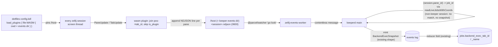

## Overview

Replace keeper's `zellij action list-panes -a -j` polling — which periodically wedges zellij's single screen thread (frozen tabs, unreachable new tabs) by forcing an O(panes) full-system process-scan storm — with a headless Rust wasm plugin that subscribes to native `PaneUpdate`/`TabUpdate` events and pushes already-joined `pane_id -> (tab_id, tab_name)` resolutions to keeper via session-scoped NDJSON files. The plugin is loaded GLOBALLY into every zellij session by the human's dotfiles-managed `config.kdl` (`load_plugins` block), which pins the plugin's `cwd` — and therefore its WASI `/host` mount — to keeper's events dir, so every session's plugin writes `<session>.ndjson` into one keeper-watched directory. keeper is the PROVIDER (builds + commits the `.wasm`, exposes its canonical path via `keeper plugin-path`, ensures the events dir exists); the human's dotfiles / arthack install scripts are the WIRER (the `load_plugins` block + the `permissions.kdl` seed). keeper folds the NDJSON through the EXISTING `BackendExecSnapshot` synthetic event (no schema change). End state: zero polling, zero process scans, event-driven tab resolution, and a reusable native-zellij -> keeper event pipe.

## Quick commands

- `bun run build:plugin` — `rustup target add wasm32-wasip1` (idempotent) + `cargo build --target wasm32-wasip1 --release` + `wasm-opt -Oz`, emit the committed `.wasm` + a `VERSION` sidecar (needs `brew install binaryen` for `wasm-opt`)
- `keeper plugin-path` — print the canonical absolute `.wasm` path for dotfiles to reference in `config.kdl` + `permissions.kdl`
- `KEEPER_ZELLIJ_FEED=plugin bun run src/daemon.ts` — run keeperd with the plugin feed enabled (default = legacy poller until cutover)
- `tail -f ~/.local/state/keeper/zellij-events/<session>.ndjson` — watch a session's live event stream
- `bun test test/zellij-events-worker.test.ts test/plugin-version-skew.test.ts`

## Acceptance

- [ ] With the plugin feed active, no `list-panes -a -j` runs and the zellij log shows no `GetPaneCwd timed out` / `NewTab did not complete within 1s` storms
- [ ] Tab renames and new tabs propagate to `jobs.backend_exec_tab_name` within ~1s (parity with, or better than, the old 5s poller)
- [ ] The 50-pane control-session screen-thread wedge no longer reproduces
- [ ] The plugin loads headless into every session via the dotfiles `load_plugins` block, writing to its pinned `/host` (= the keeper events dir); `keeper plugin-path` prints the path the `config.kdl` URL + permission seed both reference
- [ ] The legacy poller remains a working fallback behind `KEEPER_ZELLIJ_FEED`; it is retired only after parity is validated on the dev box
- [ ] No DB schema bump — reuses `BackendExecSnapshot` + `jobs.backend_exec_tab_*` (v48) columns; `SCHEMA_VERSION` and `keeper/api.py` untouched

## Early proof point

Task that proves the approach: `.1` — the plugin, loaded into a live session, appends a correct, session-scoped pane->tab NDJSON stream to its `/host` mount (= the events dir pinned by the dotfiles `load_plugins` `cwd`). The transport is settled, not a spike: `/host` maps to the plugin's `initial_cwd`, and a `load_plugins` block carries a per-plugin `cwd` (verified — `zellij-utils/src/kdl/mod.rs:5068` `load_plugins_from_kdl` -> `with_initial_cwd`; `zellij-server/src/plugins/plugin_loader.rs:432` `host_dir`). If `.1` fails (e.g. zellij will not load a plugin whose `cwd` dir is missing, or the headless plugin will not stay resident): keeper pre-creates the events dir on boot (task `.4`) so the `cwd` always exists; worst case fall back to a hidden/size-0 plugin pane for residency, or keep the poller throttled.

## References

- `/Users/mike/src/zellij-org--zellij/zellij-utils/src/data.rs` — PaneManifest (`:2281`, HashMap<tab_position, Vec<PaneInfo>>), PaneInfo (`:2296`, has `id`+`is_plugin`, NO tab_id), TabInfo (`:2237`, has tab_id+position+name)
- `/Users/mike/src/zellij-org--zellij/zellij-tile/src/shim.rs` — subscribe / request_permission / get_session_environment_variables / get_zellij_version / get_plugin_ids
- `/Users/mike/src/zellij-org--zellij/zellij-utils/src/kdl/mod.rs:5068` — `load_plugins_from_kdl` parses a per-plugin `cwd` -> `with_initial_cwd` (the global-load transport pin)
- `/Users/mike/src/zellij-org--zellij/zellij-server/src/plugins/plugin_loader.rs:432` — `/host` maps to `host_dir` (derived from the plugin's `initial_cwd`)
- zellij#4982 — background plugins cannot show a permission-grant UI; pre-seed `permissions.kdl` (maintainer-confirmed workaround) — now a dotfiles install step, not a keeper write
- zellij#5177 — `load_plugins` may double-instantiate; defend with append-only open
- `fn-681` (overlap) — both touch `src/daemon.ts` worker-spawn/messaging block; this refine REDUCES this epic's daemon footprint (no session-ensure plugin load), lowering the conflict surface
- `fn-682` (overlap) — both touch `src/reducer.ts` + `src/db.ts`; this plan still aims for NO schema bump; if either side bumps, second-to-land rebases the version number

## Docs gaps

- **src/daemon.ts header** — ELEVEN -> TWELVE workers; add the new producer-worker bullet (fifth producer instance)
- **README.md Architecture** — add the twelfth worker; revise the ninth worker's `list-panes` description to the event-driven feed; "eleven" -> "twelve"
- **README.md Install** — NEW shape: the dotfiles wiring contract (a `config.kdl` `load_plugins { "file:$(keeper plugin-path)" { cwd "<events dir>" } }` block + a `~/.cache/zellij/permissions.kdl` `ReadApplicationState` seed byte-matching the same `file:` URL) + the Rust toolchain + `binaryen` prereq for rebuilds + `keeper plugin-path`. This REPLACES the old keeper-side per-session-load + keeper-seeded-permission story.
- **CLAUDE.md** — Worker contract gains an out-of-process NDJSON carve-out (not all producers are Bun postMessage workers); `@parcel/watcher` carve-out adds the plugin output tree; sole-writer list unchanged (reuses `BackendExecSnapshot`)
- **src/backend-worker.ts header** — consolidate/retire once the poller is removed
- **keeper/api.py SUPPORTED_SCHEMA_VERSIONS** — only touched IF a schema bump is forced; the goal is none

## Best practices

- **Lifecycle:** call `subscribe(&[PaneUpdate, TabUpdate])` AND `request_permission(&[ReadApplicationState])` in `load()`, not `new()`; `render()` is a no-op; `update()` returns `false` for a headless plugin
- **Build target:** `wasm32-wasip1` (NOT the removed `wasm32-wasi`, NOT `wasip2` — host is preview1); `crate-type = ["cdylib"]`; `opt-level="z"` + lto + `wasm-opt -Oz`
- **Version pin:** `zellij-tile = "=0.44.3"` exact, commit `Cargo.lock`, rebuild on zellij upgrade — enforced by a version-skew test
- **Transport pin (global load):** load the plugin via `config.kdl` `load_plugins` with an explicit `cwd` = the keeper events dir; that `cwd` IS the plugin's `/host`. The plugin opens `/host/<session>.ndjson` and NEVER resolves a host path itself (the WASI sandbox forbids writing outside `/host` / `/data` / sandbox `/tmp`)
- **Path identity is a cross-repo contract:** the absolute `.wasm` path must byte-match in THREE places — the committed file, the `config.kdl` `load_plugins` URL, and the `permissions.kdl` URL (two of which live in dotfiles). keeper exposes it via `keeper plugin-path` so dotfiles references it rather than hardcoding a guess
- **Double-instantiation defense:** open the NDJSON with `OpenOptions::append(true).create(true)` so a #5177 double-load shares one O_APPEND stream rather than corrupting it
- **NDJSON contract:** flush per complete line; the consumer holds a carry-buffer for trailing partial bytes; the idempotent fold makes exact-once dedup cheap (re-applying a tab is a no-op)
- **Security:** emit metadata only (`pane_id`/`tab_id`/`tab_name`) — never pane titles or content (they can echo secrets); output file mode `0600`

## Alternatives <!-- DEEP only -->

- **keeper-side per-session imperative load** (`zellij action start-or-reload-plugin` on session-ensure + a keeper-written `permissions.kdl`) — the original plan. Rejected: the human wants the plugin available in EVERY zellij session (not only keeper-launched ones) and owns the wiring in dotfiles / arthack install scripts. Config-driven global load is simpler (no session-ensure code, no cwd juggling) and keeps keeper a pure provider; keeper shrinks to "build + ship + expose path + ensure dir."
- **Plugin resolves its own output path (env / absolute)** — impossible under the WASI sandbox; a zellij wasm plugin can only write to its mapped `/host`, `/data`, or sandbox `/tmp`. Pinning `/host` via the `load_plugins` `cwd` is the clean lever.
- **zellij-side batch-enrich fix** (make `enrich_panes_with_pty_data` use the batch `get_cwds`) — the true root-cause fix, but means running a forked/upstream-patched zellij. Rejected: the user wants the fix inside keeper's control.
- **`dump-layout` instead of `list-panes`** — rejected: its serialized KDL emits no runtime pane ids, so keeper cannot map `pane_id -> tab`.
- **Re-key the synthetic event to be pane-addressed** — rejected: would add a new reducer fold arm + schema columns + a re-fold migration and collide head-on with fn-682; keeping the join in main reuses the existing event verbatim.

## Architecture <!-- DEEP only -->

## Rollout <!-- DEEP only -->

1. Land the plugin crate + build wiring (committed `.wasm` via `build:plugin`, version-skew test, `keeper plugin-path`).
2. Land the ingestion worker behind `KEEPER_ZELLIJ_FEED` (default = legacy poller; plugin path dormant); keeper ensures the events dir on boot.
3. Wire the dotfiles side (OUT OF SCOPE for keeper code; keeper documents the contract in README Install): add the `load_plugins` block (`cwd` = events dir) to `config.kdl` and seed `~/.cache/zellij/permissions.kdl` in the arthack install scripts.
4. Flip `KEEPER_ZELLIJ_FEED=plugin` on the dev box; validate parity (renames + new tabs propagate; no `list-panes` storms in the zellij log) for a few days.
5. Retire the `backend-worker` poller + update docs.

Rollback at any point: flip the flag back to `poller`; the plugin and worker stay dormant and harmless.

**Caveat — orphan NDJSON from non-keeper sessions.** Because the plugin loads in EVERY session (global `load_plugins`), non-keeper sessions also write `<session>.ndjson` into the events dir. keeper's `(session, pane_id) -> job_id` join finds no live job for those and mints nothing — harmless, but leaves orphan files. Left open for now; a future plugin-side session-name prefix gate could suppress them but would couple the plugin to keeper's naming.
