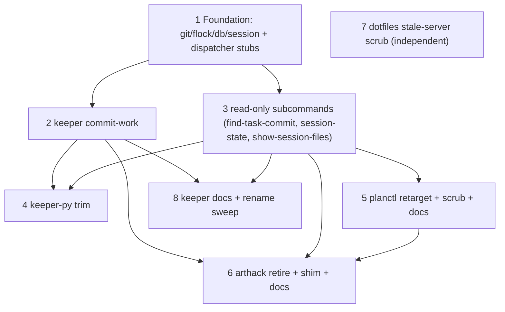

## Overview

Retire arthack's Python `jobctl` package and reimplement all four of its
subcommands as native Bun/TypeScript verbs in keeper, reading keeper's
SQLite DB directly via `src/db.ts` `openDb({readonly:true})` instead of
through the `keeper-py` Python reader. The end state: `keeper commit-work`,
`keeper find-task-commit`, `keeper session-state`, and
`keeper show-session-files` live in `cli/`; the Python `apps/jobctl` is
gone; `keeper-py` stays (planctl/chatctl/botctl still use it) minus its
now-orphaned `get_session_dirty_files`; planctl shells `keeper
find-task-commit`; a thin `jobctl` shim re-execs `keeper` so in-flight
agent prompts keep working through the rename.

Why: `commit-work` is the multi-agent git-coordination seam, and it is
deeply coupled to keeper's `file_attributions` data. Co-locating the verb
with the data collapses the cross-repo `keeper-py` edge to a local DB read
and gives us the surface to grow more coordination primitives next to the
event log.

## Quick commands

- `keeper commit-work --preview-files` — list session-attributed dirty files (no commit)
- `keeper commit-work "test(scope): msg"` — full stage→lint→commit→push, two-line NDJSON
- `keeper find-task-commit fn-700-foo.1 | jq '.commits'` — byte-identical to the old jobctl envelope (planctl consumes this)
- `keeper session-state | jq '{branch,head_sha,session_files}'`
- `cd ~/code/planctl && rg -n 'jobctl' planctl/` — must return zero functional call sites after the retarget
- `cd ~/code/arthack && test ! -d apps/jobctl && jobctl commit-work --help` — package gone, shim still answers

## Acceptance

- [ ] All four subcommands produce byte-identical stdout envelopes to the retired Python `jobctl` (compact two-line NDJSON for commit-work; pretty `indent=2` for the readers).
- [ ] `keeper commit-work` stages only session-attributed + gitignore-filtered files, never `git add -A/./*` tree-wide; session deletions stage as removals.
- [ ] The lint matrix shells the same external linters cwd-discovered (ruff/ty/cli-boundaries/shellcheck/zig/lua/hadolint/npm-lint) PLUS a new dedicated `tsc --noEmit --project` arm; exit-code is the sole pass/fail signal; stderr captured verbatim into a `lint_failed` envelope.
- [ ] Concurrent `keeper commit-work` invocations serialize on `$GIT_COMMON_DIR/keeper-commit-work.lock` via an `flock(2)` whose fd is `FD_CLOEXEC` (children don't inherit/hold the lock).
- [ ] `keeper-py` retains `get_epic`/`get_job`/`get_session_identity_for_pid`/`KeeperError` (planctl/chatctl/botctl); only `get_session_dirty_files` (+ its private helpers) and its tests are removed, after confirming no non-jobctl caller.
- [ ] planctl's three `jobctl find-task-commit` call sites shell `keeper find-task-commit` and still fail-loud on non-zero exit; `~/.bun/bin` confirmed on planctl's spawn PATH.
- [ ] `apps/jobctl` removed from arthack's uv workspace + pyproject + install.sh + CLAUDE.md; `jobctl` shim re-execs `keeper`.
- [ ] No functional `jobctl commit-work` reference remains in any repo's docs/skills/prompts (archival bug-history excepted).
- [ ] keeper test suite green (`pnpm test`), each subcommand covered with a sandboxed `KEEPER_DB` temp-repo harness.

## Early proof point

Task that proves the approach: task 1 (Foundation primitives), specifically
the `flock(2)` FFI primitive working on macOS aarch64 and the
`get_session_dirty_files` attribution reader matching the Python output on a
fixture repo. If it fails: the flock falls back to a lockfile (`O_CREAT|O_EXCL`
+ holder-pid heartbeat) since macOS ships no `flock` binary for the
`Bun.spawn(["flock"])` route; the attribution algorithm is small and
well-specified, so a reader mismatch is a parity bug, not an architecture risk.

## References

- Python source to port: `~/code/arthack/apps/jobctl/jobctl/{run_commit_work,run_find_task_commit,run_session_state,run_show_session_files,helpers,cli}.py`
- Attribution algorithm: `~/code/keeper/keeper/api.py:392` `get_session_dirty_files` (+ `_live_dirty_paths:341`, `_git_root:315`)
- keeper trailer reuse: `~/code/keeper/src/derivers.ts:1384` `parseTaskTrailers` (note `TASK_TRAILER_RE:1356` is module-local, not exported)
- dispatch factory: `~/code/keeper/cli/keeper.ts:26-136`; reader open: `~/code/keeper/src/db.ts:69,5398`; git spawn idiom: `~/code/keeper/src/git-worker.ts:600`
- planctl retarget site: `~/code/planctl/planctl/run_close_preflight.py:135` (+ `cli.py:557`, `run_worker_resume.py:135`)
- Overlap epics: fn-712 (co-edits `keeper/api.py` + `src/db.ts SCHEMA_VERSION` — whichever lands second reconciles); fn-711 (`src/exec-backend.ts`/`autopilot-worker.ts`, low). fn-710 (done) has uncommitted `cli/keeper.ts` edits in the tree — commit before adding subcommands.

## Docs gaps

- **`~/code/keeper/CLAUDE.md`**: schema-coupling rule (~115-120) names "jobctl commit-work" as the keeper-py consumer → `keeper commit-work`; ~134 "jobctl-stamped" Job-Id trailer → keeper-stamped/drop tool attribution; reconcile the stale "flock shared with planctl's auto-commit" claim (planctl takes no flock).
- **`~/code/keeper/README.md`**: add the four subcommands to the CLI list; follow the per-bump schema-history template if a version is touched.
- **`~/code/keeper/keeper/api.py`** docstring (6-10): rename the `get_session_dirty_files` consumer (function stays).
- **`~/code/arthack/CLAUDE.md:30`**, **`apps/jobctl/CLAUDE.md`** (→ tombstone), **`~/code/planctl/CLAUDE.md:30,32`**, **`README:104-116`**, **`docs/reference/commit-at-mutation-boundary.md` §6** (~16 refs). `planctl-bug-history.md` is archival — leave intact.

## Best practices

- **No `git add -A/./*` tree-wide; always `--` before pathspecs** (CVE-class argument injection — Rapid7 Gogs advisory). Pathspec-scoped `git add -A -- <files>` is correct (stages deletions).
- **Drain stdout+stderr concurrently** on every `Bun.spawn` (Promise.all) or large linter output deadlocks the pipe buffer.
- **`flock(2)` fd must be `FD_CLOEXEC`** or spawned git/ruff/tsc children inherit it and the lock isn't released until they exit; declare `i32` FFI return on aarch64 (segfault otherwise).
- **`tsc --noEmit` needs explicit `--project`/cwd** or it finds no tsconfig and false-passes exit 0.
- **bun:sqlite `{readonly:true}` + `busy_timeout`**; never open RW "just in case" (WAL reader→writer upgrade ignores busy_timeout).
- **Exit-code is the only lint pass/fail signal** — never parse diagnostics; capture stderr verbatim.

## Snippet context

No snippets or bundles attached. repo-scout's promptctl substrate returned
nothing for atomic-write / json-envelope / git-trailer / subprocess / flock
queries — this is a new CLI archetype for keeper (existing `cli/*.ts` are TUI
renderers), so no reusable snippet exists to ride forward.

## Alternatives

- **Keep jobctl in Python, move it into keeper as a polyglot CLI** — rejected: drags ruff/ty + a Python runtime into keeper's CI and keeps the `keeper-py` round-trip; the win (local DB read) is lost. (Human decided TS.)
- **Don't move — grow keeper-py instead** — rejected: leaves the coordination seam behind a cross-repo edge.
- **Rename the verb to `keeper commit`** — rejected: `commit-work` is the established verb across every worker prompt; keeping the name minimizes the rename blast radius (the verb is kept; only the binary changes).

## Architecture

Data flow unchanged from the daemon's POV: the new verbs are READ-ONLY on
`file_attributions` (via a fresh read-only connection) and WRITE only to git
— never the event log. The daemon stays the sole DB writer; `keeper
commit-work` is keeper's first git-writing subcommand.

## Rollout

- **Self-bootstrap**: the commit that lands `keeper commit-work` itself is made with the OLD `jobctl` (chicken-and-egg); thereafter keeper self-hosts its commit verb.
- **Order**: land tasks 1→2/3 (keeper verbs live + tested) before task 5 (planctl retarget) before task 6 (retire the Python package). The shim keeps `jobctl commit-work` answering throughout, so there is no window where a stale worker prompt hard-breaks.
- **Rollback**: until task 6 deletes `apps/jobctl`, the Python verbs remain a working fallback; revert the planctl retarget commit to point back at `jobctl find-task-commit`.
