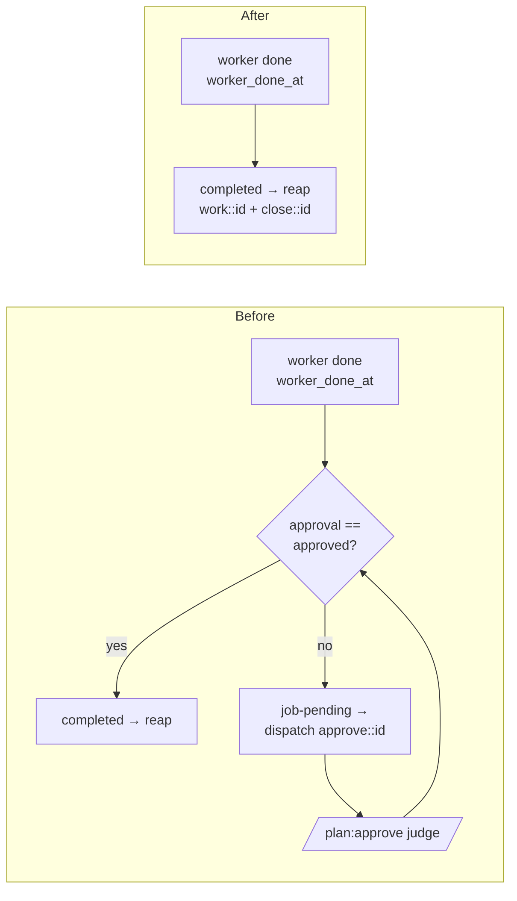

## Overview

Remove the "approval" concept from the keeper/planctl system entirely. Work
auto-completes the instant the worker (task) or closer (epic) finishes — no
LLM judge, no human ack, no gate. Two parallel gates come out: (A) the
planctl-internal **ack pipeline** (`worker_acked_at`/`closer_acked_at` stamps
in the gitignored acks SQLite, the `task ack`/`epic ack` verbs, and
`runtime_status.py`'s `pending_approval` derivation), and (B) the
keeper-facing **approval enum** (the `approval` sidecar field, `planctl
approve`, `render-approve-context`, the `/plan:approve` skill, keeper's
`epics.approval` column, the `set_{task,epic}_approval` RPCs, the readiness
predicates, the autopilot `approve` dispatch verb, board pills, and the
collections filter). Completion collapses to a single already-existing
signal: a task is complete ⟺ planctl `status == "done"` (keeper derives
`worker_phase === "done"` from `worker_done_at` being present), and an epic
is complete ⟺ `status == "done"`. `worker_done_at`/`closer_done_at` SURVIVE
untouched — they are the completion signal keeper folds.

## Quick commands

- `cd ~/code/keeper && bun test` — full keeper suite green after the strip
- `sqlite3 ~/.local/state/keeper/keeper.db "PRAGMA table_info(epics)" | grep -c approval` → `0` (column gone post-migrate)
- `sqlite3 ~/.local/state/keeper/keeper.db "SELECT sql FROM sqlite_master WHERE name='epics'" | grep -o "default_visible[^)]*approval"` → empty (virtual col rewritten)
- `cd ~/code/keeper && grep -rn "approval\|set_task_approval\|set_epic_approval" src/ | grep -v test` → empty
- `cd ~/code/planctl && uv run pytest` — full planctl suite green
- `cd ~/code/planctl && grep -rn "approve\|approval\|pending_approval\|acked_at" planctl/ | grep -v test` → empty
- `keeper autopilot` — a worker-done task flips to ✓ with no `approve::<id>` surface ever dispatched

## Acceptance

- [ ] Keeper completes a task on `worker_phase === "done"` alone and an epic on `status === "done"` alone — no approval term anywhere in the readiness verdicts.
- [ ] The autopilot `approve` dispatch verb is gone; no `approve::<id>` session is ever launched; `work`/`close` dispatch is byte-for-byte unaffected.
- [ ] Schema v63: `epics.approval` dropped and `default_visible` rewritten to `CASE WHEN status IS NOT NULL AND status='open' THEN 1 ELSE 0 END`; `63 ∈ SUPPORTED_SCHEMA_VERSIONS` in `keeper/api.py` in the same commit; `bun test` (incl. `test/schema-version.test.ts`) green.
- [ ] A from-empty re-fold reproduces byte-identical `epics` rows (re-fold determinism holds); no fold path reads or writes `approval` after the drop.
- [ ] planctl: `approve`, `render-approve-context`, `task ack`, `epic ack` verbs removed; `acks.py`, `run_approve.py`, `run_render_approve_context.py`, `migrate_approval_to_sidecar.py`, `skills/approve/` deleted; `runtime_status` collapses to `complete | untouched`.
- [ ] `worker_done_at`/`closer_done_at` stamping survives (run_done.py / run_epic_close.py) with no orphaned consumer.
- [ ] All approval/ack prose removed from keeper + planctl README.md/CLAUDE.md (present-tense, no tombstones); the keeper "writes are tightly scoped" RPC list renumbered from six surfaces to four.
- [ ] arthack: `/plan:approve` dropped from `tests/test_arthack_claude_agent_override.py`; CLAUDE.md approval refs cleaned.

## Early proof point

Task that proves the approach: `.1` (keeper behavioral collapse). It makes
keeper complete work on `worker_phase === "done"` alone while the `approval`
column still physically exists but is ignored — proving the completion
semantics hold BEFORE any schema surgery, and defusing the deploy landmine.
If it fails (e.g. an await/readiness path still hangs without approval):
re-examine `await-conditions.ts` and `readiness.ts` predicate ordering before
proceeding to the schema drop.

## References

- Sequencing landmine: if planctl stops writing `approval` while keeper still gates on `approval === "approved"`, the fold ladder resolves to `pending` forever → nothing completes → autopilot stalls. Keeper-gate-collapse (`.1`) MUST deploy before planctl loses the approve verb (`.3`). Encoded as `.3 ← .1`.
- Live board at plan time: 0 rejected rows anywhere (epic or embedded-task), 883 approved / 1 pending epics; the single in-flight not-fully-approved epic is `fn-755`, which simply auto-completes under the new semantics. No one-time sweep needed.
- keeper-py reads ZERO approval columns — the Python change is `SUPPORTED_SCHEMA_VERSIONS` frozenset + doc comment only.
- epic-scout: no inter-epic deps/overlaps; only `fn-755` open, zero file overlap.

## Architecture

Completion flow, before → after:

The whole approve sub-loop (job-pending verdict → approve dispatch → LLM
judge → approval flip) is deleted. `worker_done_at` → `worker_phase==="done"`
is retained as the sole task-completion fold input; `status==="done"` is the
sole epic-completion input.

## Rollout

Single live host, commit-to-main, no feature branches; keeperd restarts and
migrates on deploy. Safe order (encoded in task deps):

1. **`.1` keeper behavioral collapse** — keeper stops gating on `approval`
   and completes on worker-done; the `approval` column still exists but is
   ignored. Harmless against old planctl (keeper ignoring a still-written
   sidecar `approval` is a no-op). Deploy FIRST.
2. **`.2` keeper schema drop + surface cleanup** (`← .1`) — drop the column
   (v63), delete the RPC handlers, fold writes, ladder, pills, filter.
3. **`.3` planctl gate A+B removal** (`← .1`) — only after keeper no longer
   gates; removes the approve/ack verbs and stops writing `approval`. Runs
   parallel-safe with `.2` (different repo).
4. **`.4` arthack docs** (`← .3`) — after the `/plan:approve` skill is gone.

Rollback: revert the offending repo's commit; because `.2` and `.3` are
independent, a planctl revert doesn't force a keeper revert and vice-versa
once `.1` has landed.

## Best practices

- **Drop the column inside one `BEGIN IMMEDIATE`, not split from the version bump** — a crash between DROP and schema_version bump re-runs the migration; the `dropColumnIfPresent` idempotency guard (PRAGMA check) is what keeps it safe. [SQLite forum]
- **A virtual generated column blocks the drop** — `default_visible` references `approval`, so rewrite it FIRST (drop index → drop virtual col via `table_xinfo` guard → re-add new expr → recreate index) THEN drop `approval`, all one transaction. [sqlite.org/lang_altertable]
- **Never throw inside a fold** — old events still carry `approval` in their data blob; TS destructuring ignores extra keys, but confirm no fold SELECTs the dropped column and no approval-bearing synthetic-event handler is deleted (make it a tolerated no-op). [keeper CLAUDE.md invariant]
- **Verify reap idempotency** — reap now fires immediately on worker exit with a possible `data_version` double-fire; closing an already-closed pane must be a no-op, not a throw → `fatalExit`.
