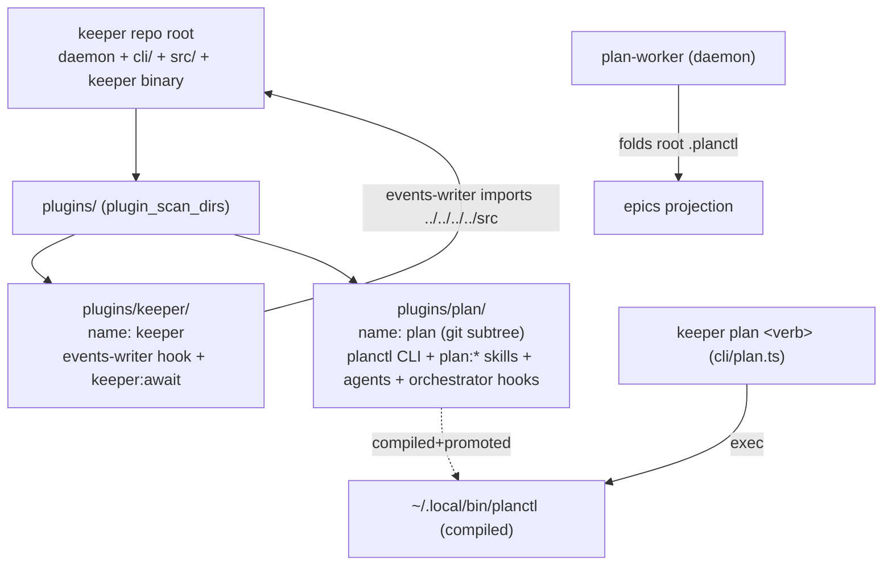

## Overview

Fold planctl into keeper as a side-by-side co-hosted Claude plugin. keeper becomes a monorepo: its daemon/CLI/`src/` stay at the repo root, while BOTH Claude plugins live under `keeper/plugins/<name>/` (`plugins/keeper/` + `plugins/plan/`), auto-discovered by claudewrap's `plugin_scan_dirs`. planctl arrives via history-preserving `git subtree` and keeps its compiled `~/.local/bin/planctl` binary; `keeper plan <verb>` is an additive exec-shim. The `plan:` skill namespace and the `planctl` command are unchanged. Payoff: the shared `.planctl/` data contract (planctl writes it, keeper's plan-worker folds it) becomes atomically changeable in one repo / one PR / one CI run.

## Quick commands

- `keeper plan status` — shim forwards to the compiled planctl binary; output byte-identical to `planctl status`
- `bun run test:full` (in keeper) — exercises keeper-cli routing + the new plan-shim conformance test (the fast tier ignores `test/keeper-cli.test.ts`)
- fresh claudewrap session → `/plan:plan` still lands `skill_name='plan:plan'` in `events`; `keeper:await` + `plan:*` both resolve
- `ls ~/code/keeper/plugins/{keeper,plan}/.claude-plugin/plugin.json` — both manifests present; scan-dir discovers both

## Acceptance

- [ ] `keeper plan <verb>` is byte-compatible with `planctl <verb>` (argv, stdin, stdout, stderr, exit code, trailing `planctl_invocation` NDJSON)
- [ ] both plugins load from `keeper/plugins/` via a single `plugin_scan_dirs` entry; `plan:*` skills + `keeper:await` both resolve in a fresh session
- [ ] keeper's events-writer hook still loads and exits 0 from `plugins/keeper/`; `resolveEventsLogDir` stays byte-synced with `src/db.ts`
- [ ] `/plan:plan` continues to record `skill_name='plan:plan'`; autopilot `/plan:<verb>` dispatch unaffected
- [ ] planctl subtree carries full history (no `--squash`); `git subtree split --prefix=plugins/plan` reconstructs a pushable branch
- [ ] `planctl` command + `~/.local/bin/planctl` promote flow unchanged; the ~132 caller files untouched
- [ ] cross-contract test: planctl writes a `.planctl/` epic → keeper plan-worker folds it → `epics` projection asserted, atomic in one repo
- [ ] post-fold soak (init→scaffold→claim→done→close) stays within planctl's p95 / stderr rollback triggers

## Early proof point

Task `.1` (the `keeper plan` exec-shim + conformance test) proves the CLI-alias half end-to-end while fully reversible, before any irreversible subtree move. If it fails: the shim contract is wrong (stdin / exit-code / signal / token-strip) — fix against the conformance fixtures; nothing else has moved, so revert is a one-file delete.

## References

- Panel verdict (opus4.8-gpt5.5, Option D hybrid): co-locate as a separate plugin subtree, frozen namespace, keep planctl compiled.
- claudewrap `plugin_scan_dirs` mechanism: `~/code/claudewrap/test/plugins.test.ts:72` (scan parent → `--plugin-dir` per manifest-bearing child, sorted; non-manifest children skipped).
- Frozen-namespace literals: `src/reducer.ts:5468`/`:5581`/`:6948`, `src/db.ts:1904`/`:2211`, `src/autopilot-worker.ts:261`.

## Alternatives

- Full merge into one "keeper" plugin (rename `plan:*`→`keeper:*`): REJECTED — `skill_name='plan:plan'` is a hardcoded literal inside keeper's reducer fold; renaming breaks the sacred re-fold-determinism invariant and autopilot dispatch.
- Marketplace co-host (`marketplace.json`): REJECTED — claudewrap's `plugin_scan_dirs` already does multi-plugin loading from one repo with one config line; a marketplace is ceremony keeper's CLAUDE.md forbids.
- Thin alias only, repos stay split: REJECTED — leaves the `.planctl/` contract change spanning two repos with no atomic commit (the actual payoff).

## Architecture

## Rollout

Reversible-first. `.1` shim — revert is deleting one file. `.2` subtree + relocate is the one semi-permanent move: `git subtree add --prefix=plugins/plan` WITHOUT `--squash`; NEVER rebase the subtree merge commit, NEVER use GitHub "Squash and merge" on a subtree PR (CR injection breaks the `git-subtree-split:` trailer and kills extractability). Cutover coordination: `.2` (keeper relocate) and `.3` (arthack claudewrap re-point) must both be live before a fresh session loads correctly — apply together and re-run `install.sh`. Rollback: revert `.3` (restore `plugin_dirs`), the relocated plugin reverts with `.2`'s commit; planctl stays extractable via subtree split. Keep the standalone `planctl` remote live through soak; archive only after.

## Docs gaps

- **keeper CLAUDE.md:13-16**: rewrite "repo root IS the plugin / ONE manifest / never duplicate" → "each plugin is a peer under `plugins/`, one manifest per plugin root, loaded via the scan-dir" (folded into `.2`).
- **keeper README:369-376 / :1212**: plugin-load + uninstall steps name `plugins/` + `plugin_scan_dirs` (folded into `.2`).
- **cli/keeper.ts USAGE + stale `:4` "four TUI subcommands" comment**: add `plan` entry, prune the count (folded into `.1`).
- **planctl README:18-27 / CLAUDE.md:14**: build/promote now run from `plugins/plan/` (folded into `.2`).
- **arthack/claude/CLAUDE.md:37-38, install.sh:307/:547, promptctl hook-copy path refs** (folded into `.3`).

## Best practices

- **git subtree:** omit `--squash` to preserve `split`/`push` extractability; the `git-subtree-split:` trailer is load-bearing — never rebase or squash-merge subtree commits. [git-subtree docs, noahtallen.com 2024]
- **Bun exec shim:** `Bun.spawnSync` + `stdio:"inherit"` + `process.exit(result.exitCode ?? 1)`; no `shell:true`, no `pipe` (buffers + breaks streaming/TTY); map signal death to `128+signal`; resolve the binary at startup. [Bun child-process docs]
- **multi-plugin:** hooks are NOT namespaced — both plugins' `PreToolUse(Bash)` hooks already co-load in every claudewrap session today, so the fold PRESERVES (does not introduce) that behavior; validate as a regression, not a discovery. [Claude Code plugins docs]
