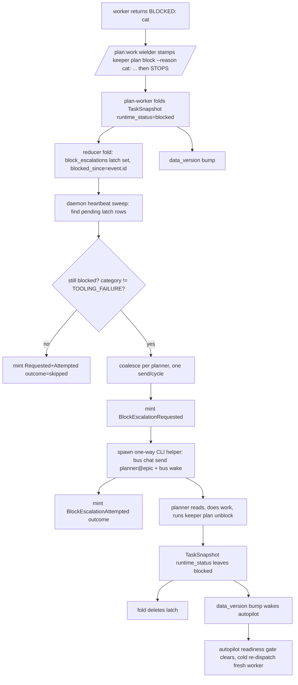

## Overview

Move the plan-task blocked-escalation loop out of the `/plan:work` orchestrator and into the keeperd daemon. Today, when a worker hits a semantic block, the `/plan:work` wielder (Phase 2c) escalates to the epic's planner over the Agent Bus, waits, and warm-resumes the worker on the planner's reply. After this epic: the wielder stamps `keeper plan block` and **stops** — the daemon detects the blocked task, escalates to the planner over the bus (one-way send + wake), and the worker resumes purely via the autopilot cold-re-dispatching once the planner unblocks the task on the board. The wielder never learns a planner was in the loop.

## Quick commands

- `bun test && bun run test:full` — full gate (mandatory: touches daemon/db/reducer/skill paths)
- `keeper plan unblock <task_id>` — new verb: flip a blocked task back to `todo`, preserving claim history
- `keeper plan block fn-x.1 --reason "SPEC_UNCLEAR: ..." && sleep <heartbeat> && keeper bus list` — manual e2e: stamp a block, watch the daemon escalate to `planner@fn-x`

## Acceptance

- [ ] A semantic block stamped by the wielder is detected by the daemon and escalated to `planner@<epic>` exactly once per block instance, with no `/plan:work`-side bus send.
- [ ] The planner unblocking the task (`keeper plan unblock`) causes the autopilot to cold-re-dispatch a fresh worker; no warm resume, no orchestrator in the loop.
- [ ] `block_escalations` re-folds byte-identically from a from-scratch replay (guarded by a refold-equivalence test).
- [ ] `TOOLING_FAILURE` blocks do NOT escalate (surface-and-stop preserved); all other categories do.
- [ ] Schema bump lands with `keeper/api.py` `SUPPORTED_SCHEMA_VERSIONS` in the same commit.

## Early proof point

Task that proves the approach: the `block_escalations` projection + fold (task 2). If it can't re-fold byte-identically against the `dispatch_never_bound` precedent, the escalate-once guarantee is unsound and the whole loop is suspect — stop and rethink the latch shape before building the producer.

## References

- Panel + /plan:hack design conclusion: wielder owns the block stamp (single writer); Phase 2c removed; actuator = one-way daemon-spawned CLI helper; resume = autopilot cold re-dispatch (planner never replies to the daemon); escalate-once = deterministic projection cloned from `dispatch_never_bound`.
- Clone sources: `src/reducer.ts:3857-3932` (`foldDispatchExpired`), `src/db.ts:1124-1132` (`CREATE_DISPATCH_NEVER_BOUND`), `src/daemon.ts:3624-3671` (`sweepExpiredPendingDispatches` + heartbeat), `plugins/plan/src/verbs/block.ts` (verb shape), `src/bus-wake.ts:276` (`runWake` fail-open injectable deps).

## Docs gaps

- **CLAUDE.md / AGENTS.md**: add `block_escalations` to the projection-class taxonomy (deterministic-replayed) + the rewinding-migration wipe-list paragraph; add the escalation-producer lifecycle to the Autopilot section. (Land inside the relevant code tasks — forward-facing prose only, no tombstone for the removed Phase 2c.)
- **README.md `## Architecture`**: add the escalation producer to the producer-worker inventory; note the board's escalation-pending state if rendered.
- **plugins/plan/CLAUDE.md**: `unblock` is a new verb (not a removed verb); note in "Notable non-members" that it does NOT re-stamp `last_validated_at` (mirrors `block`).

## Alternatives

- **Worker stamps the block (rejected):** symmetric with `keeper plan done` and more crash-robust, but it moves the stop decision into the worker and forces `block` idempotency (a double-stamp could re-fire the escalate-once latch). Single-writer wielder is cleaner; the death-window it gives up is the same failure mode today, covered by the exit-watcher backstop.
- **Warm resume / orchestrator yields for a bus reply (rejected):** contradicts "the wielder stops," and is structurally impossible for a daemon sender — a `send_only` helper has no subscribable channel to receive a reply.
- **Category projected onto TaskSnapshot (rejected):** triggers the load-bearing slot-order coordinated change; producer-side state-file read at send time avoids it.

## Architecture

## Rollout

- **Hard dependency on `fn-936` and `fn-938`.** `fn-936.1` is `in_progress` now writing `src/db.ts` (the v85 bump), `src/reducer.ts`, and `src/readiness.ts` — the exact files this epic touches, including a concurrent schema bump. `fn-938` (`todo`) edits `src/bus-worker.ts`/`cli/bus.ts` and the same `work.md.tmpl` Phase-2c section. Both wired as `depends_on_epics` so the autopilot sequences this epic AFTER they land — do not run concurrently. This epic's schema bump targets v86 assuming fn-936 lands v85 first; re-base the version number if that ordering changes.
- **Land order within the epic:** verb + projection first (parallel), then producer, then the work-skill removal LAST (so the daemon escalates before the orchestrator stops escalating — no window where a block goes un-escalated).
- **Rollback:** the work-skill change (task 4) is the only externally-visible behavior flip; reverting it restores Phase 2c escalation while the daemon arm sits dormant (a blocked task simply double-escalates, which the per-instance latch makes harmless on the daemon side).
