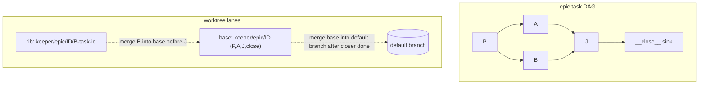

## Overview

Add a durable `worktree_mode` toggle to autopilot. When ON, the reconciler
mechanically creates git worktrees shaped by each epic's internal task DAG,
runs every agent inside its worktree, merges parallel lanes back at
convergence points, and after the epic closer runs merges the epic base
worktree into the repo's default branch and tears the worktrees down. When
OFF, it enforces (loudly) that the target repo is on its default branch
before dispatch. Entirely mechanical, no inference — it lives in the
autopilot worker's PRODUCER path, never in a fold.

Topology rule (pure, deterministic): a maximal linear chain of tasks shares
ONE worktree (no merge); the first child of a fork inherits the parent's
worktree, every other child FORKS a sub-worktree off the parent's committed
tip; a fan-in task merges its incoming lane branches before it dispatches. A
synthetic `__close__` sink depends on all leaf tasks and is pinned to the
epic base, so the closer sits where every lane has already merged in.

This rides two epics it depends on: fn-953 (the generic `set_autopilot_config`
RPC — `worktree_mode` is a column + a patch field, NO new RPC) and fn-954 (the
per-root round-robin allocator — the lane-aware mutex re-key is a parameter to
that allocator, making each worktree a cap-1 lane). Assume no merge conflicts;
on conflict fail LOUD (`git merge --abort` + sticky DispatchFailed + stop).

## Quick commands

- `keeper autopilot worktree on` — enable worktree mode (rejected mid-epic; `--force` to override).
- `keeper autopilot worktree off` — disable; `keeper autopilot` banner shows the live worktree state.
- `bun run test:full` — daemon / worker / db / readiness / commit-work / git paths (MANDATORY before landing).

## Acceptance

- [ ] `worktree_mode` is a durable `autopilot_state` column, default OFF (byte-identical to today when off), set at runtime via fn-953's `set_autopilot_config` patch — no new RPC; read fresh by the reconciler each cycle.
- [ ] With worktree mode ON, an epic's tasks run in DAG-shaped worktrees: linear chains share one worktree, parallel siblings get sub-worktrees off the parent's committed tip, fan-in tasks merge their lanes first, the closer runs in the base worktree, and the base merges into the default branch after the closer reaches done.
- [ ] Both HEAD assertions fire as sticky `DispatchFailed` (cleared by `retry_dispatch`), never `fatalExit`: OFF → repo must be on its resolved default branch; ON → the worktree HEAD must equal the deterministically-derived branch and the worktree must be registered.
- [ ] Merges are sequential pairwise (never octopus), take the `$GIT_COMMON_DIR/keeper-commit-work.lock` flock, and a conflict aborts + fails loud + stops (no merge-to-default, no teardown).
- [ ] `commit-work` skips its push leg whenever it runs inside a linked git worktree (generic; submodule false-positive guarded), so per-lane branches never reach origin — autopilot pushes once at merge-to-default.
- [ ] Crash/restart recovery is producer-only: detect `MERGE_HEAD` → abort → `git worktree prune --expire now` → retry; plus a deterministic done-but-unmerged `keeper/epic/*` scan decoupled from the 1800s recent-done window.
- [ ] Multi-repo epics (per-task `target_repo`) are rejected loudly in worktree mode for v1; enabling the toggle mid-epic is rejected (fail loud) with a `--force` escape hatch.
- [ ] `bun run test:full` green; `SCHEMA_VERSION` bumped with the matching `SUPPORTED_SCHEMA_VERSIONS` entry in `keeper/api.py` in the same commit.

## Early proof point

Prove the pure topology module FIRST (task `.2`): the DAG→worktree assignment
is a total function of `depends_on` with deterministic branch names. If a
diamond `P→{A,B}→J` does not yield `P,A,J` on the base + `B` on a rib + one
pre-merge of `B` into base before `J`, the whole mechanical model is wrong and
every downstream task rests on sand. It is pure (no fs/git), so it is cheap to
get right under synthetic-DAG unit tests before any git side effect exists.

## References

- DEPENDS ON fn-953 (generic `set_autopilot_config` + `AutopilotConfigSet` + `autopilot_state` upsert — `worktree_mode` rides this as a column + patch field) and fn-954 (per-root round-robin allocator — the lane re-key parameterizes it; both touch the same `readiness.ts` ~:1133-1403 block).
- OVERLAP fn-952 (co-mints `SCHEMA_VERSION` + touches `reducer.ts`/`db.ts`/`daemon.ts`) — wired as a dep to serialize the schema bump. OVERLAP fn-957 (`readiness.ts` `isEpicStarted` ~:106) is low-risk / different region — advisory only, not wired.
- Durable-setting plumbing template: `db.ts` autopilot_state CREATE ~:1281, column-add migration ~:4109, SCHEMA_VERSION :49; `reducer.ts` extract/fold AutopilotMode ~:4303-4366, fold dispatch ~:8381; `daemon.ts` event mint ~:2376; `rpc-handlers.ts` ~:197-262; `server-worker.ts` MUTATING_RPC allowlist ~:2021; `cli/autopilot.ts` banner ~:510-535, mode subcommand ~:817.
- Dispatch path: pure-reconcile cwd `autopilot-worker.ts:1077-1095`; per-launch dirExists→confirmRunning :1334-1400; confirmRunning mints Dispatched :1199-1270; PlannedLaunch :512-538; closer cwd=projectDir :1158-1179; finalizer guard + completion reap :1109-1180; `DONE_EPICS_REAP_WINDOW_SEC=1800` collections.ts:255.
- Mutex: `effectiveRoot` key readiness.ts:1487-1495, symmetric dispatch resolver :618-638. commit-work: `gitCommonDir` cli/commit-work.ts:247-251, push leg :578-581, flock `$GIT_COMMON_DIR/keeper-commit-work.lock` :519. branch-guard plugins/keeper/plugin/hooks/branch-guard.ts.

## Alternatives

- **Mint a standalone `set_autopilot_worktree_mode` RPC now** (independent of fn-953) — lands sooner but rebuilds the exact per-setting-RPC inconsistency fn-953 exists to delete, and the readiness re-key would be redone against fn-954's rewrite. Rejected: depend on both, author specs against their planned surfaces, let autopilot sequence.
- **Every task gets its own worktree, always merge** — simpler bookkeeping, but violates the "sequential tasks share a worktree, no merge" requirement and multiplies disk/inode cost. Rejected.
- **Octopus merge at fan-in** — refuses any non-trivial merge at the strategy level leaving NO `MERGE_HEAD`, so the abort/recovery path never fires and the daemon stalls. Rejected for sequential pairwise.
- **Persist worktree→lane assignment in a projection** — drifts after a plan edit reshapes `depends_on`, and folds may not read git/fs. Rejected: topology is re-derived each cycle; authority is DAG + live git + dispatch_failures.

## Architecture

Producer flow inside `runReconcileCycle`, BEFORE `confirmRunning` mints the
durable Dispatched: ensure the lane worktree exists (lazily, off the parent's
committed tip) → run any pre-merges for a fan-in → assert HEAD → set the launch
cwd to the worktree path. Merges, prunes, and the restart scan are producer-only
and take the shared commit-work flock; nothing git touches a fold.

## Rollout

Ships OFF by default — zero behavior change until `keeper autopilot worktree on`.
Enable on a throwaway epic first; watch the banner + `dispatch_failures` for the
HEAD assertions and any merge-abort. Disable cleanly only between epics (the
mid-epic toggle guard enforces this; `--force` is the documented escape hatch
that teaches manual draining). Rollback = `worktree off` + manual teardown of any
live `keeper/epic/*` worktrees via `git worktree remove` (never `--force` over a
dirty tree).
