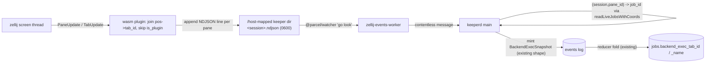

## Overview

Replace keeper's `zellij action list-panes -a -j` polling — which periodically wedges zellij's single screen thread (frozen tabs, unreachable new tabs) by forcing an O(panes) full-system process-scan storm — with a headless Rust wasm plugin that subscribes to native `PaneUpdate`/`TabUpdate` events and pushes already-joined `pane_id -> (tab_id, tab_name)` resolutions to keeper via session-scoped NDJSON files. keeper folds them through the EXISTING `BackendExecSnapshot` synthetic event (no schema change). End state: zero polling, zero process scans, event-driven tab resolution, and a reusable native-zellij -> keeper event pipe keeper can extend to future zellij events.

## Quick commands

- `bun run build:plugin` — cargo build --target wasm32-wasip1 --release + wasm-opt, emit the committed .wasm
- `KEEPER_ZELLIJ_FEED=plugin bun run src/daemon.ts` — run keeperd with the plugin feed enabled (default = legacy poller)
- `tail -f "$KEEPER_ZELLIJ_EVENTS_DIR"/<session>.ndjson` — watch a session's live event stream
- `bun test test/zellij-events-worker.test.ts test/plugin-version-skew.test.ts`

## Acceptance

- [ ] With the plugin feed active, no `list-panes -a -j` runs and the zellij log shows no `GetPaneCwd timed out` / `NewTab did not complete within 1s` storms
- [ ] Tab renames and new tabs propagate to `jobs.backend_exec_tab_name` within ~1s (parity with, or better than, the old 5s poller)
- [ ] The 50-pane control-session screen-thread wedge no longer reproduces
- [ ] The legacy poller remains a working fallback behind `KEEPER_ZELLIJ_FEED`; it is retired only after parity is validated on the dev box
- [ ] No DB schema bump — reuses `BackendExecSnapshot` + `jobs.backend_exec_tab_*` (v48) columns; `SCHEMA_VERSION` and `keeper/api.py` untouched

## Early proof point

Task that proves the approach: `.1` — the plugin emits a correct, session-scoped pane->tab NDJSON stream to a keeper-reachable path. If it fails (e.g. `/host` does not map to a keeper-controllable dir, or the headless plugin will not stay resident): fall back to a hidden/size-0 plugin pane for residency, or switch transport to a per-user `/tmp` path; worst case keep the poller but throttle it via `dump-layout`. This task carries the transport-mapping spike that de-risks every downstream task.

## References

- `/Users/mike/src/zellij-org--zellij/zellij-utils/src/data.rs` — PaneManifest (`:2281`, HashMap<tab_position, Vec<PaneInfo>>), PaneInfo (`:2296`, has `id`+`is_plugin`, NO tab_id), TabInfo (`:2237`, has tab_id+position+name)
- `/Users/mike/src/zellij-org--zellij/zellij-tile/src/shim.rs` — subscribe / request_permission / get_session_environment_variables / get_zellij_version / get_plugin_ids
- zellij#4982 — background plugins cannot show a permission grant UI; pre-seed `permissions.kdl` (maintainer-confirmed workaround)
- zellij#5177 — `load_plugins` may double-instantiate; defend with append-only open
- `fn-681` (overlap) — both touch `src/daemon.ts` worker-spawn/messaging block; merge-conflict risk
- `fn-682` (overlap) — both touch `src/reducer.ts` + `src/db.ts`; this plan aims for NO schema bump, but if either side bumps, second-to-land rebases the version number

## Docs gaps

- **src/daemon.ts header** — ELEVEN -> TWELVE workers; add the new producer-worker bullet (fifth producer instance)
- **README.md Architecture** — add the twelfth worker; revise the ninth worker's `list-panes` description to the event-driven feed; "eleven" -> "twelve"
- **README.md Install** — new Rust toolchain prereq + `build:plugin` + where the committed .wasm lives + permission pre-seed step
- **CLAUDE.md** — Worker contract gains an out-of-process NDJSON carve-out (not all producers are Bun postMessage workers); sole-writer list unchanged (reuses BackendExecSnapshot); `@parcel/watcher` carve-out adds the plugin output tree
- **src/backend-worker.ts header** — consolidate/retire once the poller is removed
- **keeper/api.py SUPPORTED_SCHEMA_VERSIONS** — only touched IF a schema bump is forced; the goal is none

## Best practices

- **Lifecycle:** call `subscribe(&[PaneUpdate, TabUpdate])` AND `request_permission(&[ReadApplicationState])` in `load()`, not `new()`; `render()` is a no-op; `update()` returns `false` for a headless plugin
- **Build target:** `wasm32-wasip1` (NOT the removed `wasm32-wasi`, NOT `wasip2` — host is preview1); `crate-type = ["cdylib"]`; `opt-level="z"` + lto + `wasm-opt -Oz`
- **Version pin:** `zellij-tile = "=0.44.3"` exact, commit `Cargo.lock`, rebuild on zellij upgrade — enforced by a version-skew test
- **Double-instantiation defense:** open the NDJSON with `OpenOptions::append(true).create(true)` so a #5177 double-load shares one O_APPEND stream rather than corrupting it
- **NDJSON contract:** flush per complete line; the consumer holds a carry-buffer for trailing partial bytes; the idempotent fold makes exact-once dedup cheap (re-applying a tab is a no-op)
- **Security:** emit metadata only (`pane_id`/`tab_id`/`tab_name`) — never pane titles or content (they can echo secrets); output file mode `0600`

## Alternatives <!-- DEEP only -->

- **zellij-side batch-enrich fix** (make `enrich_panes_with_pty_data` use the batch `get_cwds`) — the true root-cause fix, but means running a forked/upstream-patched zellij. Rejected: the user wants the fix inside keeper's control.
- **`dump-layout` instead of `list-panes`** — rejected: its serialized KDL emits no runtime pane ids, so keeper cannot map `pane_id -> tab`.
- **Plugin transport via `run_command` / `web_request`** — rejected: needs broader permissions and a per-event process spawn or an HTTP sink; the NDJSON file-drop reuses keeper's existing `@parcel/watcher` producer-worker pattern.
- **Build-from-source at install vs committed prebuilt .wasm** — chose committed prebuilt: keeper runs with zero Rust toolchain at runtime (fewer agent failure modes), guarded by a loud version-skew test that demands a rebuild on zellij upgrade.
- **Re-key the synthetic event to be pane-addressed** — rejected: would add a new reducer fold arm + schema columns + a re-fold migration and collide head-on with fn-682; keeping the join in main reuses the existing event verbatim.

## Architecture <!-- DEEP only -->

## Rollout <!-- DEEP only -->

1. Land the plugin crate + build wiring (committed .wasm, version-skew test).
2. Land the ingestion worker behind `KEEPER_ZELLIJ_FEED` (default = legacy poller; plugin path dormant).
3. Land session-load + permission pre-seed wiring.
4. Flip `KEEPER_ZELLIJ_FEED=plugin` on the dev box; validate parity (renames + new tabs propagate; no `list-panes` storms in the zellij log) for a few days.
5. Retire the `backend-worker` poller + update docs.

Rollback at any point: flip the flag back to `poller`; the plugin and worker stay dormant and harmless.
