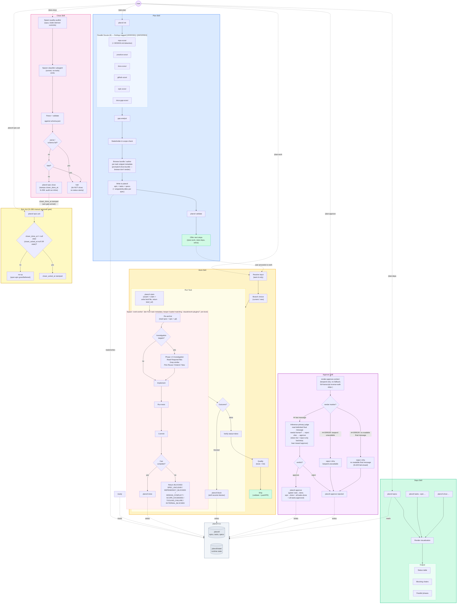

# planctl Workflow Diagram

```mermaid
flowchart TB
    %% ===== USER ENTRY =====
    user((User))

    %% ===== PLAN SKILL =====
    subgraph plan_skill["Plan Skill"]
        direction TB

        plan_init["planctl init"]

        subgraph scouts["Parallel Scouts (6) — findings tagged [VERIFIED] / [INFERRED]"]
            direction LR
            repo_scout["repo-scout\n(+ DESIGN.md detection)"]
            practice_scout["practice-scout"]
            docs_scout["docs-scout"]
            github_scout["github-scout"]
            epic_scout["epic-scout"]
            docs_gap_scout["docs-gap-scout"]
        end

        stakeholder["Stakeholder & scope check"]
        gap_analyst["gap-analyst"]
        snippet_author["Browse bundle / author\nper-task snippet metadata\n(promptctl show-bundle —\nbrowse don't render)"]
        write_planctl["Write to planctl\nepic + tasks + specs\n(+ snippets/bundles per spec)"]
        validate_plan["planctl validate"]
        offer["Offer next steps\n(/plan:work, /plan:deps, refine)"]

        plan_init --> scouts
        scouts --> gap_analyst
        gap_analyst --> stakeholder
        stakeholder --> snippet_author
        snippet_author --> write_planctl
        write_planctl --> validate_plan
        validate_plan --> offer
    end

    %% ===== WORK SKILL =====
    subgraph work_skill["Work Skill"]
        direction TB

        resolve_input["Resolve input\n(task id only)"]

        branch_choice["Branch choice\n(current / new)"]

        subgraph task_loop["Run Task"]
            direction TB
            start["planctl claim\n(assert + claim +\nwrite brief file, return brief_ref)"]

            subgraph worker_box["Spawn `work:worker` (tier from task metadata; keeper loaded matching `claude/work-plugins/<tier>/` pre-boot)"]
                direction TB
                reanchor["Re-anchor\n(read spec + epic + git)"]
                investigation_check{"Investigation\ntargets?"}
                investigation["Phase 1.5 Investigation\nRead Required files\nGrep similar\nPick Reuse / Extend / New"]
                implement["Implement"]
                test_run["Run tests"]
                commit["Commit"]
                complete_check{"Can\ncomplete?"}
                done_cmd["planctl done"]
                block_escalation["Return BLOCKED\nSPEC_UNCLEAR / DEPENDENCY_BLOCKED /\nDESIGN_CONFLICT / SCOPE_EXCEEDED /\nTOOLING_FAILURE / EXTERNAL_BLOCKED"]

                reanchor --> investigation_check
                investigation_check -- "yes" --> investigation
                investigation_check -- "no" --> implement
                investigation --> implement
                implement --> test_run
                test_run --> commit
                commit --> complete_check
                complete_check -- "yes" --> done_cmd
                complete_check -- "no" --> block_escalation
            end

            worker_outcome{"Outcome?"}
            block_record["planctl block\n(skill records blocker)"]
            verify["Verify status=done"]

            start --> worker_box
            worker_box --> worker_outcome
            worker_outcome -- "done" --> verify
            worker_outcome -- "blocked" --> block_record
        end

        quality["Quality\n(tests + lint)"]
        ship["Ship\n(validate + push/PR)"]

        resolve_input --> branch_choice
        branch_choice --> task_loop
        verify --> quality
        quality --> ship
    end

    %% ===== CLOSE SKILL =====
    subgraph close_skill["Close Skill"]
        direction TB

        spawn_auditor["Spawn quality-auditor\n(opus, trailer-derived commits)"]
        spawn_classifier["Spawn classifier subagent\n(sonnet, no-tools)\nemits <VERDICT_JSON>"]
        parse_verdict["Parse + validate\n<VERDICT_JSON>\nagainst schema.json"]

        fatal_check{"fatal?"}
        parse_fail{"parse /\nschema fail?"}

        epic_close["planctl epic close\n(stamps closer_done_at;\nfn-559: audit ran inline)"]
        halt_needs_work["halt\n(do NOT close;\nno status stamp)"]

        spawn_auditor --> spawn_classifier
        spawn_classifier --> parse_verdict
        parse_verdict --> parse_fail
        parse_fail -- "yes" --> halt_needs_work
        parse_fail -- "no" --> fatal_check
        fatal_check -- "yes" --> halt_needs_work
        fatal_check -- "no" --> epic_close
    end

    %% ===== ACK GATE (fn-386; fn-559) =====
    subgraph ack_gate["Epic Ack (fn-386 manual approval gate)"]
        direction TB

        epic_ack["planctl epic ack\n<epic_id>"]
        ack_predicate{"closer_done_at != null\nAND\n(closer_acked_at null OR stale)?"}
        ack_grandfathered["no-op\n(open epic grandfathered)"]
        ack_clear["closer_acked_at stamped"]

        epic_ack --> ack_predicate
        ack_predicate -- "no" --> ack_grandfathered
        ack_predicate -- "yes" --> ack_clear
    end

    %% ===== APPROVE SKILL (fn-592; fn-625 fail-closed + inference-primary) =====
    subgraph approve_skill["Approve Skill"]
        direction TB

        approve_render["render-approve-context\n(keeperd-only; no fallback;\nfull-transcript reverse-walk\nskips <task-notification>)"]
        approve_marker_check{"render marker?"}
        approve_keeperd_down["reject: infra\nkeeperd unavailable"]
        approve_no_msg["reject: infra\nno readable final message\n(fn-625 fail-closed)"]
        approve_judge["Inference-primary judge\nread delimited final message\nneeds-human? → reject\nelse → approve\n(token list = reject-only backstop;\nlean toward approve)"]
        approve_verdict{"verdict?"}
        approve_cmd["planctl approve <id> <status>\n(gated: task→done;\nepic→done + all-tasks-done\n+ all-tasks-approved)"]
        reject_cmd["planctl approve <id> rejected"]

        approve_render --> approve_marker_check
        approve_marker_check -- "## ERROR: keeperd unavailable" --> approve_keeperd_down
        approve_marker_check -- "## ERROR: no readable final message" --> approve_no_msg
        approve_marker_check -- "## last message" --> approve_judge
        approve_judge --> approve_verdict
        approve_verdict -- "approve" --> approve_cmd
        approve_verdict -- "reject" --> reject_cmd
        approve_keeperd_down --> reject_cmd
        approve_no_msg --> reject_cmd
    end

    %% ===== DEPS SKILL =====
    subgraph deps_skill["Deps Skill"]
        direction TB

        read_epics["planctl epics"]
        read_tasks["planctl tasks --epic ..."]
        read_show["planctl show ..."]
        render["Render visualization"]

        subgraph dep_output["Output"]
            direction LR
            status_table["Status table"]
            blocking_chains["Blocking chains"]
            parallel_phases["Parallel phases"]
        end

        read_epics --> render
        read_tasks --> render
        read_show --> render
        render --> dep_output
    end

    %% ===== PLANCTL CLI / STORAGE =====
    subgraph cli_layer["planctl CLI"]
        direction LR
        planctl_data[(".planctl/\nepics, tasks, specs")]
        planctl_state[(".planctl/state/\nruntime state")]
    end

    %% ===== CROSS-SKILL CONNECTIONS =====
    user -. "/plan:plan" .-> plan_init
    user -. "/plan:work" .-> resolve_input
    user -. "/plan:close" .-> spawn_auditor
    user -. "planctl epic ack <epic_id>" .-> epic_ack
    user -. "/plan:approve <id>" .-> approve_render
    user -. "/plan:deps" .-> read_epics

    offer -. "user proceeds to work" .-> resolve_input
    %% fn-559: close stamps closer_done_at; epic flips straight to pending_approval
    epic_close -. "closer_done_at stamped\n(ack gate armed)" .-> epic_ack

    %% ===== SKILL-TO-CLI CONNECTIONS =====
    write_planctl -. "reads/writes" .-> cli_layer
    ready -. "reads" .-> cli_layer
    done_cmd -. "writes" .-> cli_layer
    block_record -. "writes" .-> cli_layer
    read_epics -. "reads" .-> cli_layer
    approve_cmd -. "writes" .-> cli_layer
    reject_cmd -. "writes" .-> cli_layer

    %% ===== STYLES =====
    style plan_skill fill:#dbeafe,stroke:#3b82f6,stroke-width:2px
    style work_skill fill:#fef3c7,stroke:#f59e0b,stroke-width:2px
    style close_skill fill:#fce7f3,stroke:#ec4899,stroke-width:2px
    style ack_gate fill:#fef9c3,stroke:#ca8a04,stroke-width:2px
    style approve_skill fill:#fae8ff,stroke:#a21caf,stroke-width:2px
    style deps_skill fill:#d1fae5,stroke:#10b981,stroke-width:2px
    style cli_layer fill:#f1f5f9,stroke:#94a3b8,stroke-width:2px
    style scouts fill:#eff6ff,stroke:#93c5fd,stroke-width:1px
    style task_loop fill:#fefce8,stroke:#fde047,stroke-width:1px
    style worker_box fill:#fff1f2,stroke:#fda4af,stroke-width:1px
    style dep_output fill:#ecfdf5,stroke:#6ee7b7,stroke-width:1px

    style user fill:#f3e8ff,stroke:#a855f7,stroke-width:2px
    style offer fill:#d1fae5,stroke:#10b981
    style ship fill:#d1fae5,stroke:#10b981
    style planctl_data fill:#e2e8f0,stroke:#64748b
    style planctl_state fill:#e2e8f0,stroke:#64748b
```
